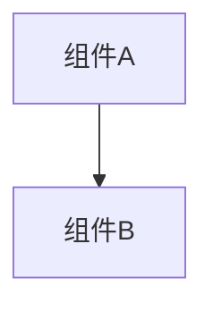

# 文档模板集合

**模板使用通用说明：**
1. 将 `[...]` 内容替换为实际内容
2. **语言规范：** 严格遵循 G1 规则。除例外清单外，所有内容按{OUTPUT_LANGUAGE}生成

---

## A1 | 知识库文档模板

### CHANGELOG.md

```markdown
# Changelog

本文件记录项目所有重要变更。
格式基于 [Keep a Changelog](https://keepachangelog.com/zh-CN/1.0.0/),
版本号遵循 [语义化版本](https://semver.org/lang/zh-CN/)。

## [Unreleased]

## [版本号] - YYYY-MM-DD

### 新增
- [新增功能描述]

### 变更
- [变更内容描述]

### 修复
- [修复问题描述]

### 移除
- [移除内容描述]
```

---

### history/index.md

```markdown
# 变更历史索引

本文件记录所有已完成变更的索引，便于追溯和查询。

---

## 索引

| 时间戳 | 功能名称 | 类型 | 状态 | 方案包路径 |
|--------|----------|------|------|------------|
| YYYYMMDDHHMM | [功能标识] | [功能/修复/重构] | ✅已完成/[-]未执行 | [链接] |

---

## 按月归档

### YYYY-MM

- [YYYYMMDDHHMM_feature](YYYY-MM/YYYYMMDDHHMM_feature/) - [一句话功能描述]
```

---

### wiki/overview.md

```markdown
# [项目名称]

> 本文件包含项目级别的核心信息。详细的模块文档见 `modules/` 目录。

---

## 1. 项目概述

### 目标与背景
[简述项目目标和背景]

### 范围
- **范围内:** [核心功能边界]
- **范围外:** [明确不做的内容]

### 干系人
- **负责人:** [姓名/角色]

---

## 2. 模块索引

| 模块名称 | 职责 | 状态 | 文档 |
|---------|------|------|------|
| [模块名] | [核心职责] | [稳定/开发中] | [链接] |

---

## 3. 快速链接
- [技术约定](../project.md)
- [架构设计](arch.md)
- [API 手册](api.md)
- [数据模型](data.md)
- [变更历史](../history/index.md)
```

---

### wiki/arch.md

```markdown
# 架构设计

## 总体架构


## 技术栈
- **后端:** [语言/框架]
- **前端:** [框架/库]
- **数据:** [数据库/存储]

## 核心流程
```mermaid
sequenceDiagram
    Participant->>System: Action
```

## 重大架构决策
完整的ADR存储在各变更的how.md中，本章节提供索引。

| adr_id | title | date | status | affected_modules | details |
|--------|-------|------|--------|------------------|---------|
| ADR-[编号] | [标题] | YYYY-MM-DD | ✅已采纳/❌已废弃 | [模块列表] | [链接] |
```

---

### project.md

```markdown
# 项目技术约定

---

## 技术栈
- **核心:** [语言版本] / [框架版本]

---

## 开发约定
- **代码规范:** [引用标准或简述]
- **命名约定:** [如: 驼峰/下划线]

---

## 错误与日志
- **策略:** [统一错误处理方式]
- **日志:** [级别与格式要求]

---

## 测试与流程
- **测试:** [单元/集成测试要求]
- **提交:** [Commit Message 规范]
```

---

### wiki/api.md

```markdown
# API 手册

## 概述
[API整体说明]

## 认证方式
[认证机制说明]

---

## 接口列表

### [模块名]

#### [METHOD] [路径]
**描述:** [功能说明]

**请求参数:**
| 参数名 | 类型 | 必填 | 说明 |
|--------|------|------|------|
| [参数] | [类型] | [是/否] | [说明] |

**响应:**
```json
{
  "code": 0,
  "data": {}
}
```

**错误码:**
| 错误码 | 说明 |
|--------|------|
| [code] | [说明] |
```

---

### wiki/data.md

```markdown
# 数据模型

## 概述
[数据架构整体说明]

---

## 数据表/集合

### [表名/集合名]

**描述:** [用途说明]

| 字段名 | 类型 | 约束 | 说明 |
|--------|------|------|------|
| [字段] | [类型] | [主键/非空/唯一等] | [说明] |

**索引:**
- [索引名]: [字段列表]

**关联关系:**
- [关联说明]
```

---

### wiki/modules/<module>.md

**状态可选值:** ✅稳定 / 🚧开发中 / 📝规划中

```markdown
# [模块名称]

## 目的
[一句话说明模块用途]

## 模块概述
- **职责:** [详细职责描述]
- **状态:** [状态图标]
- **最后更新:** YYYY-MM-DD

## 规范

<!-- 🔁 针对每个需求重复以下格式 -->
### 需求: [需求名称]
**模块:** [当前模块名]
[需求描述]

#### 场景: [场景名称]
[前置条件]
- [预期结果1]
- [预期结果2]
<!-- 循环结束 -->

## API接口
<!-- 如有API则填写 -->
### [METHOD] [路径]
**描述:** [功能]
**输入:** [参数]
**输出:** [响应]

## 数据模型
<!-- 如有数据表则填写 -->
### [表名/模型名]
| 字段 | 类型 | 说明 |
|------|------|------|
| [字段] | [类型] | [说明] |

## 依赖
- [依赖模块列表]

## 变更历史
- [YYYYMMDDHHMM_feature](../../history/YYYY-MM/...) - [变更简述]
```

---

## A2 | 方案文件模板

### plan/ 和 history/ 下的 why.md

**逻辑控制：** `产品分析` 章节仅在触发 G8（产品设计原则）时生成，否则省略。

```markdown
# 变更提案: [功能名称]

## 需求背景
[描述现状、痛点及变更驱动因素]

<!-- ⚠️ 仅在触发 G8 时生成此章节 -->
## 产品分析

### 目标用户与场景
- **用户群体:** [特征描述]
- **使用场景:** [具体场景描述]
- **核心痛点:** [解决的问题]

### 价值主张与成功指标
- **价值主张:** [核心价值]
- **成功指标:** [可量化的指标]

### 人文关怀
[包容性/隐私/道德考量]
<!-- 产品分析章节结束 -->

## 变更内容
1. [变更点1]
2. [变更点2]

## 影响范围
- **模块:** [列表]
- **文件:** [列表]
- **API:** [列表]
- **数据:** [列表]

## 核心场景

<!-- 🔁 针对每个需求重复以下格式 -->
### 需求: [需求名称]
**模块:** [所属模块名称]
[需求简述]

#### 场景: [场景名称]
[条件描述]
- [预期结果]
<!-- 循环结束 -->

## 风险评估
- **风险:** [描述]
- **缓解:** [措施]
```

---

### plan/ 和 history/ 下的 how.md

```markdown
# 技术设计: [功能名称]

## 技术方案
### 核心技术
- [语言/框架/库]

### 实现要点
- [关键逻辑1]
- [关键逻辑2]

## 架构设计
<!-- 如有架构变更 -->
```mermaid
flowchart TD
    [图表代码]
```

## 架构决策 ADR
<!-- 如涉及架构决策，否则省略 -->
### ADR-[编号]: [决策标题]
**上下文:** [背景与问题]
**决策:** [核心决策]
**理由:** [原因]
**替代方案:** [方案] → 拒绝原因: [原因]
**影响:** [后果与风险]

## API设计
<!-- 如有API变更 -->
### [METHOD] [路径]
- **请求:** [结构]
- **响应:** [结构]

## 数据模型
<!-- 如有数据变更 -->
```sql
[SQL或Schema代码]
```

## 安全与性能
- **安全:** [措施]
- **性能:** [优化]

## 测试与部署
- **测试:** [策略]
- **部署:** [流程]
```

---

### plan/ 和 history/ 下的 task.md

**Markdown anchor链接格式按why.md实际章节标题生成**

```markdown
# 任务清单: [功能名称]

目录: `helloagents/plan/YYYYMMDDHHMM_<feature>/`

---

## 1. [核心功能模块名称]
- [ ] 1.1 在 `path/to/file.ts` 中实现 [具体功能]，验证 why.md#[需求标题anchor]-[场景标题anchor]
- [ ] 1.2 在 `path/to/file.ts` 中实现 [具体功能]，验证 why.md#[需求标题anchor]-[场景标题anchor]，依赖任务1.1

## 2. [次要功能模块名称]
- [ ] 2.1 在 `path/to/file.ts` 中实现 [具体功能]，验证 why.md#[需求标题anchor]-[场景标题anchor]，依赖任务1.2

## 3. 安全检查
- [ ] 3.1 执行安全检查（按G9: 输入验证、敏感信息处理、权限控制、EHRB风险规避）

## 4. 文档更新
- [ ] 4.1 更新 <知识库文件>

## 5. 测试
- [ ] 5.1 在 `tests/integration/xxx.test.ts` 中实现场景测试: [场景1名称]，验证点: [关键验证点列表]
```

**任务状态符号:** 遵循G11定义

---

## A3 | 版本号解析规则

### 多语言版本号来源（优先级: 主 > 次）

| 语言/框架 | 主来源 | 次来源 |
|----------|--------|--------|
| JavaScript/TypeScript | package.json → version | index.js/ts → VERSION常量 |
| Python | pyproject.toml → [project].version | setup.py/__init__.py → __version__ |
| Java(Maven) | pom.xml → \<version\> | - |
| Java(Gradle) | gradle.properties/build.gradle → version | - |
| Go | Git标签(tag) | - |
| Rust | Cargo.toml → [package].version | - |
| .NET | .csproj → \<Version\>/\<AssemblyVersion\> | - |
| C/C++ | CMakeLists.txt → project(...VERSION) | 头文件 → #define PROJECT_VERSION |

**用途:** 供 G7 版本管理规则引用，确定各语言项目的版本号文件位置。
