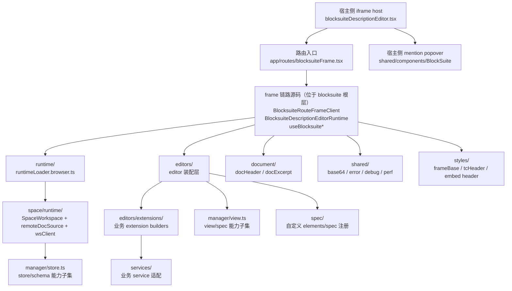
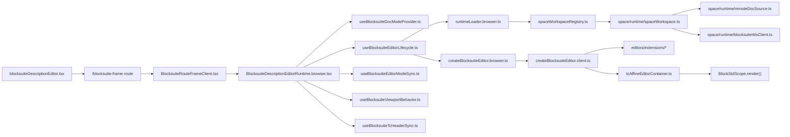

# Blocksuite 架构总览

这份文档只回答三件事：

1. `blocksuite/` 现在的分层是什么
2. 主要依赖链怎么走
3. 每一层的职责边界是什么

## 分层架构图

## 依赖图

## 职责摘要

- 宿主层  
  只负责创建 iframe、传递参数、同步主题和承接 `postMessage`。

- frame 链路源码  
  负责 iframe 内的协议、运行时编排和 editor 页面级行为。

- `BlocksuiteDescriptionEditorRuntime`  
  是唯一 orchestrator，自身不实现底层运行时，只负责把 mode、lifecycle、viewport、tcHeader sync 组合起来。

- `runtime/`  
  负责浏览器侧统一 runtime 入口，不直接承载 `SpaceWorkspace` 底层实现。

- `space/runtime/`  
  负责文档运行时底座：workspace/doc 生命周期、远端 source、ws 同步。

- `editors/`  
  负责把 `store/workspace/docModeProvider` 组装成真正可挂载的 editor DOM。

- `editors/extensions/`  
  负责把业务能力转成 `BlocksuiteExtensionBundle` 并注入 editor。

- `services/`  
  只保留 service 逻辑，不承载 extension builder，不承载 editor DOM 控制器。

- `manager/`  
  负责统一项目允许启用的 Blocksuite 能力子集，分别喂给 store 侧和 view 侧。

- `document/` / `shared/`  
  分别承载文档语义 helper 和横切基础件。

- 宿主侧 `BlockSuite/` 组件目录  
  承载 mention popover 这类必须跟 iframe host 并列渲染的宿主 UI。

## 当前判断

当前架构已经和目录对齐到下面这条规则：

- 根层源码只保留 frame 接入链路
- editor 装配收口在 `editors/`
- 文档运行时底座收口在 `space/runtime/`
- 横切基础件不再散落在根目录

如果后续继续收口，优先遵守这两条：

1. 新增 iframe 接入链路代码，才允许进入 Blocksuite 根层
2. 其他新增源码必须先进明确子域，不再把根层当缓冲区
