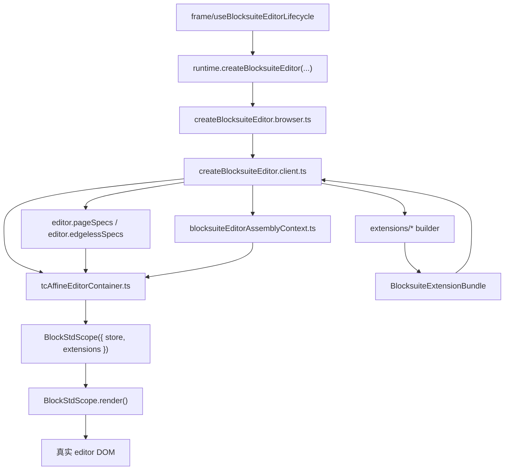

# Blocksuite Editor 架构

## 范围

这里只讲 [editors/](../../editors) 目录内部的装配链路。

不在本文档展开：

- iframe 宿主与 `postMessage`：看 [FRAME-DEEP-DIVE.md](../FRAME-DEEP-DIVE.md)
- 业务文档语义：看 [BUSINESS.md](../BUSINESS.md)
- 运行时与远端 snapshot：看 [architecture/RUNTIME.md](../architecture/RUNTIME.md)

## 分层

`editors/` 现在分成四层：

1. 入口层  
   文件：
   - [createBlocksuiteEditor.browser.ts](../../editors/createBlocksuiteEditor.browser.ts)
   - [createBlocksuiteEditor.client.ts](../../editors/createBlocksuiteEditor.client.ts)
   
   作用：
   - 接收 runtime 提供的 `store/workspace/docModeProvider`
   - 创建 editor 实例
   - 聚合 extension bundle
   - 绑定销毁逻辑与导航回调

2. 实例上下文层  
   文件：
   - [blocksuiteEditorAssemblyContext.ts](../../editors/blocksuiteEditorAssemblyContext.ts)
   
   作用：
   - 保存当前 editor 实例的上下文
   - 承载标题缓存、房间缓存、mention 锁、disposer 注册器
   - 避免模块级共享状态污染多实例

3. extension 装配层  
   文件：
   - [extensions/types.ts](../../editors/extensions/types.ts)
   - [extensions/buildBlocksuiteCoreEditorExtensions.ts](../../editors/extensions/buildBlocksuiteCoreEditorExtensions.ts)
   - [extensions/buildBlocksuiteMentionExtensions.ts](../../editors/extensions/buildBlocksuiteMentionExtensions.ts)
   - [extensions/buildBlocksuiteLinkedDocExtensions.ts](../../editors/extensions/buildBlocksuiteLinkedDocExtensions.ts)
   - [extensions/buildBlocksuiteEmbedExtensions.ts](../../editors/extensions/buildBlocksuiteEmbedExtensions.ts)
   - [extensions/blocksuiteEditorTitle.ts](../../editors/extensions/blocksuiteEditorTitle.ts)
   
   作用：
   - 把业务能力转成 `BlocksuiteExtensionBundle`
   - 明确区分 `shared/page/edgeless` 三类扩展
   - 通过 `api` 字段在 builder 之间做受控协作

4. 渲染容器层  
   文件：
   - [tcAffineEditorContainer.ts](../../editors/tcAffineEditorContainer.ts)
   
   作用：
   - 作为自定义 web component 挂载到 DOM
   - 接收 `doc/pageSpecs/edgelessSpecs/mode`
   - 内部创建 `BlockStdScope`
   - 调用 `BlockStdScope.render()` 产出真正的 editor DOM

## 架构图

## 调用链

真实调用链固定是：

- [useBlocksuiteEditorLifecycle.ts](../../frame/useBlocksuiteEditorLifecycle.ts)
  -> [runtimeLoader.browser.ts](../../runtime/runtimeLoader.browser.ts)
  -> `runtime.createBlocksuiteEditor(...)`
  -> [createBlocksuiteEditor.browser.ts](../../editors/createBlocksuiteEditor.browser.ts)
  -> [createBlocksuiteEditor.client.ts](../../editors/createBlocksuiteEditor.client.ts)
  -> [tcAffineEditorContainer.ts](../../editors/tcAffineEditorContainer.ts)

这里最重要的边界是：

- `runtime/` 负责把文档和 workspace 准备好
- `editors/` 负责把这些输入装成 editor
- `tcAffineEditorContainer` 负责真正调用 Blocksuite 内核 render

## 当前文件职责

- [createBlocksuiteEditor.browser.ts](../../editors/createBlocksuiteEditor.browser.ts)
  浏览器边界，转发到 client 侧创建逻辑。
- [createBlocksuiteEditor.client.ts](../../editors/createBlocksuiteEditor.client.ts)
  editor 总装入口，只保留 orchestration。
- [blocksuiteEditorAssemblyContext.ts](../../editors/blocksuiteEditorAssemblyContext.ts)
  editor 实例上下文与 disposer 生命周期。
- [mockServices.ts](../../editors/mockServices.ts)
  editor 最小宿主服务替身，不是测试 mock。
- [tcAffineEditorContainer.ts](../../editors/tcAffineEditorContainer.ts)
  把 `store + extensions` 交给 `BlockStdScope` 的真正渲染容器。

## 设计约束

- `createBlocksuiteEditor.client.ts` 不再直接堆业务流程实现。
- `extensions/` 里的 builder 必须返回统一的 [BlocksuiteExtensionBundle](../../editors/extensions/types.ts)。
- 业务数据访问放在 [services/](../../services)，不要直接把 `tuanchat.xxxController` 写回 editor 入口。
- 只有语义独立的能力才拆文件；纯粹的小 helper 优先留在所属 builder 或上下文文件内。
