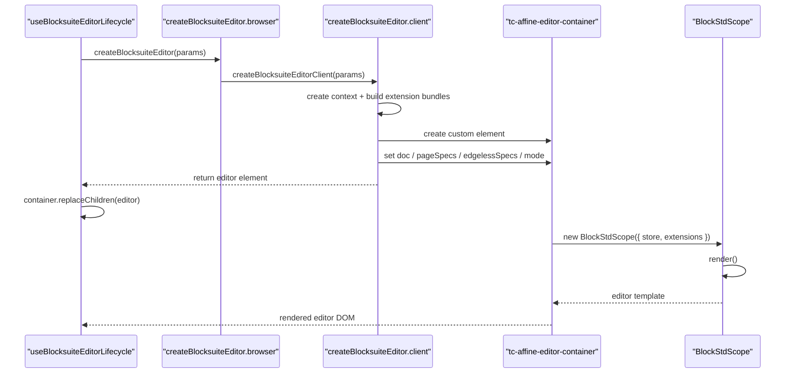

# Blocksuite Editor 挂载

## 要回答的问题

“创建一个 editor 并显示内容”在这套实现里不是一步，而是四步：

1. runtime 准备好 `store/workspace`
2. `editors/` 把这些输入装成 editor 实例
3. web component 把 `store + specs` 交给 Blocksuite 内核
4. 内核 render 出真实 DOM

## 挂载时序



## 真实调用链

- [useBlocksuiteEditorLifecycle.ts](../../frame/useBlocksuiteEditorLifecycle.ts)
  负责拿到 runtime、workspace、store，并调用 `runtime.createBlocksuiteEditor(...)`
- [createBlocksuiteEditor.browser.ts](../../editors/createBlocksuiteEditor.browser.ts)
  作为浏览器边界，把调用转到 client 侧实现
- [createBlocksuiteEditor.client.ts](../../editors/createBlocksuiteEditor.client.ts)
  创建 editor web component，并把上下文和 extension bundle 都装进去
- [tcAffineEditorContainer.ts](../../editors/tcAffineEditorContainer.ts)
  作为自定义元素，内部调用 `BlockStdScope.render()`

## “把 store 挂进去”是什么意思

在 [createBlocksuiteEditor.client.ts](../../editors/createBlocksuiteEditor.client.ts) 里，真正发生的是：

1. `document.createElement("tc-affine-editor-container")`
2. 给这个实例挂属性：
   - `editor.doc = store`
   - `editor.pageSpecs = [...]`
   - `editor.edgelessSpecs = [...]`
   - `editor.mode = "page" | "edgeless"`

这里不是 React props，而是 web component 实例属性。

## 为什么这个 web component 自己能渲染

[tcAffineEditorContainer.ts](../../editors/tcAffineEditorContainer.ts) 不是普通 `div`，而是带 `render()` 生命周期的自定义元素。

它内部会：

1. 根据 mode 选择 page specs 或 edgeless specs
2. 创建：

```ts
new BlockStdScope({
  store: this.doc,
  extensions: this._specs.value,
})
```

3. 调用：

```ts
this._std.value.render()
```

所以：

- 外层 `render()` 是你们自己的 web component 壳
- 内层 `BlockStdScope.render()` 才是 Blocksuite 内核 render

## page / edgeless 为什么能切换

因为这个容器内部不是写死一套 DOM。

它维护：

- `pageSpecs`
- `edgelessSpecs`
- `mode`

然后在 render 前根据 `mode` 选择当前 specs，再交给 `BlockStdScope`。

所以切 mode 的本质不是“换一套 React 页面”，而是：

- 切换当前 extension/spec 组合
- 让容器重新用另一套 specs 渲染 editor

## 渲染失败时优先看哪里

1. [useBlocksuiteEditorLifecycle.ts](../../frame/useBlocksuiteEditorLifecycle.ts)
   是否真的拿到了 `store`
2. [createBlocksuiteEditor.client.ts](../../editors/createBlocksuiteEditor.client.ts)
   是否真的给容器挂上了 `doc/pageSpecs/edgelessSpecs`
3. [tcAffineEditorContainer.ts](../../editors/tcAffineEditorContainer.ts)
   是否真的走到了 `new BlockStdScope(...).render()`
4. [extensions/](../../editors/extensions)
   是否把必须的 extension/filter 误删了
