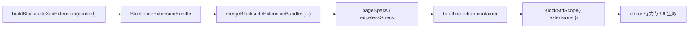

# Blocksuite Editor 插件

## 插件在这里指什么

这里的“插件”不是浏览器插件，而是 `editors/extensions/` 里的业务 extension builder。

它们的职责是：

- 把业务能力转成 Blocksuite 能识别的 `ExtensionType`
- 决定能力属于 `page`、`edgeless` 还是两者共用
- 在需要时暴露给其他 builder 协作的内部 `api`

当前 builder：

- [buildBlocksuiteCoreEditorExtensions.ts](../../editors/extensions/buildBlocksuiteCoreEditorExtensions.ts)
- [buildBlocksuiteMentionExtensions.ts](../../editors/extensions/buildBlocksuiteMentionExtensions.ts)
- [buildBlocksuiteLinkedDocExtensions.ts](../../editors/extensions/buildBlocksuiteLinkedDocExtensions.ts)
- [buildBlocksuiteEmbedExtensions.ts](../../editors/extensions/buildBlocksuiteEmbedExtensions.ts)

## 插件如何工作

### 1. builder 创建 extension bundle

每个 builder 统一返回 [BlocksuiteExtensionBundle](../../editors/extensions/types.ts)：

```ts
type BlocksuiteExtensionBundle<TApi = undefined> = {
  sharedExtensions?: ExtensionType[]
  pageExtensions?: ExtensionType[]
  edgelessExtensions?: ExtensionType[]
  disposers?: Array<() => void>
  api?: TApi
}
```

含义：

- `sharedExtensions`：page 和 edgeless 都会挂载
- `pageExtensions`：只进入 page specs
- `edgelessExtensions`：只进入 edgeless specs
- `disposers`：editor 销毁时清理副作用
- `api`：给其他 builder 或总装入口消费的内部接口

### 2. 总装入口聚合 bundle

[createBlocksuiteEditor.client.ts](../../editors/createBlocksuiteEditor.client.ts) 会：

1. 创建 editor 上下文
2. 调用多个 builder
3. 用 `mergeBlocksuiteExtensionBundles(...)` 合并
4. 把结果写到：
   - `editor.pageSpecs`
   - `editor.edgelessSpecs`

### 3. web component 把 specs 交给内核

[tcAffineEditorContainer.ts](../../editors/tcAffineEditorContainer.ts) 内部会根据 mode 选择当前 specs，然后创建：

```ts
new BlockStdScope({
  store: this.doc,
  extensions: this._specs.value,
})
```

到这一步，extension 才真正被 Blocksuite 内核消费。

## 插件协作图



## 如何写一个插件

统一按下面的顺序：

### 第一步：判断需不需要 service

如果插件要请求业务数据，先在 [services/](../../services) 新增 service。

规则：

- service 负责拿数据
- extension builder 负责把能力装进 editor

不要在 builder 里直接写 `tuanchat.xxxController`。

### 第二步：在 `editors/extensions/` 创建 builder

命名建议：

- `buildBlocksuiteXxxExtension.ts`

例如：

- `buildBlocksuiteDocTagExtension.ts`

### 第三步：返回统一 bundle

推荐形态：

```ts
import type { BlocksuiteExtensionBundle } from "./types";
import type { BlocksuiteEditorAssemblyContext } from "../blocksuiteEditorAssemblyContext";

export function buildBlocksuiteDocTagExtension(
  context: BlocksuiteEditorAssemblyContext,
): BlocksuiteExtensionBundle {
  return {
    sharedExtensions: [
      SomeBlocksuiteExtension({
        /* ... */
      }),
    ],
  };
}
```

如果需要和其他 builder 协作，再通过 `api` 暴露最小接口，不要直接互相读取私有状态。

### 第四步：接入总装入口

在 [createBlocksuiteEditor.client.ts](../../editors/createBlocksuiteEditor.client.ts) 里：

```ts
const docTag = buildBlocksuiteDocTagExtension(context);

const merged = mergeBlocksuiteExtensionBundles(
  core,
  mention,
  linkedDoc,
  embed,
  docTag,
);
```

### 第五步：补测试

测试放在 [test/](../../test)。

优先级：

- 先补 builder 级单测
- 再补需要时序/挂载行为的高层测试

## 当前插件分工

### Core

[buildBlocksuiteCoreEditorExtensions.ts](../../editors/extensions/buildBlocksuiteCoreEditorExtensions.ts)

负责：

- `DocModeProvider` override
- link preview provider override
- editor setting
- parse doc url
- quick search
- doc title 过滤

### Mention

[buildBlocksuiteMentionExtensions.ts](../../editors/extensions/buildBlocksuiteMentionExtensions.ts)

负责：

- 用户服务接入
- mention 菜单
- mention 插入
- mention 锁与去重

### Linked Doc

[buildBlocksuiteLinkedDocExtensions.ts](../../editors/extensions/buildBlocksuiteLinkedDocExtensions.ts)

负责：

- linked-doc 菜单
- 文档标题读取
- room doc 过滤
- doc link 导航

### Embed

[buildBlocksuiteEmbedExtensions.ts](../../editors/extensions/buildBlocksuiteEmbedExtensions.ts)

负责：

- room map embed option
- no-credentialless iframe view override
- edgeless embed synced-doc header

## 不要这样做

- 不要在 [createBlocksuiteEditor.client.ts](../../editors/createBlocksuiteEditor.client.ts) 里直接扩写业务逻辑
- 不要在 builder 里发明另一套返回结构
- 不要把普通工具函数也拆成单独文件；只有语义明确的能力模块才拆
- 不要把 service、builder、DOM 容器职责写在一个文件里
