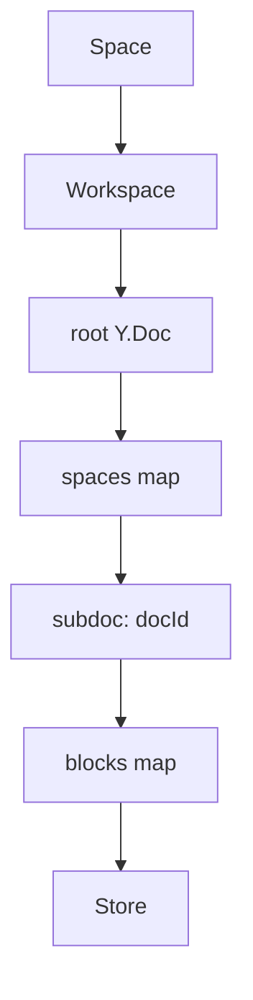

# 01 项目如何集成 BlockSuite 引擎

## 核心结论

这个项目集成的不是“一个 BlockSuite React 组件”，而是一套完整子系统：

- 宿主页面只负责 iframe host
- 真正的编辑器运行时在 `/blocksuite-frame`
- 数据底座是 `Space -> Workspace -> Doc -> Store`
- 业务能力通过 extension builders 注入
- 本地持久化、远端恢复、WS 增量都挂在同一条 runtime 链路上

一句话总结：这里集成的是一个“隔离、可扩展、可同步”的 BlockSuite 子系统。

## 分层图

```mermaid
flowchart TD
    A[业务页面] --> B[BlocksuiteDescriptionEditor 宿主]
    B --> C[/blocksuite-frame]
    C --> D[BlocksuiteRouteFrameClient]
    D --> E[BlocksuiteDescriptionEditorRuntime]
    E --> F[runtimeLoader]
    F --> G[spaceWorkspaceRegistry]
    G --> H[SpaceWorkspace]
    E --> I[createBlocksuiteEditor]
    I --> J[extension builders]
    I --> K[tc-affine-editor-container]
    K --> L[BlockStdScope]
```

## 1. 宿主层

宿主入口是 [blocksuiteDescriptionEditor.tsx](../../shared/components/BlockSuite/blocksuiteDescriptionEditor.tsx)。

职责：

- 创建 iframe
- 管理 skeleton
- 同步主题
- 维护宿主和 iframe 的消息桥

它不直接创建 editor/store。

## 2. iframe 路由层

路由入口是 [blocksuiteFrame.tsx](../../../../routes/blocksuiteFrame.tsx) 和 [BlocksuiteRouteFrameClient.tsx](../../BlocksuiteRouteFrameClient.tsx)。

职责：

- 解析 query 参数
- 启动 browser runtime bootstrap
- 监听宿主消息
- 回传高度、模式、ready、navigate

## 3. runtime 编排层

核心 orchestrator 是 [BlocksuiteDescriptionEditorRuntime.browser.tsx](../../BlocksuiteDescriptionEditorRuntime.browser.tsx)。

职责：

- 组合 mode、lifecycle、viewport、tcHeader sync
- 承接云端覆盖、本地 header、外部回调
- 决定 iframe 内最终渲染结构

## 4. 数据底座层

[spaceWorkspaceRegistry.ts](../../space/spaceWorkspaceRegistry.ts) 和 [spaceWorkspace.ts](../../space/runtime/spaceWorkspace.ts) 负责把业务 `Space` 映射到 BlockSuite `Workspace`。

内部关系：



## 5. editor 装配层

[createBlocksuiteEditor.client.ts](../../editors/createBlocksuiteEditor.client.ts) 负责把：

- `store`
- `workspace`
- `DocModeProvider`
- `extensions`

组装成真正的 editor DOM。

最终渲染落在 [tcAffineEditorContainer.ts](../../editors/tcAffineEditorContainer.ts) 的 `BlockStdScope`。

## 6. 业务扩展层

业务能力统一放在 [editors/extensions/](../../editors/extensions)：

- mention
- linked-doc
- quick-search
- embed

而不是散落在宿主页面或 editor 容器里。

## 7. 构建层也做了专门兼容

[vite.config.ts](/Users/chxr/Projects/tuan-chat-web/vite.config.ts) 里专门处理了：

- `@blocksuite/*` 强制走 `dist`
- `yjs` / `lit` / `@blocksuite/*` 单例去重
- BlockSuite `accessor` 语法降级
- blocksuite 相关模块 warmup

这也是集成的一部分。

## 建议阅读顺序

1. [blocksuiteDescriptionEditor.tsx](../../shared/components/BlockSuite/blocksuiteDescriptionEditor.tsx)
2. [BlocksuiteRouteFrameClient.tsx](../../BlocksuiteRouteFrameClient.tsx)
3. [BlocksuiteDescriptionEditorRuntime.browser.tsx](../../BlocksuiteDescriptionEditorRuntime.browser.tsx)
4. [useBlocksuiteEditorLifecycle.ts](../../useBlocksuiteEditorLifecycle.ts)
5. [spaceWorkspaceRegistry.ts](../../space/spaceWorkspaceRegistry.ts)
6. [spaceWorkspace.ts](../../space/runtime/spaceWorkspace.ts)
7. [createBlocksuiteEditor.client.ts](../../editors/createBlocksuiteEditor.client.ts)
