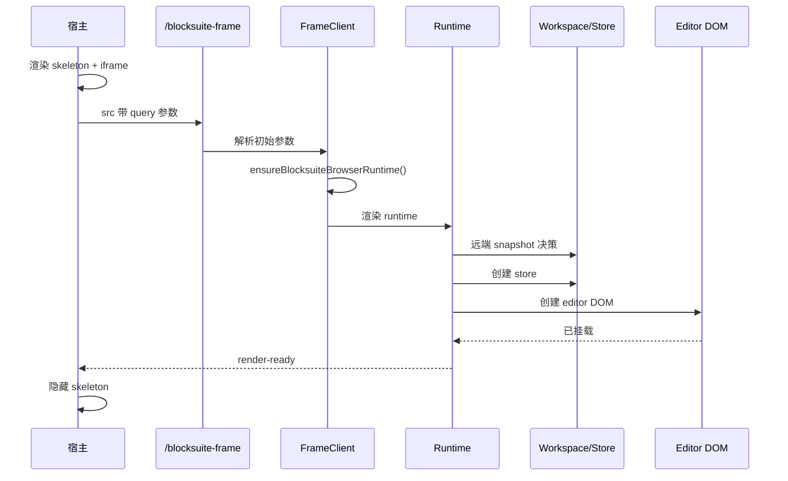

# 02 编辑器首屏渲染的逻辑

## 核心结论

首屏不是一次普通 React render，而是一个分阶段启动流程：

1. 宿主先显示 skeleton 和 iframe 外壳
2. iframe bootstrap browser runtime
3. runtime 在创建 store 前先判断远端 snapshot
4. editor 创建并挂入 DOM
5. 等内容稳定后回传 `render-ready`
6. 宿主再隐藏 skeleton

## 时序图

## 1. 宿主先显示 skeleton

[blocksuiteDescriptionEditor.tsx](../../shared/components/BlockSuite/blocksuiteDescriptionEditor.tsx) 维护：

- `isFrameReady`
- `hasFrameReadyOnce`

策略：

- 首次打开前显示 skeleton
- ready 过一次后，后续切文档尽量不再回到纯骨架态

## 2. 首开 query 会被冻结

[useBlocksuiteFrameInit.ts](../../shared/components/BlockSuite/useBlocksuiteFrameInit.ts) 会把首开参数冻结到 `frozenInitParamsRef`。

目的：

- 避免 `src` 变化触发整帧重建
- 后续参数改走 `sync-params`

## 3. iframe 先 bootstrap，再进 runtime

[BlocksuiteRouteFrameClient.tsx](../../BlocksuiteRouteFrameClient.tsx) 首先调用 [bootstrap/browser.ts](../../bootstrap/browser.ts)。

这一步会：

- 注入样式
- 注册 core custom elements
- patch `customElements.define`

## 4. 创建 store 前先判断远端 snapshot

[useBlocksuiteEditorLifecycle.ts](../../useBlocksuiteEditorLifecycle.ts) 会先调用 [blocksuiteEditorLifecycleHydration.ts](../../blocksuiteEditorLifecycleHydration.ts) 的 `waitForRemoteSnapshotDecision()`。

返回值可能是：

- `snapshot-hit`
- `empty`
- `error`
- `timed-out`

目的：

- 有远端内容时优先恢复，减少首屏空白和回填闪烁
- 远端明确为空时，才初始化最小骨架

## 5. editor 挂入 DOM 后，才允许 `render-ready`

runtime 会：

1. 创建 store
2. 创建 editor
3. `container.replaceChildren(editor)`
4. 延后一帧通知父层 `render-ready`

如果启动期远端状态异常，还会继续等待补救窗口，再发 `render-ready`。

## 6. 首屏阶段只负责 ready，不再承担高度同步

当前 iframe host 统一运行在 full-only 模式下，宿主必须提供稳定高度链。

[BlocksuiteRouteFrameClient.tsx](../../BlocksuiteRouteFrameClient.tsx) 在首屏阶段只负责：

- 启动 browser runtime
- 接收宿主主题与参数同步
- 在 editor 可见后回传 `render-ready`

## 关键文件

- [blocksuiteDescriptionEditor.tsx](../../shared/components/BlockSuite/blocksuiteDescriptionEditor.tsx)
- [useBlocksuiteFrameInit.ts](../../shared/components/BlockSuite/useBlocksuiteFrameInit.ts)
- [BlocksuiteRouteFrameClient.tsx](../../BlocksuiteRouteFrameClient.tsx)
- [BlocksuiteDescriptionEditorRuntime.browser.tsx](../../BlocksuiteDescriptionEditorRuntime.browser.tsx)
- [useBlocksuiteEditorLifecycle.ts](../../useBlocksuiteEditorLifecycle.ts)
- [blocksuiteEditorLifecycleHydration.ts](../../blocksuiteEditorLifecycleHydration.ts)
