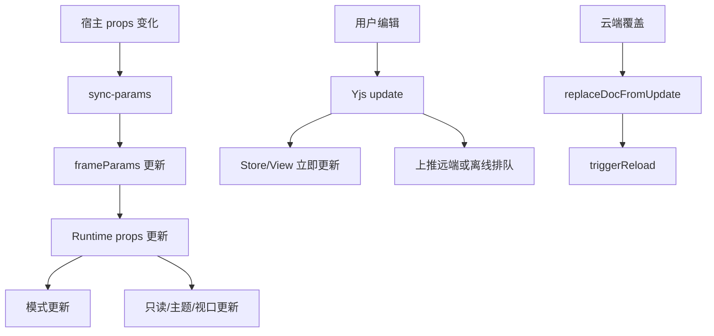

# 03 编辑器的更新逻辑

## 核心结论

这里的“更新”至少分成 5 类：

1. 宿主参数更新
2. 模式更新
3. 内容更新
4. 视图状态更新
5. 强制替换和 reload

不要把所有变化都当成“React 重新 render 一次”。

## 更新图

## 1. 宿主参数更新

宿主通过 [useBlocksuiteFrameBridge.ts](../../shared/components/BlockSuite/useBlocksuiteFrameBridge.ts) 发送 `sync-params`，而不是重建 iframe。

典型字段：

- `docId`
- `readOnly`
- `mode`
- `tcHeaderTitle`

## 2. 模式更新

[useBlocksuiteDocModeProvider.ts](../../useBlocksuiteDocModeProvider.ts) 负责：

- `currentMode`
- `DocModeProvider`
- `localStorage` 持久化

[useBlocksuiteEditorModeSync.ts](../../useBlocksuiteEditorModeSync.ts) 负责：

- `editor.switchEditor(currentMode)`
- 高度同步
- 进入 edgeless 时 `fitToScreen()`

## 3. 内容更新

内容更新的事实源是 Yjs，不是 React state。

[spaceWorkspace.ts](../../space/runtime/spaceWorkspace.ts) 在 `SpaceDoc.load()` 后监听：

- `spaceDoc.on("update", handler)`

每次更新后：

1. Store/View 先反映变化
2. 同步 meta title
3. 再判断是否上推远端

## 4. 视图状态更新

这类更新不一定改内容，但会影响表现：

- 只读：`editor.readOnly`
- 主题：`theme postMessage`
- 全屏：`useBlocksuiteViewportBehavior`

## 5. Header 更新

[document/docHeader.ts](../../document/docHeader.ts) 把 header 写进 Yjs `tc_header` map。

链路：

1. UI 写 `setBlocksuiteDocHeader()`
2. `tc_header` 改变
3. `subscribeBlocksuiteDocHeader()` 通知 runtime
4. [useBlocksuiteTcHeaderSync.ts](../../useBlocksuiteTcHeaderSync.ts) 同步给 meta、宿主和外部回调

## 6. 强制替换更新

“云端覆盖本地”不走普通 merge，而是：

1. 拉远端 snapshot
2. 清本地离线队列
3. `replaceDocFromUpdate()`
4. `triggerReload()`

所以这类问题要看 reload 链，而不是普通 update 链。

## 关键文件

- [useBlocksuiteFrameBridge.ts](../../shared/components/BlockSuite/useBlocksuiteFrameBridge.ts)
- [BlocksuiteRouteFrameClient.tsx](../../BlocksuiteRouteFrameClient.tsx)
- [useBlocksuiteDocModeProvider.ts](../../useBlocksuiteDocModeProvider.ts)
- [useBlocksuiteEditorModeSync.ts](../../useBlocksuiteEditorModeSync.ts)
- [useBlocksuiteEditorLifecycle.ts](../../useBlocksuiteEditorLifecycle.ts)
- [docHeader.ts](../../document/docHeader.ts)
- [useBlocksuiteTcHeaderSync.ts](../../useBlocksuiteTcHeaderSync.ts)
- [spaceWorkspace.ts](../../space/runtime/spaceWorkspace.ts)
