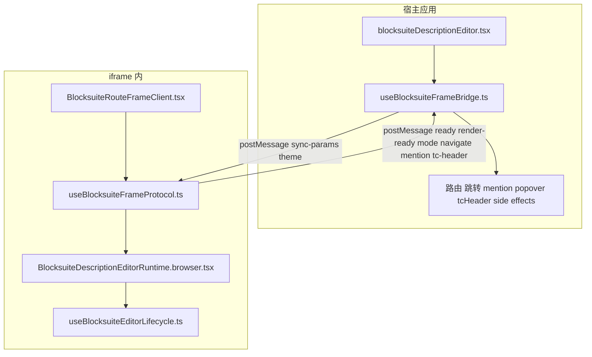
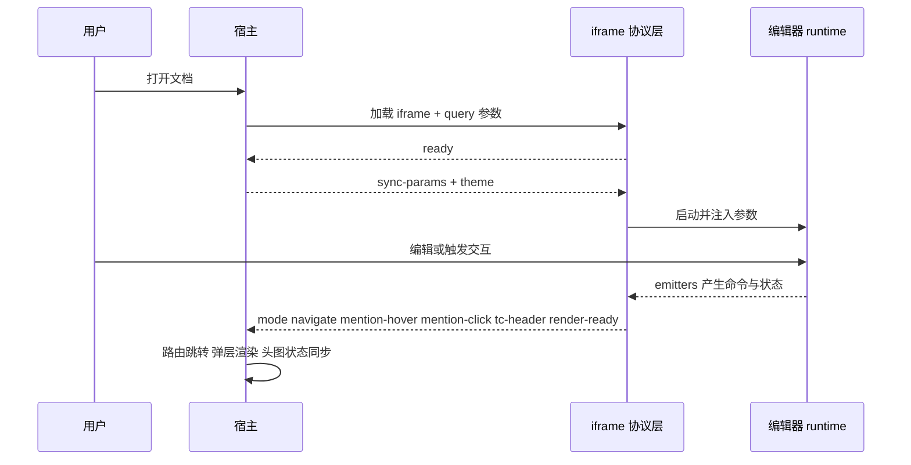

# 04 iframe 和主线程的通信系统

## 核心结论

宿主和 BlockSuite runtime 之间的边界，是一套 `postMessage` 协议，不是 props 直传。

宿主负责：

- 创建 iframe
- 发参数
- 收状态
- 承接 iframe 外层 UI
- 作为 host adapter 做协议校验和宿主副作用分发

iframe 负责：

- 真正的 editor runtime
- 模式回传
- 导航请求
- mention / header 事件上抛
- 由 frame adapter 承接 query、消息协议和 runtime 参数桥接

编辑器内部还保留一层 runtime emitters：

- `navigate`
- `tc-header`
- `mention-click`
- `mention-hover`

这些事件允许在 runtime 或局部控件里就近发出，但都必须走同一套协议 envelope。

## 通信全景图

## 关键时序图

## 1. 协议隔离

所有消息都带：

- `tc: "tc-blocksuite-frame"`
- `instanceId`

宿主还会校验：

- `origin`
- `source === iframe.contentWindow`
- `data.tc`
- `data.instanceId`

iframe 侧现在也会校验：

- `origin`
- `source === window.parent`
- `data.tc`
- `data.instanceId`

## 2. 宿主发给 iframe

主要是 2 类消息：

- `sync-params`
- `theme`

用途分别是：

- 增量同步文档参数
- 同步主题

## 3. iframe 回给宿主

主要消息：

- `ready`
- `render-ready`
- `mode`
- `navigate`
- `mention-click`
- `mention-hover`
- `tc-header`

## 4. mention 为什么一定走宿主

自定义 [tcMentionElement.client.ts](../../spec/tcMentionElement.client.ts) 会把：

- `userId`
- `anchorRect`
- hover / click 状态

发给宿主。真正的 popover 在宿主侧渲染，这样才能稳稳覆盖 iframe。

## 5. 导航为什么也走宿主

编辑器内部知道目标 docId，但业务路由属于宿主应用。

因此 runtime 会发：

- `postMessage({ type: "navigate", to })`

宿主决定：

- 自己处理
- 或走默认 `navigate(to)`

## 关键文件

- [useBlocksuiteFrameBridge.ts](../../shared/components/BlockSuite/useBlocksuiteFrameBridge.ts)
- [shared/frameProtocol.ts](../../shared/frameProtocol.ts)
- [BlocksuiteRouteFrameClient.tsx](../../BlocksuiteRouteFrameClient.tsx)
- [useBlocksuiteFrameProtocol.ts](../../useBlocksuiteFrameProtocol.ts)
- [useBlocksuiteFrameThemeSync.ts](../../shared/components/BlockSuite/useBlocksuiteFrameThemeSync.ts)
- [useBlocksuiteTcHeaderSync.ts](../../useBlocksuiteTcHeaderSync.ts)
- [tcMentionElement.client.ts](../../spec/tcMentionElement.client.ts)
