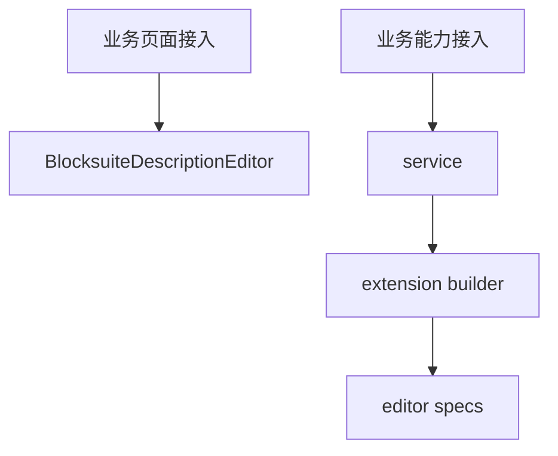
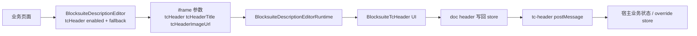

# 05 如何接入该项目的业务

## 核心结论

“接入业务”有两层完全不同的意思：

1. 把编辑器接进业务页面
2. 把业务能力接进编辑器内部

先分清楚自己要做哪一层。

## 总图

## 1. 页面层接入

页面里直接用 [BlocksuiteDescriptionEditor](../../shared/components/BlockSuite/blocksuiteDescriptionEditor.tsx)。

关键参数：

- `workspaceId`
- `spaceId`
- `docId`
- `variant`
- `readOnly`
- `allowModeSwitch`
- `fullscreenEdgeless`
- `tcHeader`

典型接入点：

- [spaceSettingWindow.tsx](../../../window/spaceSettingWindow.tsx)
- [roomSettingWindow.tsx](../../../window/roomSettingWindow.tsx)
- [chatPageMainContent.tsx](../../../chatPageMainContent.tsx)
- [docCardMessage.tsx](../../../message/docCard/docCardMessage.tsx)

## 2. `tcHeader` 其实是业务接入的重要一层

如果业务页面希望文档顶部不是 BlockSuite 默认标题，而是“业务实体头部”，就要把 `tcHeader` 打开。

页面层常见写法：

- 在 [chatPageMainContent.tsx](../../../chatPageMainContent.tsx) 里传 `tcHeader={{ enabled: true, fallbackTitle: tcHeaderTitle }}`
- 在 [spaceSettingWindow.tsx](../../../window/spaceSettingWindow.tsx) 里传空间名和头像
- 在 [roomSettingWindow.tsx](../../../window/roomSettingWindow.tsx) 里传房间名和头像
- 在 [docCardMessage.tsx](../../../message/docCard/docCardMessage.tsx) 里传卡片标题和封面

这里的 `fallbackTitle` 和 `fallbackImageUrl` 只是首屏占位和业务兜底，不是最终状态源。

## 3. `tcHeader` 的边界不只在页面层

`tcHeader` 看起来像一个 UI 参数，但实际跨了三层：

1. 业务页面决定是否启用，以及给什么 fallback
2. iframe 内的 [BlocksuiteTcHeader.tsx](../../BlocksuiteTcHeader.tsx) 负责编辑标题、封面和操作按钮
3. [useBlocksuiteTcHeaderSync.ts](../../useBlocksuiteTcHeaderSync.ts) 把最新 header 写回宿主，并补 `ensureDocMeta`

宿主侧接收点在 [useBlocksuiteFrameBridge.ts](../../shared/components/BlockSuite/useBlocksuiteFrameBridge.ts)：

- 收 `tc-header` 消息
- 触发 `onTcHeaderChange`
- 对有实体身份的文档写入 `entityHeaderOverrideStore`

所以更准确地说，`tcHeader` 既属于“业务接入”，也属于“iframe 通信”和“文档同步”之间的交叉层；之前文档只把它放进参数列表，确实讲得不够完整。

## 4. 先搞清楚 docId 规则

主要两套：

- [spaceDocId.ts](../../space/spaceDocId.ts)
- [descriptionDocId.ts](../../description/descriptionDocId.ts)

常见值：

- `space:<spaceId>:description`
- `room:<roomId>:description`
- `sdoc:<docId>:description`

## 5. Workspace 要和业务 Space 对齐

通常写法：

- `workspaceId={\`space:${spaceId}\`}`
- `spaceId={spaceId}`
- `docId={buildSpaceDocId(...)}`

## 6. 新建业务文档时，不止要有 docId

常见完整动作：

1. 后端拿到实体 id
2. 组装 docId
3. `ensureSpaceDocMeta()`
4. 更新侧边栏或业务列表
5. 跳到业务路由

参考：

- [useSpaceSidebarTreeActions.ts](../../../hooks/useSpaceSidebarTreeActions.ts)
- [chatPageRouteUtils.ts](../../../hooks/chatPageRouteUtils.ts)

## 7. 如果要把业务能力接进 editor

正确路径：

1. 先写 service
2. 再写 `buildBlocksuiteXxxExtension.ts`
3. 返回 `BlocksuiteExtensionBundle`
4. 在 [createBlocksuiteEditor.client.ts](../../editors/createBlocksuiteEditor.client.ts) 里 merge

参考文档：

- [editor/INTEGRATION.md](../editor/INTEGRATION.md)
- [editor/PLUGINS.md](../editor/PLUGINS.md)

## 8. 什么时候业务接入必须考虑 `tcHeader`

这几类场景应该把它当成正式业务能力，而不是可有可无的皮肤：

- 文档标题要映射业务实体名，例如空间、房间、独立文档
- 文档封面要映射业务头像或封面
- 宿主页面顶部、侧边栏、卡片标题需要跟编辑器内标题联动
- 需要用“云端覆盖”“切换画布”“全屏”这些头部动作

如果只是把编辑器当成一个普通富文本框嵌进去，才可以不启用 `tcHeader`。
