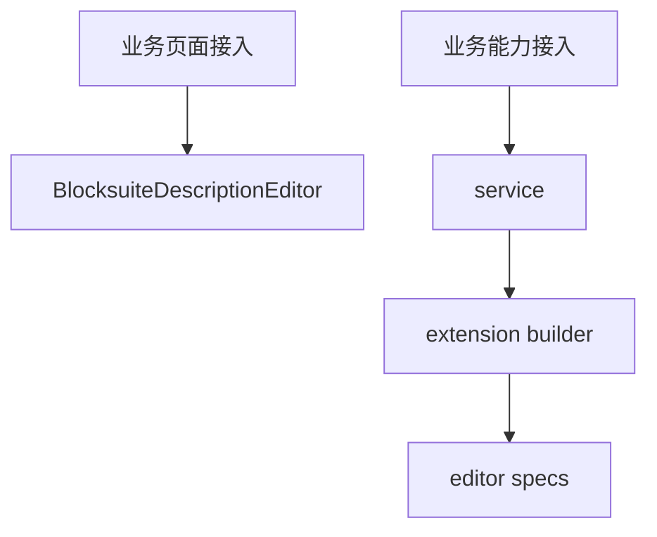

# 05 如何接入该项目的业务

## 核心结论

“接入业务”有两层完全不同的意思：

1. 把编辑器接进业务页面
2. 把业务能力接进编辑器内部

先分清楚自己要做哪一层。

## 总图

## 1. 页面层接入

页面里直接用 [BlocksuiteDescriptionEditor](../../shared/components/BlockSuite/blocksuiteDescriptionEditor.tsx)。

关键参数：

- `workspaceId`
- `spaceId`
- `docId`
- `variant`
- `readOnly`
- `allowModeSwitch`
- `fullscreenEdgeless`
- `tcHeader`

典型接入点：

- [spaceSettingWindow.tsx](../../../window/spaceSettingWindow.tsx)
- [roomSettingWindow.tsx](../../../window/roomSettingWindow.tsx)
- [chatPageMainContent.tsx](../../../chatPageMainContent.tsx)
- [docCardMessage.tsx](../../../message/docCard/docCardMessage.tsx)

## 2. 先搞清楚 docId 规则

主要两套：

- [spaceDocId.ts](../../space/spaceDocId.ts)
- [descriptionDocId.ts](../../description/descriptionDocId.ts)

常见值：

- `space:<spaceId>:description`
- `room:<roomId>:description`
- `sdoc:<docId>:description`

## 3. Workspace 要和业务 Space 对齐

通常写法：

- `workspaceId={\`space:${spaceId}\`}`
- `spaceId={spaceId}`
- `docId={buildSpaceDocId(...)}`

## 4. 新建业务文档时，不止要有 docId

常见完整动作：

1. 后端拿到实体 id
2. 组装 docId
3. `ensureSpaceDocMeta()`
4. 更新侧边栏或业务列表
5. 跳到业务路由

参考：

- [useSpaceSidebarTreeActions.ts](../../../hooks/useSpaceSidebarTreeActions.ts)
- [chatPageRouteUtils.ts](../../../hooks/chatPageRouteUtils.ts)

## 5. 如果要把业务能力接进 editor

正确路径：

1. 先写 service
2. 再写 `buildBlocksuiteXxxExtension.ts`
3. 返回 `BlocksuiteExtensionBundle`
4. 在 [createBlocksuiteEditor.client.ts](../../editors/createBlocksuiteEditor.client.ts) 里 merge

参考文档：

- [editor/INTEGRATION.md](../editor/INTEGRATION.md)
- [editor/PLUGINS.md](../editor/PLUGINS.md)
