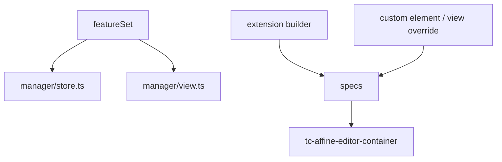

# 06 如何自定义块、扩展和编辑器能力

## 核心结论

这里的“自定义块”不能只理解成写一个 React 组件。

当前可扩展层次至少有 4 层：

1. `featureSet` / manager：决定系统允许哪些能力
2. `spec` / custom elements：定制或覆盖元素和 block view
3. extension builders：把业务能力注入 page / edgeless / shared specs
4. embed / view override：对现有块做项目级重写

## 能力图

## 1. 先决定能力是否允许进入系统

[featureSet.ts](../../manager/featureSet.ts) 维护：

- `SUPPORTED_BLOCKSUITE_FEATURES`
- `UNSUPPORTED_BLOCKSUITE_FEATURES`

store 和 view 都围绕这份子集装配，避免一边支持一边不支持。

## 2. 现有定制案例

### mention

[tcMentionElement.client.ts](../../spec/tcMentionElement.client.ts) 自定义了 `affine-mention`。

### embed iframe view override

- [embedIframeNoCredentiallessViewOverride.ts](../../editors/extensions/embed/embedIframeNoCredentiallessViewOverride.ts)
- [embedIframeNoCredentiallessElements.ts](../../editors/extensions/embed/embedIframeNoCredentiallessElements.ts)

### edgeless embed-doc header

[buildBlocksuiteEmbedExtensions.ts](../../editors/extensions/embed/buildBlocksuiteEmbedExtensions.ts)

### room-map embed

- [roomMapEmbedConfig.ts](../../spec/roomMapEmbedConfig.ts)
- [roomMapEmbedOption.ts](../../editors/extensions/embed/roomMapEmbedOption.ts)

## 3. extension builder 是主流接入方式

统一协议是 [extensions/types.ts](../../editors/extensions/types.ts) 的 `BlocksuiteExtensionBundle`。

当前 builder：

- [buildBlocksuiteCoreEditorExtensions.ts](../../editors/extensions/buildBlocksuiteCoreEditorExtensions.ts)
- [buildBlocksuiteMentionExtensions.ts](../../editors/extensions/buildBlocksuiteMentionExtensions.ts)
- [buildBlocksuiteLinkedDocExtensions.ts](../../editors/extensions/buildBlocksuiteLinkedDocExtensions.ts)
- [buildBlocksuiteQuickSearchExtension.ts](../../editors/extensions/buildBlocksuiteQuickSearchExtension.ts)
- [buildBlocksuiteEmbedExtensions.ts](../../editors/extensions/embed/buildBlocksuiteEmbedExtensions.ts)

## 4. 如果要新增一个自定义块，推荐步骤

1. 先判断是否真需要新 flavour
2. 优先考虑增强现有 block
3. 必要时同时改：
   - `manager/store.ts`
   - `manager/view.ts`
   - `spec/` 或自定义 element
   - `editors/extensions/`
   - `createBlocksuiteEditor.client.ts`

## 5. slash menu 和 toolbar 也属于可定制层

[manager/view.ts](../../manager/view.ts) 里还会过滤未支持的 slash menu 项。

这说明定制点不只在 block 渲染，也在命令入口层。
