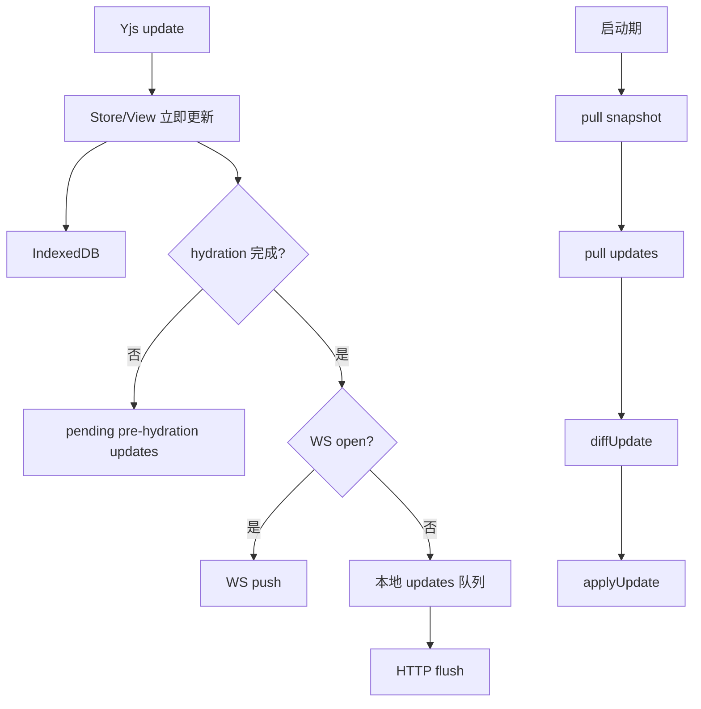

# 07 本地与远程同步层逻辑

## 核心结论

同步层是三层混合架构：

1. 本地持久化：IndexedDB
2. 远端恢复：snapshot + updates log
3. 在线增量：WebSocket

设计目标是：

- 本地先可用
- 远端可恢复
- 在线尽量实时
- 离线不丢更新
- 防止空本地覆盖远端

## 总图

## 1. 本地层

[spaceWorkspace.ts](../../space/runtime/spaceWorkspace.ts) 在 workspace 构造时创建：

- `DocEngine + IndexedDBDocSource`
- `BlobEngine + IndexedDBBlobSource`

所以本地 workspace/doc/blob 都先落 IndexedDB。

## 2. 文档粒度

一个 `SpaceWorkspace` 下：

- 一个 `root Y.Doc`
- `spaces` map
- 多个 `subdoc(docId)`

每个 `SpaceDoc` 自己管理：

- 当前 subdoc
- hydration 状态
- WS 订阅
- pending updates

## 3. 启动期远端 hydration

为什么先做这一步：

- 防止空本地一打开就上推，覆盖远端已有内容

做法：

- hydration 完成前，本地新 update 先放进 `_pendingPreHydrationUpdates`
- 等远端恢复后再决定是否合并上推

## 4. 远端恢复

[remoteDocSource.ts](../../space/runtime/remoteDocSource.ts) 的 `pull()` 会：

1. 拉 snapshot
2. 拉 snapshot 之后的 updates
3. merge 成 `mergedUpdate`
4. 用 `stateVector` 做 `diffUpdate`
5. 只 apply 缺失增量

## 5. 在线实时层

[blocksuiteWsClient.ts](../../space/runtime/blocksuiteWsClient.ts) 负责：

- `joinDoc`
- `leaveDoc`
- `pushUpdate`
- `onUpdate`
- `pushAwareness`
- `onAwareness`

当前描述类文档打开后，会 join 对应 doc room，并把远端 update apply 回本地。

## 6. 离线队列

如果 WS 不在线，`push()` 会：

1. 写 [descriptionDocDb.ts](../../description/descriptionDocDb.ts) 的本地 updates 队列
2. debounce 后触发 HTTP flush
3. 成功后清队列

## 7. compaction

为避免 updates log 越积越多，系统会在合适时机：

1. 拉 snapshot + updates
2. merge 成新完整 update
3. 写回 v2 snapshot
4. 删除旧 updates

## 关键文件

- [spaceWorkspace.ts](../../space/runtime/spaceWorkspace.ts)
- [remoteDocSource.ts](../../space/runtime/remoteDocSource.ts)
- [blocksuiteWsClient.ts](../../space/runtime/blocksuiteWsClient.ts)
- [descriptionDocRemote.ts](../../description/descriptionDocRemote.ts)
- [descriptionDocDb.ts](../../description/descriptionDocDb.ts)
