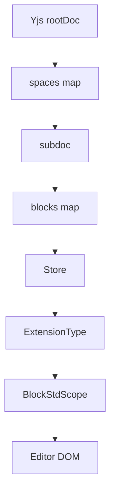

# 08 BlockSuite 底层设计的数据抽象

## 核心结论

底层真正重要的抽象链是：

- Yjs
- Workspace / Doc / Store
- ExtensionType
- BlockStdScope

所以这里不是“React 组件树驱动编辑器”，而是“CRDT 文档 + 运行时容器 + 扩展系统 + 渲染宿主”驱动编辑器。

## 抽象图

## 1. Yjs 是事实数据源

[INTERNAL-DATA.md](../INTERNAL-DATA.md) 和 [spaceWorkspace.ts](../../space/runtime/spaceWorkspace.ts) 展示了当前结构：

- `root Y.Doc`
- `rootDoc.getMap("spaces")`
- `subdoc(docId)`
- `blocks` map

这决定了内容更新、同步和恢复都围绕 Yjs update 展开。

## 2. Workspace 是文档集合容器

在这个项目里：

- `Space ≈ Workspace`

一个业务空间，对应一个 BlockSuite 文档集合容器。

关键文件：

- [spaceWorkspaceRegistry.ts](../../space/spaceWorkspaceRegistry.ts)
- [INTERNAL-DATA.md](../INTERNAL-DATA.md)

## 3. Doc 是单文档运行时壳

`SpaceDoc` 管理：

- subdoc
- awarenessStore
- storeContainer
- WS
- hydration
- pending updates

所以它不是一个轻量数据对象，而是文档级运行时。

## 4. Store 是编辑器的数据操作入口

Store 负责：

- 访问 block tree
- 提供编辑入口
- 挂 schema / history / service token

editor 不直接操作原始 Yjs map，而是通过 Store 理解文档。

## 5. ExtensionType 是能力拼装协议

最关键的中间层抽象是 `ExtensionType`。

它承载：

- store/schema extension
- view extension
- service override
- widget

项目通过 [manager/store.ts](../../manager/store.ts) 和 [manager/view.ts](../../manager/view.ts) 管理它们。

## 6. BlockStdScope 是从数据到 DOM 的桥

[tcAffineEditorContainer.ts](../../editors/tcAffineEditorContainer.ts) 里会：

- 选当前 mode 对应 specs
- `new BlockStdScope({ store, extensions })`
- `std.render()`

这才是编辑器 DOM 的真正来源。

## 7. Page 和 Edgeless 的本质

Page 和 Edgeless 不是两套完全独立数据模型，而是：

- 同一份 doc/store
- 不同 view specs
- 不同 viewport / widget / 交互模式

这也是为什么切模式主要是 `switchEditor(mode)`。

## 关键文件

- [INTERNAL-DATA.md](../INTERNAL-DATA.md)
- [spaceWorkspace.ts](../../space/runtime/spaceWorkspace.ts)
- [spaceWorkspaceRegistry.ts](../../space/spaceWorkspaceRegistry.ts)
- [manager/store.ts](../../manager/store.ts)
- [manager/view.ts](../../manager/view.ts)
- [tcAffineEditorContainer.ts](../../editors/tcAffineEditorContainer.ts)
