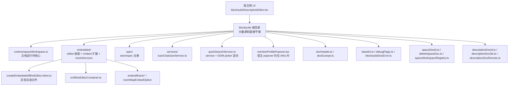
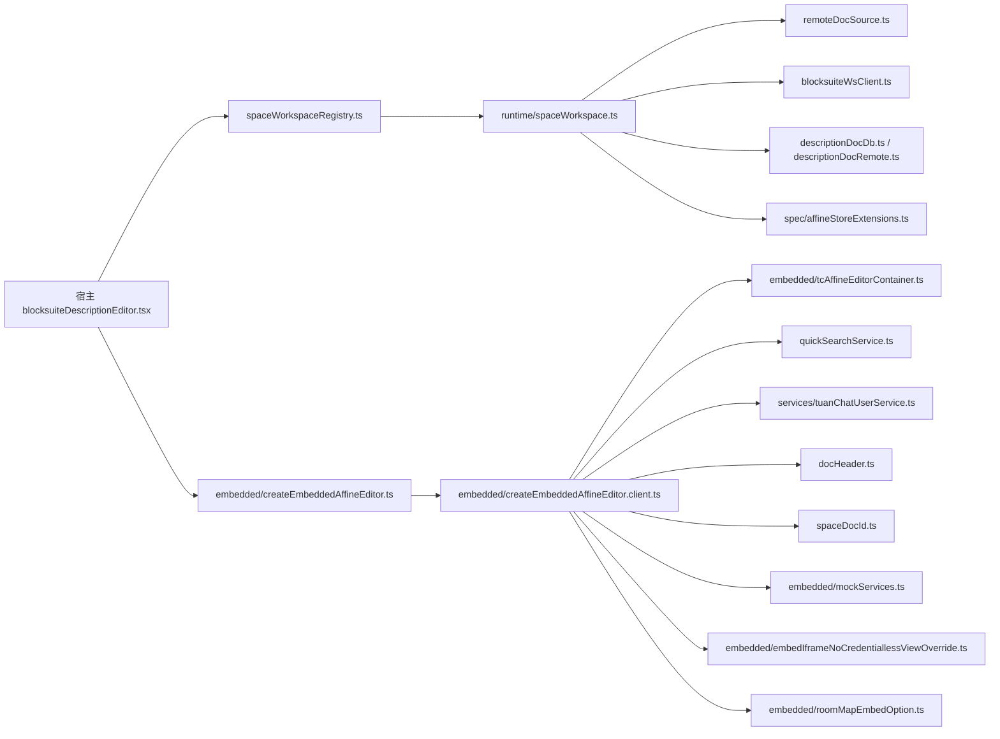
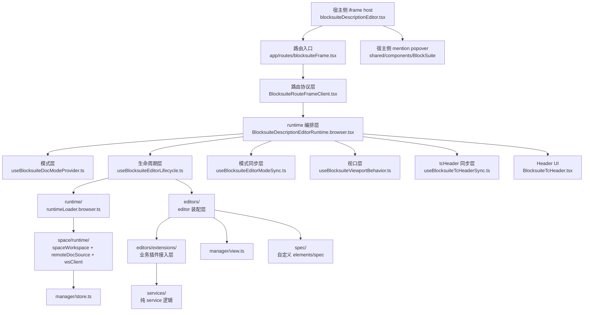
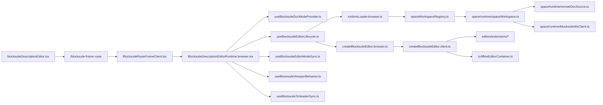

# Blocksuite 架构对比记录（main vs 当前）

这份记录用来回答两个问题：

1. `main` 分支的 Blocksuite 架构是什么样
2. 当前治理分支相对 `main` 收缩了什么、解开了什么耦合

说明：

- `main` 分支没有当前的 [ARCHITECTURE-OVERVIEW.md](../ARCHITECTURE-OVERVIEW.md)
- 下面的 `main` 架构图和依赖图，是根据 `main` 分支的真实目录和关键文件重建的

## Main 分支架构图

## Main 分支依赖图

## 当前分支架构图

## 当前分支依赖图

## 治理与收缩成果

### 1. 顶层语义从“平铺文件”收成“明确子域”

`main` 分支里很多职责直接平铺在 [blocksuite/](../../) 根目录：

- `descriptionDoc*`
- `spaceDoc*`
- `docHeader.ts`
- `docExcerpt.ts`
- `quickSearchService.ts`
- `mentionProfilePopover.tsx`
- `base64.ts`
- `debugFlags.ts`
- `blocksuiteDocError.ts`

当前分支已经收成了这些稳定子域：

- [description/](../../description)
- [space/](../../space)
- [document/](../../document)
- [shared/](../../shared)
- [services/](../../services)
- [editors/](../../editors)
- [manager/](../../manager)

### 2. editor 装配不再依赖 `embedded/` 巨型总装文件

`main` 的 editor 装配核心是：

- `app/components/chat/infra/blocksuite/embedded/createEmbeddedAffineEditor.client.ts`

这个文件同时承担：

- editor 容器创建
- linked-doc
- mention
- quick search
- embed
- 业务 API 调用
- 标题与 meta 规则

当前分支已经拆成：

- [createBlocksuiteEditor.browser.ts](../../editors/createBlocksuiteEditor.browser.ts)
- [createBlocksuiteEditor.client.ts](../../editors/createBlocksuiteEditor.client.ts)
- [editors/extensions/](../../editors/extensions)

结果是：

- editor 装配入口明确
- 业务插件接入点明确
- extension builder 有统一 bundle 协议

### 3. runtime 从“底层实现兼入口”拆成门面层和底层实现层

`main` 里：

- `app/components/chat/infra/blocksuite/runtime/spaceWorkspace.ts`

既像入口，又像底层实现。

当前分支拆成：

- [runtime/runtimeLoader.browser.ts](../../runtime/runtimeLoader.browser.ts)：浏览器 runtime 门面
- [space/spaceWorkspaceRegistry.ts](../../space/spaceWorkspaceRegistry.ts)：业务层窄接口
- [space/runtime/](../../space/runtime)：底层运行时实现

这样以后看调用链时，会更容易判断：

- 谁是对外入口
- 谁是底层实现
- 谁是业务层桥接

### 4. iframe 内运行时编排层被明确化

`main` 上没有现在这套清晰的 runtime hook 分层。

当前分支里，`BlocksuiteDescriptionEditorRuntime` 已经明确成唯一 orchestrator，下挂：

- [useBlocksuiteDocModeProvider.ts](../../useBlocksuiteDocModeProvider.ts)
- [useBlocksuiteEditorLifecycle.ts](../../useBlocksuiteEditorLifecycle.ts)
- [useBlocksuiteEditorModeSync.ts](../../useBlocksuiteEditorModeSync.ts)
- [useBlocksuiteViewportBehavior.ts](../../useBlocksuiteViewportBehavior.ts)
- [useBlocksuiteTcHeaderSync.ts](../../useBlocksuiteTcHeaderSync.ts)

这次治理最直接的成果是：

- hook 之间不再直接形成混乱的语义耦合
- `BlocksuiteDescriptionEditorRuntime` 承担唯一编排职责

### 5. service 边界比 `main` 清楚很多

`main` 的 [quickSearchService.ts](../../services/quickSearchService.ts) 实际上混了：

- service 协议
- picker DOM 创建
- 键盘事件与挂载点控制

当前分支已经拆成：

- [services/quickSearchService.ts](../../services/quickSearchService.ts)：只保留 service 协议和适配层
- [buildBlocksuiteQuickSearchExtension.ts](../../editors/extensions/buildBlocksuiteQuickSearchExtension.ts)：extension 接入点
- [blocksuiteQuickSearchPicker.ts](../../editors/extensions/blocksuiteQuickSearchPicker.ts)：DOM 控制器

### 6. 宿主 UI 从 Blocksuite infra 里抽出来了

`main` 的：

- `app/components/chat/infra/blocksuite/mentionProfilePopover.tsx`

还在 Blocksuite infra 根目录里。

当前分支已经迁到宿主侧：

- [/Users/chxr/Projects/tuan-chat-web/app/components/chat/shared/components/BlockSuite/blocksuiteMentionProfilePopover.tsx](/Users/chxr/Projects/tuan-chat-web/app/components/chat/shared/components/BlockSuite/blocksuiteMentionProfilePopover.tsx)

这意味着：

- Blocksuite 内核层和宿主层 UI 边界更清楚
- mention popover 不再被误认为是 editor infra 的内部模块

## 收缩结果总结

可以把这轮治理压成三句话：

1. `main` 更像“以功能可跑为目标的聚合式实现”。
2. 当前分支更像“主链清楚、子域清楚、装配点清楚的分层实现”。
3. 最重要的成果不是文件变多，而是主执行链更短、横切能力有落点、巨型总装文件被拆散。

## 结论

这轮治理最核心的收益有三类：

- 结构收益：目录边界与职责更匹配
- 依赖收益：从网状混合依赖收成了主链 + 子层
- 维护收益：后续新增能力更容易判断应该放在 `runtime`、`editors/extensions`、`services` 还是宿主层
