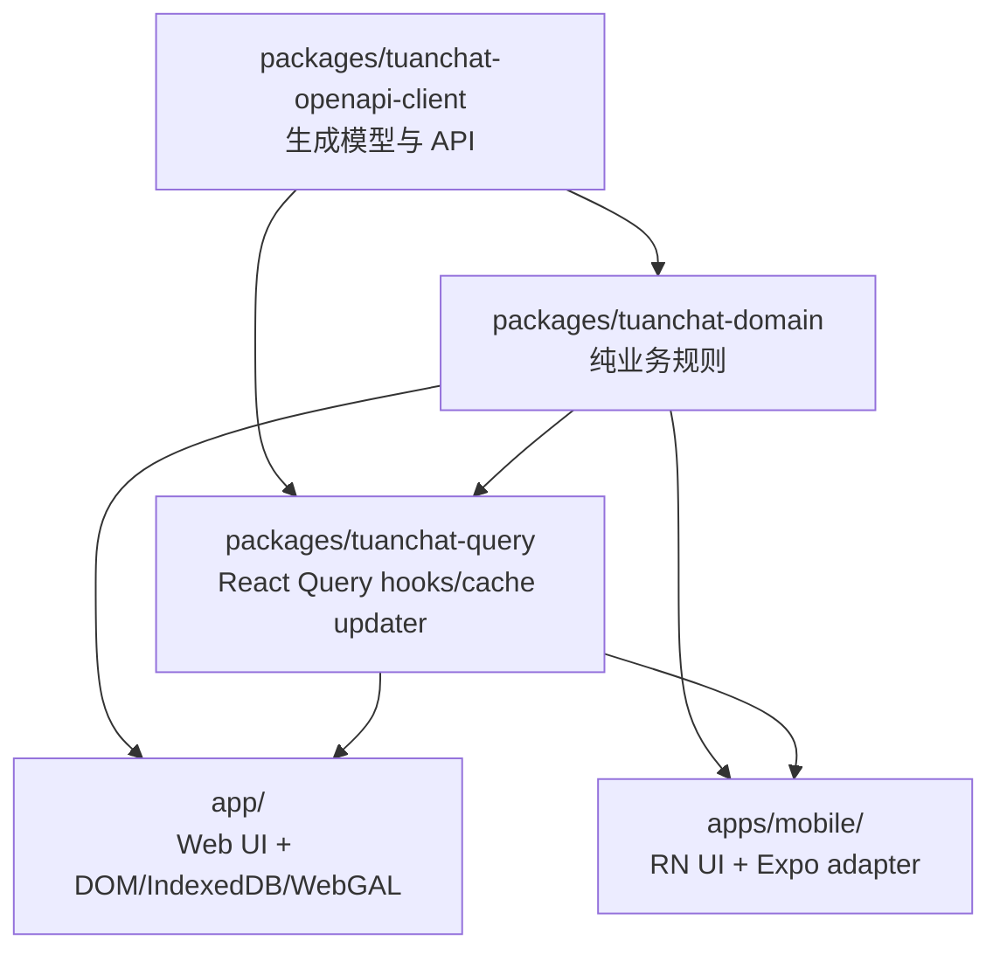

# TuanChat 移动端功能与 Web 端对齐计划

更新日期：2026-05-17

## 一、当前结论

移动端不再按“另写一套聊天逻辑”的方向继续扩张。当前策略是：

- UI 可以不同：移动端使用抽屉、底部弹窗、长按菜单、轻量卡片。
- 领域逻辑必须共享：消息预览、消息类型、发送身份、角色权限、私聊未读、通知缓存、房间消息查询 key 都进入 `@tuanchat/domain` / `@tuanchat/query`。
- 平台裁剪必须显式：WebGAL 实时渲染、文档、素材库、复杂 GM 工作台等可以不做，但入口不能表现成半实现。

## 二、已对齐能力

### 聊天室

- 房间消息查询、发送后刷新、WebSocket 实时写入复用移动端本地 `roomMessages` 查询 key，不再依赖已移除的 Web 端旧房间消息 key。
- 移动端回复预览、消息引用预览复用 `@tuanchat/domain/message-preview`，覆盖图片、文件、视频、语音、骰娘、状态事件、指令请求、线索、文档、房间跳转、子区、已读线等类型。
- 主消息流复用 `selectVisibleMainRoomMessages`，过滤 thread reply，并按当前用户/主持权限处理隐藏消息。
- 删除消息后先在本地 cache 置为 deleted 状态，再触发 refetch。
- 长按菜单已移除“假编辑”，只保留回复、复制、删除。
- 发送前复用 `resolveSendIdentity`，统一旁白、观战、角色、avatarId、customRoleName 的处理。
- 输入框已补齐文本/指令请求/状态事件模式切换；状态事件模式提供角色 ID 输入。
- 房间未读计数已接入 `messageSession.latestSyncId / lastReadSyncId`，当前房间会自动更新已读位置。
- 移动端 WebSocket 收到房间消息时会检测 sync gap，并通过 `getHistoryMessages({ roomId, syncId })` 补拉缺口。

### 私聊与好友

- 私聊 inbox 查询复用 `@tuanchat/query/direct-message`。
- 私聊会话分组、消息去重、已读线过滤、未读数计算复用 `@tuanchat/domain/direct-message`。
- 发送私聊成功后会 upsert 到 inbox cache，不再只依赖整表 refetch。
- ChatShell 选择私聊联系人后会渲染 `DmChatView`，不会继续显示群聊窗口。
- 好友添加的用户名搜索已接入 `userController.getUserInfoByUsername`，不再把“用户名模式”降级成数字 ID。
- 私聊页已支持回复、复制、撤回、文本/图片/视频/文件/音频附件发送，并自动同步当前会话已读位置。
- 私聊撤回会先更新 `dmInbox` cache 中的消息状态，再触发 inbox 刷新，避免 UI 等待整表 refetch。

### 角色与成员

- 房间角色查询复用 `@tuanchat/query/room-roles`。
- 用户角色查询复用 `useUserRolesByTypesQuery`。
- 可选角色由上层按当前用户、主持权限、观战状态计算；`RoleSwitchSheet` 不再自行用 `currentUserId` 简化过滤。
- 旁白入口仅主持可见。
- 成员权限基础判断已收敛到 `@tuanchat/domain/member-permissions`，Web 和移动端通过同一套成员类型语义判断主持、副主持、玩家、观战、骰娘。

### 通知

- 通知分页、未读数、已读、全部已读 mutation 复用 `@tuanchat/query/notifications`。
- 移动端 WebSocket 收到用户通知 push 后会写入通知分页 cache，并同步未读数 cache。
- 底部 Tab 和通知页未读 badge 使用同一个 unread count query。
- 通知点击已统一走移动端路由适配：`/chat/private/:userId` 打开私聊，`/chat/:spaceId/:roomId` 打开房间，`/role` 打开角色页，未知或反馈类路径兜底到个人/通知页。
- 系统通知点击的 `pendingTargetPath` 已由 `NotificationNavigationBridge` 消费，不再只是悬空状态。

### 附件与富文本

- 移动端附件上传请求已修正为 domain request 接受的字段，不再传入无效 `url/originalUrl`。
- TextEnhance 移动端已具备 parser + RN renderer；后续仍建议继续把 parser 下沉到 domain，避免 Web 与移动端分叉。

## 三、本轮 P0 对齐结果

### P0：已完成，后续保持守护

| 功能 | 当前状态 | 下一步 |
|---|---|---|
| 房间未读计数 | 已接真实 session read position / latest syncId | 继续观察会话接口返回异常时的兜底策略 |
| 通知点击跳转 | 已解析 `targetPath/resourceType/resourceId` 并导航到移动端可用页面 | 后续新增移动端页面时扩展路由映射 |
| 私聊撤回 | 已复用 `useRecallDirectMessageMutation` 并更新 inbox cache | 后续补撤回成功/失败 toast 体验 |
| 私聊图片/表情 | 已复用 shared media draft/extra 构建私聊媒体消息 | 表情素材选择器后续可继续接入当前附件链路 |
| WebSocket 缺口补拉 | 已做房间 sync gap 检测与补拉 | 后续可继续抽成跨端 shared detector |

### P1：体验与能力完善（本轮已推进）

| 功能 | 说明 |
|---|---|
| 内联媒体渲染 | 已抽出移动端共用 `MobileMessageMediaPreview`，聊天室和私聊图片可点开预览，视频/音频/文件可从消息流直接打开播放或查看 |
| 表情/贴纸选择器 | `ExpressionPickerSheet` 已接入聊天室发送链路，可把当前可用角色头像作为图片消息发送，并复用当前回复、标注、角色身份 |
| 成员操作菜单 | 成员抽屉长按成员可查看资料；主持可设置玩家/观战/副主持、移除成员、转让主持，并刷新成员/房间/空间缓存 |
| 查看他人资料页 | 已从成员长按、私聊标题进入 `UserProfileSheet`，弹层会按 userId 拉完整公开资料 |
| 头像上传 | 已复用移动端媒体上传链路，不新增第二套上传逻辑；个人资料、创建空间、创建房间均支持选择图片并上传头像 |
| 自定义角色名 | `RoleSwitchSheet` 的自定义角色名已接到聊天室发送身份解析，发送请求会保存 `customRoleName` |
| 房间/空间创建后的 cache 同步 | 已在 `@tuanchat/query/spaces` 增加 upsert cache helper；移动端创建成功后立即写入 active spaces / rooms 缓存并异步 refetch |

### P2：移动端可选增强

| 功能 | 说明 |
|---|---|
| WebGAL choose 只读摘要 | 不跑 WebGAL 引擎，只展示选项摘要 |
| 文档/线索卡片跳转 | 小屏只读查看，不做复杂编辑器 |
| 状态事件卡片 | 对 `.st` / `.next` 提供结构化展示 |
| 注解目录共享 | 把 Web 的 annotation normalize/effect alias 继续下沉到 domain |
| TextEnhance parser 共享 | RN/Web 各自渲染，但 parser 只保留一份 |

## 四、明确不做或保持 Web only

| 功能 | 原因 |
|---|---|
| WebGAL 实时渲染/演出控制 | 依赖 DOM/Canvas 与桌面工作区 |
| 文档编辑器、地图、流程图 | 大屏复杂编辑，不适合当前移动端 |
| 素材库、资源管理、仓库/版本控制 | 桌面创作和管理场景优先 |
| Hover toolbar、右键菜单、拖拽排序 | 移动端交互模型不同，使用长按/底部弹窗替代 |
| 消息版本 diff、批量导入 | 小屏价值低且交互复杂 |
| AI 图片生成工作台 | 复杂参数和历史管理更适合 Web |

## 五、架构方向

核心原则：

- `domain` 不依赖 React、DOM、RN、localStorage、FileSystem。
- `query` 负责 query key、hook、cache updater、mutation 封装。
- Web 和移动端只负责平台 UI、存储 adapter、导航和手势。
- 所有“移动端不支持”的能力后续应进入 capability 配置，而不是保留不可达代码。
