# 咕噜噜 Replay 数据清洗规则审查稿

## 定位

本文是咕噜噜安科文导入 replay 前的**AI-first 数据清洗规则定义稿**，用于把原文、图片和上下文整理成可复核、可重生成的 replay 事实层。

默认目标是尽可能减少人类参与：程序和 LLM 完成证据聚合、图片分类、视觉聚合、抠图门禁、角色分类和一致性校验；人类只审异常队列和少量抽样结果。本文不声明当前脚本已经全部实现这些规则。正式落地时，应把本文中的字段、分类和门禁规则同步到脚本、修正表和验收报告。

## 清洗目标

把咕噜噜作品目录中的原文和图片整理成可复核、可重生成的 replay 事实层：

```text
sourceRoot/
  meta.json
  parts/*.md
  images/**

-> 原文事件流
-> 场景标志 timeline
-> 图片用途决策表
-> 角色与头像候选
-> 骰子/BGM/作者说明清理结果
-> 可导入资源目录
```

核心原则：

- 楼层不是消息，只是来源元数据。
- 图片不是默认头像，必须先判定用途。
- 地点/背景只从作者显式场景标志行产生，普通正文地点词不切场。
- 漫画类图片不抠图。
- 先做证据包和图片聚合，再做角色分类；不能逐张孤立判断后再补救。
- LLM 是主流程参与者，用于图片类型、视觉合并、角色归属、抠图 QA 和异常解释。
- 人类只负责最终抽样和异常复核，不负责逐图分类。
- 图片去重分两层：`sha256` 只处理物理重复；`aHash`、`dHash`、`pHash`、RMSE 或 embedding 只生成视觉相似候选，不能直接自动合并。
- 每个 AI/人工判断必须写回结构化文件，不能只停留在口头结论。

## 总览

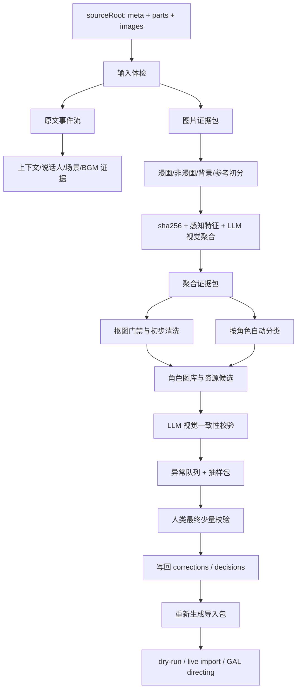

## 输出文件建议

所有输出都应放在当前 `sourceRoot` 下。

```text
sourceRoot/
  cleaning-review/
    source-inventory.json
    floor-audit.csv
    image-evidence-packs.jsonl
    image-type-labels.csv
    image-visual-groups.csv
    role-classification-candidates.csv
    ai-review-runs.json
    content-events.json
    scene-events.csv
    speaker-aliases.csv
    message-image-bindings.csv
    bgm-manifest.csv
    event-corrections.csv
    image-decisions.csv
    image-decisions.json
    image-relations.csv
    image-similarity-candidates.csv
    image-feature-index.json
    matting-decisions.csv
    anomaly-queue.csv
    final-sampling-review.csv
    summary.json

  image-role-review-copy/
    manifest.json
    corrections.csv

  image-role-review-clean-human-full/
    by-character/
    reference-only/
    background-candidates/
    reports/
      role-visual-audit/
      duplicate-contact-sheets/
      visual-duplicates-removed.csv
```

## 责任边界

| 执行方 | 负责内容 | 不能负责 |
| --- | --- | --- |
| 程序 | 输入体检、解析楼层、找图片、算 hash/特征、抽上下文、生成证据包、按确定性规则聚合、生成报告 | 在缺少证据时拍板角色归属或视觉合并 |
| LLM | 主流程视觉/语义判断：漫画/非漫画、参考图、视觉合并、角色分类、抠图 QA、异常解释 | 直接修改线上消息或绕过结构化回写 |
| 人工 | 最终少量校验：异常队列、每个高频角色抽样、总体分类是否明显跑偏、批准规则边界 | 逐图分类、手工改输出目录但不回写 corrections |

## AI-first 策略

默认不把未知图片批量交给人类。人类只看这些内容：

- LLM 低置信或自相矛盾的图片组。
- 跨角色相似、同一聚合组多角色冲突、漫画/非漫画边界不清的图片组。
- 抠图 QA 失败或抠图门禁和产物不一致的图片。
- 每个高频角色的少量抽样图库，用于确认是否混入明显错图。
- summary 中显示数量异常的分类桶。

LLM 可以在流程任意需要处介入，但必须满足：

- 输入必须是证据包或聚合证据包，而不是孤立图片。
- 输出必须是结构化 JSON/CSV。
- 每个结论必须带 `confidence`、`evidenceSummary`、`reviewStatus`。
- 低置信结论进入异常队列，不阻塞其他高置信流程。

## 重生成原则

清洗结果必须可重复生成。任何临时输出目录都不是事实来源。

事实来源优先级：

1. 当前 `sourceRoot` 下的原始 `parts/*.md`、`images/**`、`meta.json`。
2. 人工批准的 `corrections.csv`、`visual-corrections.csv`、`image-decisions.csv`、`matting-decisions.csv`。
3. LLM 输出并已写回的结构化审查文件。
4. 程序生成的证据索引和候选报告。
5. clean 目录、contact sheet、透明图、导入包等派生产物。

硬约束：

- 不从旧 clean 目录反推事实。
- 不把旧 `__matted.png` 当成原图。
- 不跨作品复用 `sourceRoot` 下的修正文件，除非人工明确迁移。
- 重新生成时必须先读取保留的 corrections，再清理和重建输出目录。
- 每次规则变更后，summary 必须体现关键数量变化。

## 一、原文清洗

### 输入体检

在拆事件前，必须先确认源目录本身可用。输入体检只产出审计结果，不改原文。

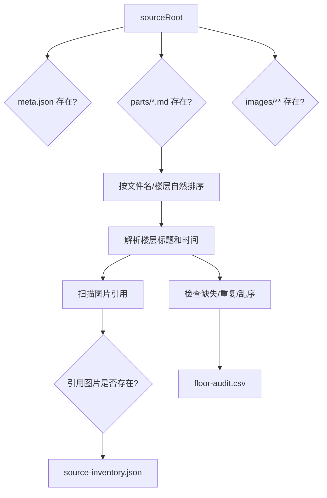

体检项目：

| 项目 | 规则 |
| --- | --- |
| `sourceRoot` | 必须是当前作品目录，不能把其他 opus 的审查结果混进来 |
| `meta.json` | 记录 opus id、标题、作者、来源；缺失时仍可解析，但 summary 必须标 warning |
| `parts/*.md` | 必须按楼层范围自然排序后拼接；不能靠文件系统返回顺序 |
| 编码 | 文本文件按 UTF-8 读写；发现乱码先停下来检查编码 |
| 换行 | 解析前统一 CRLF/LF，但 `sourceText` 保留原始内容 |
| 楼层标题 | 识别 `## 第N楼` 和 `> 时间: ...`；不匹配的块进入异常队列 |
| 楼层范围 | 检查缺失、重复、乱序、超出目标范围 |
| 图片引用 | 扫描 Markdown 图片语法，规范化 `../images/`、反斜杠和重复路径 |
| 图片文件 | 引用不存在时进入 `missing-image`，不能静默忽略 |
| 空楼层 | 保留楼层元数据，事件数为 0；是否进入导入由审查决定 |

`source-inventory.json` 建议记录：

```json
{
  "sourceRoot": "D:/gululu-cache/output/opus-88-owner-only-refetch-v3",
  "metaPath": "meta.json",
  "partsCount": 12,
  "imageFileCount": 3456,
  "referencedImageCount": 3200,
  "missingReferencedImages": [],
  "encodingWarnings": [],
  "generatedAt": "2026-06-06T00:00:00+08:00"
}
```

`floor-audit.csv` 至少包含：

| 字段 | 说明 |
| --- | --- |
| `floor` | 楼层号 |
| `partFile` | 来源 Markdown 文件 |
| `sourceTime` | 原帖时间 |
| `bodyLineCount` | 楼层正文行数 |
| `imageRefCount` | 图片引用数量 |
| `eventCount` | 清洗后事件数量 |
| `status` | `ok`、`missing`、`duplicate`、`parse-error`、`empty` |
| `notes` | 异常说明 |

### 原文证据层

原文清洗要保留事件和来源之间的映射。事件可改分类，但不能丢来源。

每条事件至少保留：

| 字段 | 说明 |
| --- | --- |
| `eventIndex` | 清洗后的稳定事件序号 |
| `floor` | 来源楼层 |
| `sourceTime` | 来源时间 |
| `sourceLineStart` / `sourceLineEnd` | 在楼层正文中的行号，能定位原文 |
| `sourceText` | 原始文本块 |
| `kind` | `scene`、`dialog`、`inferredDialog`、`narration`、`dice`、`bgm`、`nonPerformance` |
| `performanceUse` | `perform`、`metadata`、`reference`、`exclude` |
| `imagePath` | 当前事件绑定的原始图片路径 |
| `sceneId` | 当前作者场景标志产生的场景 ID |
| `reviewStatus` | `auto`、`needs-human-review`、`ai-confirmed`、`human-confirmed` |

硬约束：

- 楼层号、发布时间、作者和来源 URL 不作为演出消息，只保存在 source 元数据里。
- 事件序号必须在重生成时稳定；同样输入和同样 corrections 应生成同样 `eventIndex`。
- `event-corrections.csv` 必须按 `eventIndex`、`floor+sourceTextHash` 或等价稳定键回写。
- 被排除的作者说明也要保留为 `nonPerformance` 或审计记录，不能直接从事实层删除。

### 原文事件类型

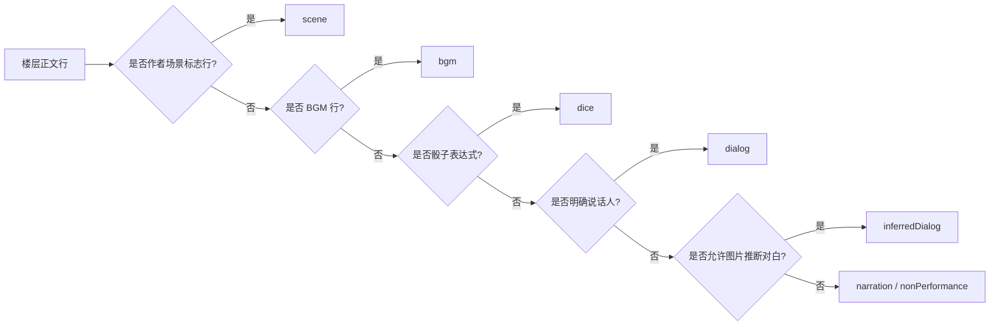

| 类型 | 来源 | 是否进入演出 | 备注 |
| --- | --- | --- | --- |
| `scene` | 作者场景标志行 | 不作为对白；作为场景元数据 | 后续可驱动背景/清场 |
| `dialog` | `角色：文本` | 是 | 保留原始 speaker，另存归一化 roleName |
| `inferredDialog` | 图片 + 高置信上下文 | 可选 | 默认需审查 |
| `narration` | 普通叙述 | 是 | 可转旁白或 intro |
| `dice` | 历史骰子和选项 | 是 | 不重新投骰 |
| `bgm` | `BGM：xxx` | 是，或保留事件 | 无音频时保留缺失项 |
| `nonPerformance` | 作者公告、格式说明、无关吐槽 | 否 | 保留来源，不进入演出 |

### 楼层拆分与事件顺序

楼层只是来源容器，不能被压平成一条消息。

规则：

- 一个楼层可以拆成多条 `dialog`、`narration`、`dice`、`bgm`、`scene`。
- 事件顺序按原文出现顺序排列；图片 Markdown 本身不是消息，但会影响后续文本的 `imagePath`。
- 空行可以触发旁白段落 flush，但不能打散骰子选项表。
- 同楼层连续骰子、骰子说明、选项表需要作为一个 `diceTurn` 审查。
- 同一楼层中途出现新的图片，后续文本绑定到新图片；前一张图片不应跨图片段继续生效。
- 没有图片的对白可以使用该角色默认头像作为导入 fallback，但 `content-events.json` 仍应标明原文事件没有图片。

### 说话人与角色别名

说话人解析只负责把文本标签转成候选角色，不负责最终角色事实。

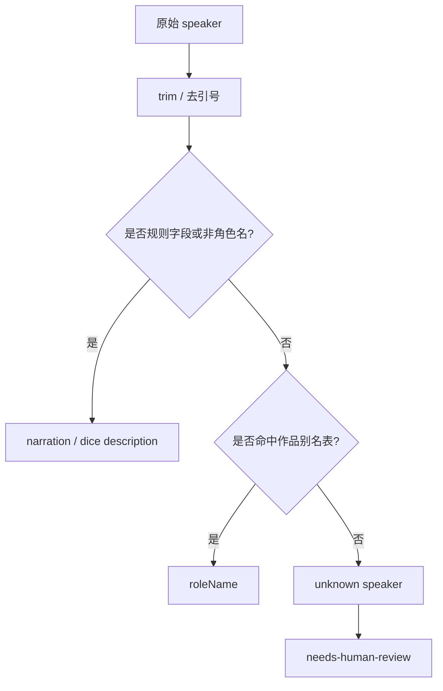

规则：

- `speakerName` 保留原帖显示名，例如 `师匠`、`神子`、`烈`。
- `roleName` 是导入角色卡使用的归一化名，例如 `八意永琳`、`丰聪耳神子`、`烈海王`。
- 别名表是作品级事实，不是全局事实；opus 88 的别名不能直接迁移到其他作品。
- 规则字段、技能名、状态名、数值字段不能误当角色说话人。
- `角色：“文本”`、`角色：文本` 可以作为明确对白；宽松引号格式必须进入抽样复核。
- 未知说话人不应自动创建正式角色卡，除非后续人工或 LLM 确认。

`speaker-aliases.csv` 建议记录：

| 字段 | 说明 |
| --- | --- |
| `speakerName` | 原帖说话人 |
| `roleName` | 归一化角色名 |
| `aliasSource` | `auto-rule`、`manifest`、`llm`、`human` |
| `count` | 出现次数 |
| `firstFloor` | 首次出现楼层 |
| `status` | `confirmed`、`needs-human-review`、`rejected` |
| `notes` | 说明 |

### 图片与消息绑定

图片绑定分成“原文共现”和“导入头像 fallback”两层，不能混淆。

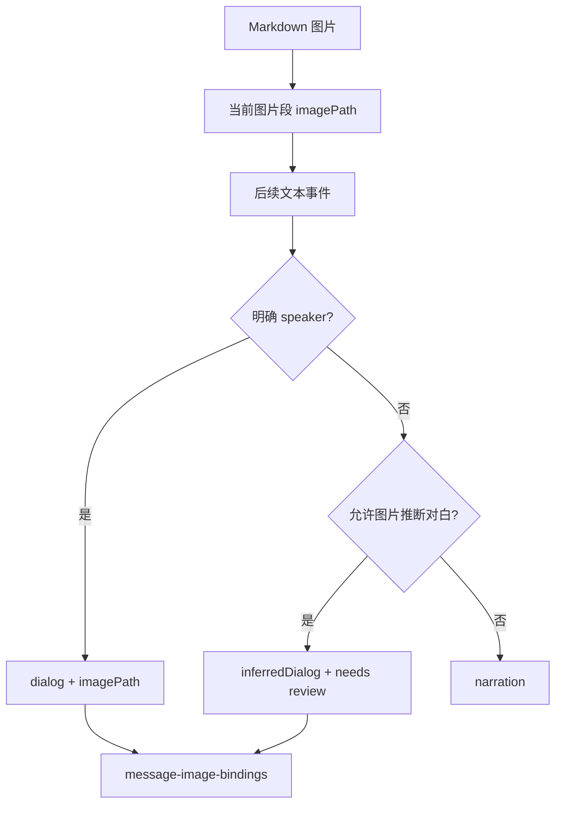

绑定规则：

- Markdown 图片自身不生成消息，除非后续 GAL directing 明确要求 `image.show`。
- 图片出现后，只影响同一图片段内后续文本。
- 明确说话人的对白可以记录 `imagePath`，但图片仍需通过图片审查才能成为头像资源。
- 没有明确说话人的文本，只有在图片有稳定角色证据时才可成为 `inferredDialog`。
- `inferredDialog` 默认 `reviewStatus=needs-human-review`，不能直接视为正式对白。
- 规则说明、作者吐槽、骰子选项旁的图片不能因为共现就绑定成角色头像。
- 如果图片被判为 `reference-only`、`manga-panel`、`background`、`author-asset` 或 `excluded`，对应对白不能使用它作为角色头像。

`message-image-bindings.csv` 建议记录：

| 字段 | 说明 |
| --- | --- |
| `eventIndex` | 事件序号 |
| `floor` | 楼层 |
| `sourceRelPath` | 原始图片路径 |
| `bindingKind` | `explicit-segment`、`default-avatar-fallback`、`inferred-from-image`、`directing-image-show` |
| `speakerName` | 原始说话人 |
| `roleName` | 归一化角色 |
| `imageDecisionStatus` | 图片审查状态 |
| `assetKind` | 图片用途 |
| `allowedAsAvatar` | 是否允许作为头像 |
| `reviewStatus` | `auto`、`ai-confirmed`、`needs-human-review`、`human-confirmed`、`rejected` |
| `notes` | 说明 |

### 场景标志规则

地点/背景信息只从作者单独添加的场景标志行产生。

应识别：

```text
~永远亭~
～永远亭～
——神灵庙——
~红魔馆门口~
～午饭后的神灵庙～
```

不应识别：

```text
神灵庙吗，是偏向人类方的势力呢。
神子：在神灵庙的门口出现了……
1 博丽神社
2 红魔馆
具体发生的地点是【1d10:10】
```

建议 `scene` 事件结构：

```json
{
  "kind": "scene",
  "floor": 84,
  "eventIndex": 1201,
  "sceneLabel": "午饭后的神灵庙",
  "locationName": "神灵庙",
  "source": "author-scene-marker",
  "sourceText": "～午饭后的神灵庙～"
}
```

字段规则：

| 字段 | 说明 |
| --- | --- |
| `sceneLabel` | 作者原始标题，保留“门口”“午饭后”“指挥部”等修饰 |
| `locationName` | 归一化主地点，用于背景匹配和场景归并 |
| `sourceText` | 原始标志行 |
| `source` | 固定为 `author-scene-marker` |

硬约束：

- 普通正文提到地点名，不产生 `scene`。
- 骰子选项中的地点名，只属于 dice options。
- 角色对白中的地点名，不产生 `scene`。
- 没有作者标志行时，不自动更新当前地点。
- 如需正文推断地点，必须另设 `inferredScene`，默认关闭，且不能覆盖作者标志。

### 骰子清洗

骰子是 replay 事实，不允许重投。

需要保留：

```text
diceTurn.command
diceTurn.options
diceTurn.replies
diceTurn.sourceText
```

示例：

```text
那么烈啊，你要去往何处呢【1d13：】

1 博丽神社
2 红魔馆
...
13 其他的势力
```

结果：

```text
那么烈啊，你要去往何处呢【1d13：9】
```

清洗规则：

- 骰子前说明尽量并入 `diceTurn.command`。
- 选项表不能拆成多条旁白。
- 嵌套骰要保留多段 `replies`。
- 大成功/大失败、重投、继续投不能压成单一结果。
- 选项中的地点名不产生 `scene`。

### BGM 清洗

BGM 是 replay 时间线事件，但音频资源必须单独匹配。

规则：

- `BGM：xxx`、`BGM: xxx` 生成 `bgm` 事件。
- BGM 行不作为旁白，也不作为角色对白。
- 没有本地音频 manifest 时，BGM 事件仍保留，并记录为 unresolved media。
- BGM 名称要保留原文，同时可另存归一化名用于匹配本地文件。
- 不自动从视频网站、音乐平台或游戏 OST 来源下载音频。
- 如果同名 BGM 多次出现，只生成一个资源匹配项，但每个时间线事件都要保留。

`bgm-manifest.csv` 建议记录：

| 字段 | 说明 |
| --- | --- |
| `eventIndex` | BGM 事件序号 |
| `floor` | 楼层 |
| `originalName` | 原文 BGM 名 |
| `normalizedName` | 归一化匹配名 |
| `matchStatus` | `unresolved`、`matched-local-file`、`ignored` |
| `localFilePath` | 用户提供的本地音频路径 |
| `mediaId` | 上传或复用后的资源 ID |
| `notes` | 缺失或版权说明 |

### 作者说明与规则说明

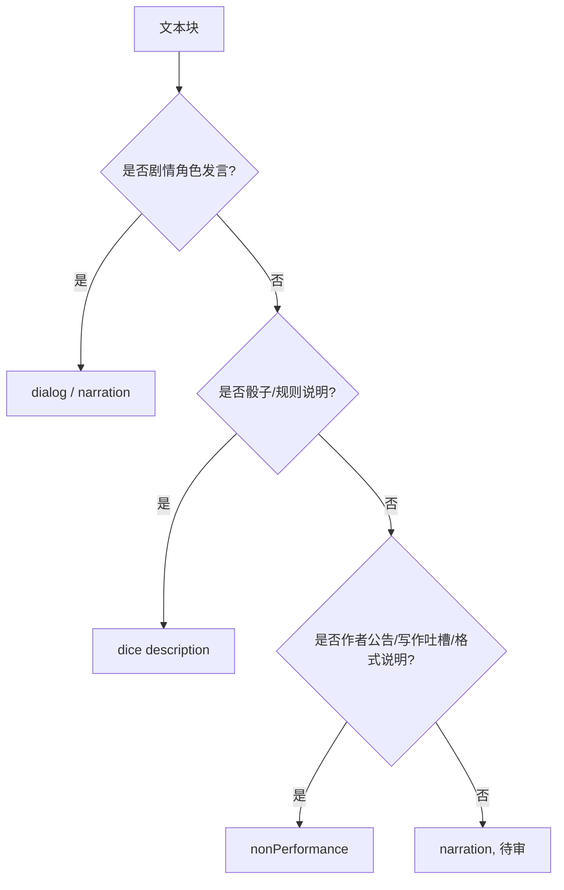

应进入 `nonPerformance` 的例子：

- 更新公告。
- 作者写作反思。
- 格式说明。
- “之后会怎么写”的 meta 说明。
- 和剧情无关的作者吐槽。

可保留为 `dice description` 的例子：

- 技能说明。
- 判定规则。
- 选项含义。
- 大成功/大失败说明。

## 二、图片清洗

### 图片清洗主流程

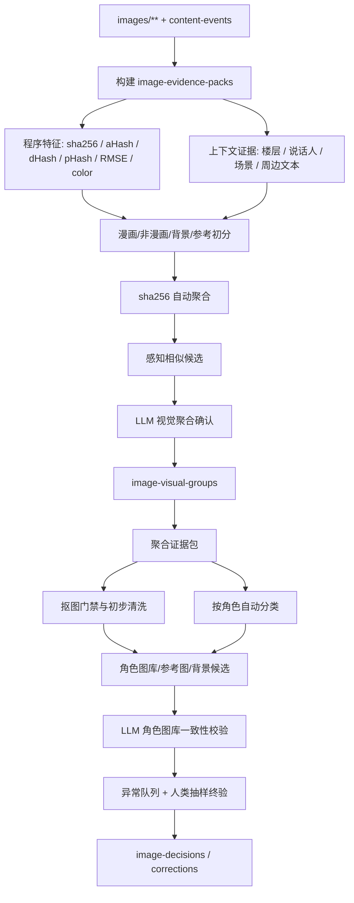

### 图片证据包

图片清洗要先建立证据包，再做用途、聚合、清洗和角色分类。证据包只描述“文件是什么、在哪里出现、上下文是什么、和哪些图片相似”，不直接决定最终角色归属。

每张原始图片至少保留：

| 字段 | 说明 |
| --- | --- |
| `sourceRelPath` | 图片相对 `sourceRoot` 的原始路径 |
| `absolutePath` | 本地绝对路径，只用于本机处理，不进入导入包 |
| `sourceUrl` | 原帖图片 URL，如导出中存在 |
| `firstFloor` | 第一次出现楼层 |
| `allFloors` | 所有出现楼层 |
| `contextBefore` / `contextAfter` | 图片前后文本窗口 |
| `nearbySpeakers` | 图片附近明确说话人 |
| `nearbyEvents` | 图片前后事件摘要 |
| `sceneLabel` / `locationName` | 图片出现时的作者场景 |
| `width` / `height` / `mime` / `fileSize` | 文件基础信息 |
| `sha256` | 物理去重键 |
| `featureRefs` | 指向感知特征记录 |
| `programTypeHints` | 程序初判，例如低彩度、黑白、透明、白底、截图 |

`image-evidence-packs.jsonl` 每行建议结构：

```json
{
  "sourceRelPath": "images/gululu/3438_a27d3f490aa6.png",
  "sha256": "image-sha256",
  "firstFloor": 84,
  "allFloors": [84, 91],
  "nearbySpeakers": ["烈"],
  "sceneLabel": "午饭后的神灵庙",
  "contextBefore": "……",
  "contextAfter": "烈：……",
  "programTypeHints": {
    "lowColor": true,
    "meanChroma": 0.02,
    "colorfulRatio": 0.01,
    "hasAlpha": false,
    "whiteBackgroundLikely": true
  },
  "featureRefs": ["image-feature-index.json#image-sha256"]
}
```

证据优先级：

1. 已批准 corrections 和 decisions。
2. 聚合后的多上下文证据包。
3. LLM 看图后写回的结构化视觉结论。
4. 图片附近明确说话人和当前剧情上下文。
5. `sha256` 聚合出的同图多上下文证据。
6. 路径名中的角色目录，且仅当路径确实包含角色信息时使用。
7. 感知相似候选，只能用于聚合候选和风险排队，不是角色事实。

路径规则：

- `images/gululu/<id>_<hash>.<ext>` 这类路径不含角色信息，不能从 `gululu` 推断角色。
- 历史整理目录如果出现 `东方/丰聪耳神子/...` 这类结构，可作为弱证据。
- 路径名和画面冲突时，以视觉审查结论为准。
- 同一 `sha256` 在不同上下文被判成不同角色时，必须进入 `needs-human-review` 或 `conflict`，不能静默选一个。

### 漫画/非漫画初分

漫画初分要尽量自动化，但不能只用“黑白”一条规则。

程序可先生成这些特征：

| 特征 | 用途 |
| --- | --- |
| `meanChroma` / `colorfulRatio` | 判断低彩度、黑白或灰度倾向 |
| `edgeDensity` | 漫画线稿、截图文字、复杂背景的辅助信号 |
| `textBubbleLikely` | 漫画对白气泡或文字区域提示 |
| `panelBorderLikely` | 漫画分镜边框提示 |
| `hasAlpha` | 透明底角色素材提示 |
| `whiteBackgroundLikely` | 可能需要抠图的白底角色素材提示 |
| `aspectRatio` / `cropTightness` | 头像裁切、漫画格、背景图的辅助信号 |

初分类建议：

| 初分类 | 定义 | 后续默认 |
| --- | --- | --- |
| `manga-like` | 低彩度、线稿/网点/分镜特征明显 | 交给 LLM 细分 `manga-avatar` / `manga-panel` / `reference-only` |
| `color-character-like` | 彩色角色、立绘、胸像、头像 | 进入非漫画角色素材流程 |
| `background-like` | 场景、建筑、纯背景 | 进入背景候选，不走角色抠图 |
| `reference-like` | 规则图、截图、作者说明、多人不可分 | 默认不进演出 |
| `uncertain` | 程序信号冲突 | 进入 LLM 类型判断 |

硬约束：

- “黑白”只是 `manga-like` 的强信号，不是充分条件。
- 低彩度立绘、灰度设定图、黑白截图不一定是漫画。
- 彩色漫画分镜也可能是 `manga-panel`。
- 漫画分类由 LLM 基于图像和上下文确认；确认后写入 `image-type-labels.csv`。
- `manga-avatar` 可以作为聊天头像候选，但永不抠图。
- `manga-panel` 默认 `reference-only`，不进入角色头像和舞台立绘。

### 先聚合再分类

图片角色分类必须消费聚合证据包，不应逐张孤立判断。

聚合顺序：

1. `sha256` 相同自动形成 `physicalDuplicate` 组。
2. 对唯一 hash 计算感知特征，生成相似候选。
3. LLM 看候选组和上下文，确认 `visualDuplicate`、`variantGroup`、`single`。
4. 将所有来源路径、楼层、上下文、说话人投票聚合到 `image-visual-groups`。
5. 后续抠图、角色分类、参考图排除都以聚合组为单位优先处理。

优势：

- 同一图片多次出现的上下文会叠加，角色归属更稳定。
- 重复图只需分类一次，降低 LLM 调用和人工抽查成本。
- 先发现差分组，避免把同角色表情差分误合并。
- 先确认漫画组，避免漫画头像进入抠图流程。

非漫画聚合要谨慎：

- 彩色立绘/头像相似默认先当 `variantGroup`，除非 LLM 明确确认没有表情、姿势、状态差异。
- 不同角色之间即使风格相近，也不能合并，只能进入异常队列。
- LLM 对 `visualDuplicate` 置信度不足时，保留为 `single` 或 `variantGroup`，不要为了降低成本强行合并。

### 按角色自动分类

角色分类发生在视觉聚合之后，输入是聚合证据包。

LLM/程序共同使用：

- 聚合组内所有 `nearbySpeakers` 和楼层上下文。
- 该组图片视觉内容。
- 作品级 `speaker-aliases.csv`。
- 已确认角色图库。
- 路径弱证据。
- 与其他角色图库的相似/冲突信息。

输出写入 `role-classification-candidates.csv`：

| 字段 | 说明 |
| --- | --- |
| `visualGroupId` | 聚合组 |
| `candidateRoleName` | 候选角色 |
| `assetKind` | 图片用途 |
| `renderUse` | `stage`、`chat-avatar`、`background`、`reference`、`none` |
| `confidence` | 0-1 |
| `evidenceSummary` | 主要证据 |
| `conflictReason` | 冲突原因 |
| `reviewStatus` | `ai-confirmed`、`needs-human-review`、`human-confirmed`、`rejected` |

人类不逐图分类。人类只看：

- `confidence` 低于阈值的角色分类。
- 同一视觉组出现多个角色候选。
- 某角色图库中混入明显风格/作品/人物不同的图。
- 每个高频角色抽样 contact sheet。

### `sha256` 物理去重

`sha256` 只回答一个问题：两个文件字节是否完全相同。

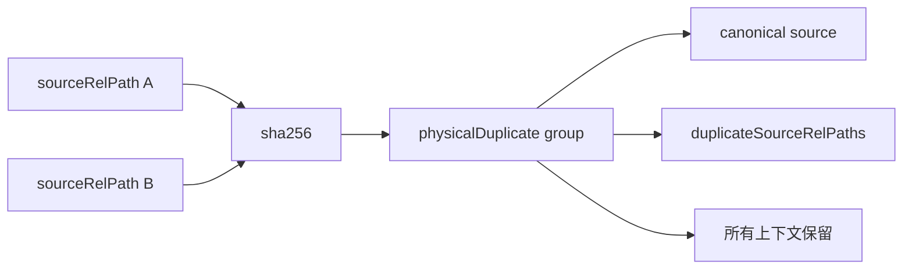

规则：

- `sha256` 相同可自动标记为 `physicalDuplicate`。
- 可以用硬链接节省磁盘，但不能删除原始路径，也不能改 Markdown 引用。
- 导入资源可以复用同一个 canonical 文件，但事件溯源必须保留每个 `sourceRelPath`。
- `corrections` 查找必须同时支持 `sourceRelPath` 和 `sha256`。
- 如果同一 `sha256` 有多个非空修正，以人工最近确认或更具体的 `sourceRelPath` 修正优先；冲突不能自动覆盖。
- 物理重复不是视觉判断，不说明“这张图适合作为头像”，只说明文件相同。

### 感知相似候选

你记得的 pHash 属于这一层。它和 `sha256` 不同：它用于发现“看起来可能相同或相近”的图片，但不能直接合并图片。

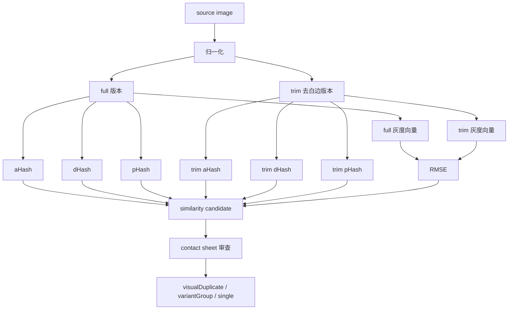

推荐特征：

| 特征 | 用途 | 限制 |
| --- | --- | --- |
| `aHash` | 快速发现整体亮度布局相近的图 | 对裁切、边框、局部差分较敏感 |
| `dHash` | 发现边缘和明暗梯度相近的图 | 不能区分细微表情语义 |
| `pHash` | 用 DCT 频域特征发现缩放、压缩后的近似图 | 当前脚本尚未实现为独立字段，需要补齐 |
| `RMSE` | 在统一尺寸灰度图上比较像素差异 | 对裁切和构图变化敏感 |
| `embedding` | 可选，用于更强的视觉语义相似检索 | 可能把同画风不同角色拉近，必须审查 |
| `full` / `trim` 双版本 | 同时比较原图和去白边图 | 去白边可能误删漫画边框或文字气泡 |

当前实现状态：

- `scripts/gululu-build-clean-human-images.mjs` 当前已有 `aHash`、`dHash`、`full/trim` 双版本灰度向量和 RMSE 辅助判断。
- 当前脚本有 `isSameMangaFrame`、`isNearIdenticalRaster`、`isColorVariantCandidate` 这类候选规则。
- 当前脚本没有真正命名为 `pHash` 的字段；本文把 `pHash` 写为目标流程中应补齐的同层感知特征。
- 因此，现阶段报告里如果写“pHash 已处理”是不准确的；应写“感知哈希候选已处理，当前为 aHash/dHash/RMSE，pHash 待补齐”。

感知候选输出建议：

| 字段 | 说明 |
| --- | --- |
| `sourceSha256` | 图片 A |
| `candidateSha256` | 图片 B |
| `sourceRelPath` | 图片 A 的代表路径 |
| `candidateRelPath` | 图片 B 的代表路径 |
| `candidateKind` | `near-identical`、`same-manga-frame-candidate`、`color-variant-candidate`、`uncertain-similar` |
| `featureSignals` | 命中的特征，例如 `dHash<=3;trimRmse<=34` |
| `sameCharacterCandidate` | 是否同一候选角色范围内发现 |
| `requiresReview` | 固定为 true，除 `sha256` 物理重复外都需要审查 |
| `reviewResult` | 审查后写入 `visualDuplicate`、`variantGroup`、`single`、`reject` |

硬约束：

- 感知哈希相近只能生成候选，不能自动删除图片。
- 感知哈希相近不能自动选 canonical。
- 漫画图相似必须确认是否同一漫画格，不可只看 dHash 或 pHash。
- 彩色立绘相似默认先按差分候选看待，不能因为 pHash 接近就合并。
- 不同角色之间的相似候选必须进入冲突队列，不能自动跨角色归并。
- `visualDuplicate` 减少上传数；`variantGroup` 不减少上传数。

### 图片用途分类

| `assetKind` | 定义 | 进演出 | 是否抠图 | 典型例子 |
| --- | --- | --- | --- | --- |
| `character-sprite` | 可上 WebGAL 舞台的角色立绘 | 是 | 按门禁处理，通常需要 | 全身/半身白底角色图 |
| `character-avatar-bust` | 半身/胸像角色头像，可能可上舞台 | 视 `renderUse` | 可抠 | 动漫胸像、角色半身图 |
| `character-avatar-chat` | 聊天小头像 | 是，仅聊天头像 | 默认不抠 | 小裁切头像、头像框 |
| `manga-avatar` | 漫画头像裁切，可代表角色 | 可作聊天头像 | 永不抠图 | 黑白漫画角色头部 |
| `manga-panel` | 漫画分镜/大幅画面 | 默认不进演出 | 永不抠图 | 战斗分镜、倒地图 |
| `background` | 明确背景候选 | 可进背景流程 | 不走角色抠图 | 神社、庭院、门口背景 |
| `reference-only` | 参考图，不进演出 | 否 | 永不抠图 | 规则图、剧情参考、多人图 |
| `author-asset` | 作者说明配图 | 否 | 永不抠图 | 作者吐槽图、公告图 |
| `excluded` | 排除 | 否 | 永不抠图 | 无关图、垃圾图 |
| `unknown` | 待审 | 否 | 不抠 | 信息不足 |

### `reference-only` 范围

`reference-only` 是“有审查价值但不进入演出”的素材证据层。

适用：

- 剧情参考图。
- 大幅漫画分镜，但需要回溯剧情。
- 战斗过程图、倒地图、受击图。
- 规则/技能/状态说明图。
- 作者吐槽配图，但仍有回溯价值。
- 多人图，不能稳定绑定到单个角色。
- 场景参考图，但尚未纳入背景流程。
- 低置信但不想丢弃的候选图。

不适用：

- 明确角色头像：应为 `character-avatar-*` 或 `manga-avatar`。
- 明确角色立绘：应为 `character-sprite`。
- 明确背景且准备进入演出：应为 `background`。
- 明确无关图：应为 `excluded`。

硬约束：

- 不参与头像选择。
- 不参与 `spriteTransform`。
- 不参与 matting。
- 不进入正式角色资源目录。
- 必须保留 `sourceRelPath`、楼层、上下文和 `notes`。

## 三、抠图门禁

### 决策字段

抠图不能只看 `assetKind`，需要同时看用途。

```json
{
  "assetKind": "character-avatar-bust",
  "renderUse": "stage",
  "mattingAllowed": true,
  "needsMatting": true,
  "mattingReason": "白底半身图，进入舞台显示"
}
```

字段说明：

| 字段 | 说明 |
| --- | --- |
| `assetKind` | 图片用途分类 |
| `renderUse` | `stage`、`chat-avatar`、`background`、`reference`、`none` |
| `mattingAllowed` | 此类图片是否允许抠图 |
| `needsMatting` | 当前图片是否实际需要抠图 |
| `mattingStatus` | `not-needed`、`pending`、`processed`、`rejected`、`approved` |
| `mattingReason` | 为什么抠或不抠 |

### 抠图决策图

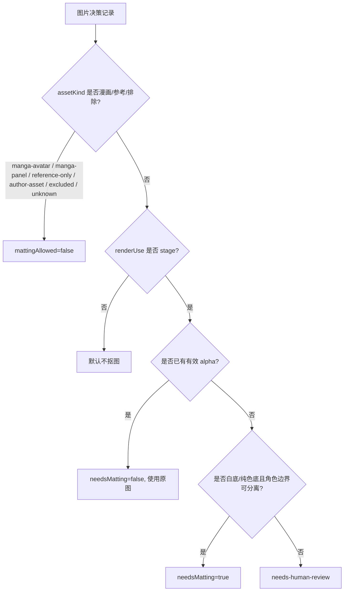

### 抠图规则表

| 分类 | `renderUse` | 默认 `mattingAllowed` | 默认 `needsMatting` |
| --- | --- | --- | --- |
| `character-sprite` | `stage` | true | 无 alpha 且白底时 true |
| `character-avatar-bust` | `stage` | true | 无 alpha 且白底时 true |
| `character-avatar-bust` | `chat-avatar` | false | false |
| `character-avatar-chat` | `chat-avatar` | false | false |
| `manga-avatar` | `chat-avatar` | false | false |
| `manga-panel` | `reference` | false | false |
| `background` | `background` | false | false |
| `reference-only` | `reference` | false | false |
| `author-asset` | `none` | false | false |
| `excluded` | `none` | false | false |
| `unknown` | `none` | false | false |

硬约束：

- 漫画头像即使是角色头像，也不抠图。
- 大幅漫画分镜不抠图。
- 聊天小头像默认不抠图。
- 只有进入舞台的角色立绘/胸像才考虑抠图。
- 已有 `matting-results.json` 不能被 clean 脚本无条件消费，必须先通过 `mattingAllowed=true`。
- QA 未通过的透明图不能进入正式导入。

### 错误案例归因

错误路径示例：

```text
by-character/烈海王/0085__3438_a27d3f490aa6__dup9__matted.png
by-character/烈海王/0108__5409_ce3e3b72c159__dup15__matted.png
by-character/烈海王/0102__426_bd28ff5d711d__dup4__matted.png
```

错误原因：

```text
漫画头像
-> 被标成 assetKind=avatar
-> 因白边和低彩度进入 shouldMatte=true
-> rembg 产出透明图
-> clean 阶段无条件消费 transparentRelPath
-> 生成 __matted.png
```

修正规则：

```text
漫画头像 -> manga-avatar
manga-avatar -> mattingAllowed=false
clean 阶段必须忽略已有 matting result
```

旧错误产物处理规则：

- 旧目录中的 `__matted.png` 不能作为事实层输入。
- 重新生成 clean 目录时，必须从 `images/**` 原图、`image-decisions`、`image-relations`、`matting-decisions` 出发。
- 如果旧 `__matted.png` 对应图片现在被判定为 `manga-avatar`、`manga-panel`、`reference-only`、`author-asset`、`excluded` 或 `unknown`，则旧透明图必须作废。
- 如果旧 `matting-results.json` 中存在透明图，但 `mattingAllowed=false`，clean 阶段必须忽略 `transparentRelPath`。
- 如果旧透明图仍可能有用，也必须重新经过 `mattingAllowed=true`、`needsMatting=true`、`qaStatus=approved` 三道门禁。
- 验收时应专门统计 `manga-avatar` 和 `manga-panel` 的 `__matted` 数量，必须为 0。

### 最终人工审查目录

以后人工最终审查不看中间 CSV、HTML 或未处理原图目录作为主入口，而看“已处理、已抠图、已聚合”的最终图片目录。

推荐目录名：

```text
<sourceRoot>/image-role-review-clean-vision-final/
```

生成规则：

- 目录必须由最新 `image-decisions.vision.csv`、`matting-decisions.vision.csv` 和 `matting-results.vision.json` 物化。
- `mattingAllowed=true && needsMatting=true` 的非漫画舞台素材，必须先运行 `rembg:isnet-anime`，再把透明 PNG 放入最终目录。
- `manga-avatar`、`manga-panel`、`reference-only`、`excluded`、`unknown` 不允许消费旧透明图，只复制原图。
- `physicalDuplicate`、`visualDuplicate` 默认聚合为一个代表图。
- `variantGroup` 默认保留差分，不强行压成一张。
- 最终目录必须包含 `index.csv` 和 `summary.json`，记录每张输出图的来源、聚合来源数、是否使用透明图、角色、分类和置信度。
- 如果该目录不存在，或里面仍是未抠图的 `needs-matting` 队列，就不能认为图片清洗流程已经跑完。

## 四、视觉重复与差分

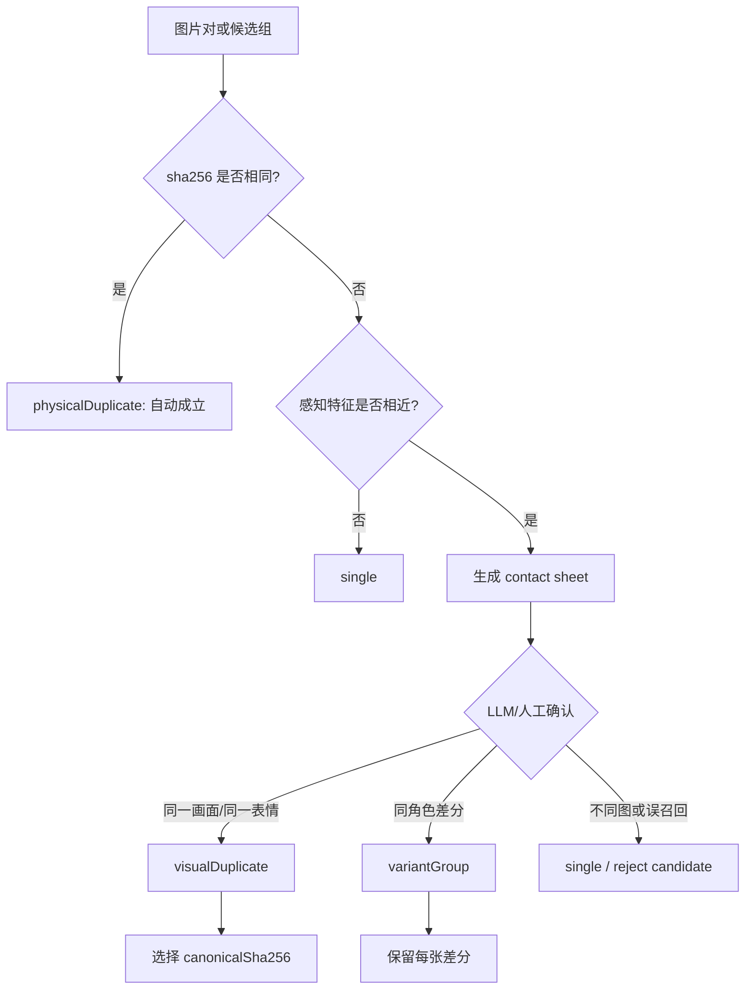

| 关系 | 是否减少上传 | 是否保留差分 | 说明 |
| --- | --- | --- | --- |
| `physicalDuplicate` | 是 | 否 | 文件完全相同 |
| `visualDuplicate` | 是 | 否 | 同一画面不同裁切/压缩，需人工/LLM 确认 |
| `variantGroup` | 否 | 是 | 表情、眼睛、嘴型、受伤状态等不同 |
| `single` | 否 | 是 | 独立图片 |

判定标准：

| 关系 | 可以自动判定吗 | 允许的依据 |
| --- | --- | --- |
| `physicalDuplicate` | 可以 | `sha256` 相同 |
| `visualDuplicate` | 不可以 | 感知候选 + 视觉确认同一画面、同一角色、同一表情或同一漫画格 |
| `variantGroup` | 不可以 | 视觉确认同角色、同构图或同基础立绘，但表情/动作/状态不同 |
| `single` | 可以作为默认 | 无相似候选，或候选被审查驳回 |

`visualDuplicate` 的 canonical 选择优先级：

1. 分辨率更高。
2. 裁切更完整，头发、帽子、手臂、道具不缺失。
3. 压缩噪声更少。
4. 没有明显文字气泡、边框、遮挡、截图 UI。
5. 和正文对白上下文最稳定共现。
6. 若以上相同，选择更早出现的 `sourceRelPath`，保证重生成稳定。

`variantGroup` 必须保留的差分：

- 睁眼/闭眼、嘴型、眉毛、脸红、汗、受伤、流血、倒地等状态差异。
- 彩色立绘的表情差分、姿势差分、服装差分。
- 同一漫画角色但不是同一格的不同截图。
- 同一角色在不同剧情状态下的图，例如战斗前、受伤后、特殊变身。

漫画图特殊规则：

- `manga-avatar` 可以参与视觉相似候选，但只作为候选进入审查。
- 黑白漫画的边框、网点、对白气泡容易让 hash 相近或相远，因此不能单靠 dHash/pHash/RMSE。
- 只有确认是同一漫画格的裁切、缩放、压缩版本，才能标为 `visualDuplicate`。
- 不同漫画格即使构图相似，也必须是 `single` 或 `variantGroup`，不能复用 canonical。
- 漫画图无论是 `visualDuplicate` 还是 `variantGroup`，都不改变“永不抠图”的规则。

彩色立绘特殊规则：

- 彩色立绘、白底半身、透明底角色图，相似候选默认先进入 `variantGroup` 待审。
- 只有确认没有表情/姿势/状态差异，只是裁切、缩放、压缩、格式转换，才能改成 `visualDuplicate`。
- 不能因为整体 pHash 接近就合并彩色差分。

输出行为：

- `physicalDuplicate` 和 `visualDuplicate` 可在导入阶段复用同一个 avatar/resource。
- `variantGroup` 只用于整理和审查，不减少上传数。
- `visualDuplicate` 被隐藏或复用时，仍要在 `visual-duplicates-removed.csv` 记录从哪个 `sourceRelPath` 复用哪个 canonical。
- 任何视觉关系都不删除 `images/**` 原图，也不改原始 Markdown 引用。

示例记录：

```json
{
  "sourceRelPath": "images/gululu/3438_a27d3f490aa6.png",
  "sha256": "source-sha256",
  "visualRelationType": "visualDuplicate",
  "visualGroupId": "烈海王-manga-frame-001",
  "canonicalSha256": "canonical-sha256",
  "relationReviewedBy": "llm",
  "relationStatus": "confirmed",
  "notes": "同一漫画头像的不同下载副本，画面和表情一致"
}
```

硬约束：

- `variantGroup` 不能合并为一个 canonical。
- 彩色立绘差分默认按 `variantGroup` 保留。
- 漫画图即使相似，也要确认是否同一格，不可只靠 dHash。
- 所有非 `sha256` 关系都必须能回溯到 contact sheet 或人工/LLM 审查记录。

## 五、背景与场景资源

场景标志和背景图片是两件事。

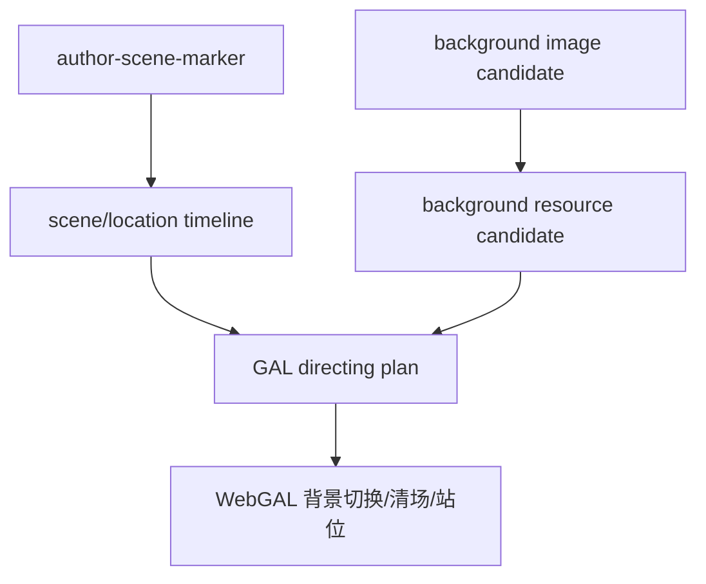

规则：

- `scene` 事件只说明当前地点/场景，不代表已有背景图。
- `background` 图片必须来自图片审查，不从角色头像里推断。
- 普通地点词不创建 `scene`。
- 背景图不走角色抠图流程。
- 没有背景图时，仍保留 `scene` 元数据，后续可用默认背景或不切背景。

## 六、审查表字段

### `event-corrections.csv`

保存对原文事件分类、演出用途和内容修正的人工/LLM 回写。它是原文清洗的 correction 层，不直接改 `parts/*.md`。

| 字段 | 必填 | 说明 |
| --- | --- | --- |
| `eventKey` | 是 | 稳定事件键，优先 `eventIndex`，必要时用 `floor+sourceTextHash` |
| `floor` | 是 | 楼层 |
| `sourceTextHash` | 是 | 原始文本块 hash，用于重生成后定位 |
| `originalKind` | 是 | 程序初判类型 |
| `correctedKind` | 否 | 修正后的 `scene`、`dialog`、`inferredDialog`、`narration`、`dice`、`bgm`、`nonPerformance` |
| `performanceUse` | 否 | `perform`、`metadata`、`reference`、`exclude` |
| `speakerName` | 否 | 修正后的原始说话人 |
| `roleName` | 否 | 修正后的归一化角色名 |
| `imagePath` | 否 | 修正后的绑定图片 |
| `sceneId` | 否 | 修正后的场景 |
| `reviewedBy` | 是 | `llm`、`human` |
| `status` | 是 | `confirmed`、`rejected`、`needs-human-review` |
| `notes` | 否 | 说明 |

### `speaker-aliases.csv`

保存作品级说话人归一化结果。导入角色卡只能消费这里或等价 manifest 中已确认的别名，不能直接使用全局硬编码别名作为最终事实。

| 字段 | 必填 | 说明 |
| --- | --- | --- |
| `speakerName` | 是 | 原帖显示名 |
| `roleName` | 是 | 归一化角色名 |
| `aliasSource` | 是 | `auto-rule`、`manifest`、`llm`、`human` |
| `count` | 否 | 出现次数 |
| `firstFloor` | 否 | 首次出现楼层 |
| `status` | 是 | `confirmed`、`needs-human-review`、`rejected` |
| `notes` | 否 | 说明 |

### `message-image-bindings.csv`

保存事件和图片之间的关系。它回答“这条事件原文附近是哪张图”，不等于“这张图可以导入为头像”。

| 字段 | 必填 | 说明 |
| --- | --- | --- |
| `eventIndex` | 是 | 事件序号 |
| `floor` | 是 | 楼层 |
| `sourceRelPath` | 否 | 原始图片路径 |
| `evidencePackId` | 否 | 对应图片证据包 ID |
| `visualGroupId` | 否 | 聚合后的视觉组 ID |
| `bindingKind` | 是 | `explicit-segment`、`default-avatar-fallback`、`inferred-from-image`、`directing-image-show` |
| `speakerName` | 否 | 原始说话人 |
| `roleName` | 否 | 归一化角色 |
| `imageDecisionStatus` | 否 | 图片审查状态 |
| `assetKind` | 否 | 图片用途分类 |
| `allowedAsAvatar` | 是 | 是否允许作为头像资源 |
| `reviewStatus` | 是 | `auto`、`ai-confirmed`、`needs-human-review`、`human-confirmed`、`rejected` |
| `notes` | 否 | 说明 |

### `bgm-manifest.csv`

保存 BGM 时间线事件和本地音频资源匹配结果。

| 字段 | 必填 | 说明 |
| --- | --- | --- |
| `eventIndex` | 是 | BGM 事件序号 |
| `floor` | 是 | 楼层 |
| `originalName` | 是 | 原文 BGM 名 |
| `normalizedName` | 是 | 归一化匹配名 |
| `matchStatus` | 是 | `unresolved`、`matched-local-file`、`ignored` |
| `localFilePath` | 否 | 用户提供的本地音频路径 |
| `mediaId` | 否 | 上传或复用后的资源 ID |
| `notes` | 否 | 缺失、版权或匹配说明 |

### `image-evidence-packs.jsonl`

保存每张原始图片的证据包。它是图片 AI 判断的输入层，不是最终分类结果。

| 字段 | 必填 | 说明 |
| --- | --- | --- |
| `evidencePackId` | 是 | 稳定证据包 ID，建议由 `sha256 + sourceRelPathHash` 生成 |
| `sourceRelPath` | 是 | 原始图片相对路径 |
| `sha256` | 是 | 物理去重键 |
| `firstFloor` | 否 | 首次出现楼层 |
| `allFloors` | 否 | 所有出现楼层 |
| `nearbyEvents` | 否 | 图片前后事件摘要 |
| `nearbySpeakers` | 否 | 图片附近明确说话人 |
| `contextBefore` / `contextAfter` | 否 | 原文上下文窗口 |
| `sceneId` / `sceneLabel` / `locationName` | 否 | 图片出现时的作者场景标志 |
| `sourcePostMeta` | 否 | 作者、时间、来源 URL 等回溯信息 |
| `programTypeHints` | 否 | 程序特征提示，例如低彩度、白底、透明、截图、疑似分镜 |
| `featureRefs` | 否 | 指向 `image-feature-index.json` 或向量文件 |
| `referencedByEventIndexes` | 否 | 关联事件序号 |

硬约束：

- 每次 LLM 判断图片时，输入必须包含证据包或聚合证据包。
- 证据包可以重复指向同一 `sha256`，但不能丢失不同 `sourceRelPath` 的上下文。
- 证据包只描述证据，不写最终 `assetKind`、角色或抠图结论。

### `image-type-labels.csv`

保存图片类型初分和 LLM 类型确认结果。它先于角色分类产生，用于阻止漫画图进入抠图流程。

| 字段 | 必填 | 说明 |
| --- | --- | --- |
| `evidencePackId` | 是 | 证据包 ID |
| `sourceRelPath` | 是 | 原始图片代表路径 |
| `sha256` | 是 | 图片 hash |
| `programTypeHint` | 否 | 程序初判：`manga-like`、`color-character-like`、`background-like`、`reference-like`、`uncertain` |
| `llmTypeLabel` | 否 | LLM 确认：`manga-avatar`、`manga-panel`、`character-sprite`、`character-avatar-bust`、`character-avatar-chat`、`background`、`reference-only`、`author-asset`、`excluded`、`unknown` |
| `assetKind` | 是 | 当前采用的图片用途分类 |
| `renderUse` | 是 | `stage`、`chat-avatar`、`background`、`reference`、`none` |
| `confidence` | 是 | 0-1 |
| `evidenceSummary` | 是 | 类型判断依据 |
| `reviewRunId` | 否 | 对应 `ai-review-runs.json` |
| `reviewStatus` | 是 | `ai-confirmed`、`needs-human-review`、`human-confirmed`、`rejected` |

硬约束：

- `assetKind=manga-avatar` 或 `manga-panel` 时，后续 `mattingAllowed` 必须为 false。
- `programTypeHint=manga-like` 不能自动等同于漫画，必须有 LLM 或人工确认。
- `unknown` 不进入头像、背景或抠图正式资源线。

### `image-visual-groups.csv`

保存 sha256 和感知相似候选经过 LLM/人工确认后的视觉聚合结果。后续角色分类优先以 `visualGroupId` 为单位运行。

| 字段 | 必填 | 说明 |
| --- | --- | --- |
| `visualGroupId` | 是 | 视觉组 ID |
| `groupRelationType` | 是 | `physicalDuplicate`、`visualDuplicate`、`variantGroup`、`single` |
| `canonicalSha256` | 否 | 复用 canonical；`variantGroup` 不得用它减少上传 |
| `canonicalRelPath` | 否 | canonical 代表路径 |
| `memberSha256s` | 是 | 组内 hash 列表 |
| `memberSourceRelPaths` | 是 | 组内来源路径列表 |
| `memberEvidencePackIds` | 是 | 组内证据包列表 |
| `aggregatedFloors` | 否 | 聚合后的楼层列表 |
| `aggregatedSpeakers` | 否 | 聚合后的说话人证据 |
| `aggregatedScenes` | 否 | 聚合后的场景证据 |
| `assetKindSummary` | 否 | 组内类型分布 |
| `relationConfidence` | 是 | 视觉聚合置信度 |
| `reviewedBy` | 是 | `program`、`llm`、`human` |
| `reviewRunId` | 否 | 对应 AI 审查运行 |
| `contactSheetPath` | 否 | 用于复核的图板 |
| `conflictReason` | 否 | 冲突说明 |
| `reviewStatus` | 是 | `auto`、`ai-confirmed`、`needs-human-review`、`human-confirmed`、`rejected` |

硬约束：

- `physicalDuplicate` 可以由程序自动确认。
- `visualDuplicate` 必须有 LLM 或人工确认，除非另有明确高精度视觉验证规则。
- `variantGroup` 只聚合证据，不减少上传数。
- 组内出现漫画/非漫画、角色、场景互相冲突时，必须进入异常队列。

### `role-classification-candidates.csv`

保存视觉组到角色/用途的自动分类候选。它是角色分类的候选层，最终导入仍消费 `image-decisions.csv` 中已确认的结论。

| 字段 | 必填 | 说明 |
| --- | --- | --- |
| `visualGroupId` | 是 | 聚合组 |
| `candidateRoleName` | 否 | 候选角色；背景、参考图可为空 |
| `assetKind` | 是 | 图片用途 |
| `renderUse` | 是 | `stage`、`chat-avatar`、`background`、`reference`、`none` |
| `locationName` | 否 | 背景候选地点 |
| `confidence` | 是 | 0-1 |
| `evidencePackIds` | 是 | 主要证据包 |
| `speakerEvidence` | 否 | 说话人/别名证据摘要 |
| `visualEvidence` | 否 | 视觉证据摘要 |
| `pathEvidence` | 否 | 路径弱证据摘要 |
| `conflictReason` | 否 | 多角色、路径冲突、风格冲突等 |
| `reviewRunId` | 否 | 对应 AI 审查运行 |
| `reviewStatus` | 是 | `ai-confirmed`、`needs-human-review`、`human-confirmed`、`rejected` |

### `ai-review-runs.json`

保存每次 LLM 审查的可追溯记录，避免只留下结论而无法复盘。

| 字段 | 必填 | 说明 |
| --- | --- | --- |
| `reviewRunId` | 是 | 审查运行 ID |
| `taskKind` | 是 | `image-type-labeling`、`visual-grouping`、`role-classification`、`matting-qa`、`anomaly-review`、`sampling-review` |
| `inputRefs` | 是 | 输入文件、证据包、contact sheet 或视觉组引用 |
| `outputRefs` | 是 | 输出 CSV/JSON 引用 |
| `model` | 是 | 使用的模型 |
| `promptVersion` | 是 | prompt 版本 |
| `confidencePolicy` | 否 | 自动确认阈值策略 |
| `startedAt` / `finishedAt` | 否 | 运行时间 |
| `status` | 是 | `succeeded`、`partial`、`failed` |
| `errorSummary` | 否 | 429、解析失败或输出校验失败摘要 |

### `image-decisions.csv`

保存最终图片决策索引。它应由证据包、类型标签、视觉组、角色候选和抠图门禁综合生成，不应由人工直接逐图填写。

| 字段 | 必填 | 说明 |
| --- | --- | --- |
| `sourceRelPath` | 是 | 原始图片相对路径 |
| `sha256` | 是 | 物理去重键 |
| `evidencePackId` | 是 | 证据包 ID |
| `visualGroupId` | 是 | 视觉组 ID |
| `allSourceRelPaths` | 否 | 同一 `sha256` 的所有来源路径，JSON 数组或分号分隔 |
| `duplicateSourceRelPaths` | 否 | 除代表图外的物理重复路径 |
| `decisionStatus` | 是 | `ai-confirmed`、`human-confirmed`、`needs-human-review`、`reference-only`、`excluded` |
| `assetKind` | 是 | 图片用途分类 |
| `renderUse` | 是 | `stage`、`chat-avatar`、`background`、`reference`、`none` |
| `character` | 否 | 最终角色；正式导入时应来自聚合后确认结论 |
| `candidateRoleName` | 否 | AI 候选角色 |
| `roleConfidence` | 否 | 角色归属置信度 |
| `visualStatus` | 是 | `unreviewed`、`ai-confirmed`、`human-confirmed`、`rejected`、`conflict` |
| `locationName` | 否 | 背景/地点候选 |
| `mattingAllowed` | 是 | 是否允许抠图 |
| `needsMatting` | 是 | 是否需要抠图 |
| `mattingStatus` | 是 | `not-needed`、`pending`、`processed`、`approved`、`rejected`、`skipped-existing-alpha` |
| `visualRelationType` | 是 | `single`、`physicalDuplicate`、`visualDuplicate`、`variantGroup` |
| `canonicalSha256` | 否 | 复用 canonical |
| `relationStatus` | 是 | `auto`、`candidate`、`confirmed`、`rejected` |
| `relationReviewedBy` | 否 | `program`、`llm`、`human` |
| `featureCandidateCount` | 否 | 感知相似候选数量 |
| `aiReviewRunIds` | 否 | 参与该结论的 AI 审查运行 |
| `confidence` | 否 | 综合置信度 |
| `anomalyStatus` | 否 | `none`、`queued`、`resolved` |
| `samplingStatus` | 否 | `not-sampled`、`sampled-pending`、`sampled-approved`、`sampled-rejected` |
| `exclude` | 是 | 是否排除 |
| `evidenceSummary` | 否 | 角色/用途判断的主要证据摘要 |
| `notes` | 否 | 审查说明 |

### `image-feature-index.json`

保存每个 `sha256` 的感知特征，供重生成和调试使用。特征文件是证据层，不应被人工直接当成最终决策。

建议结构：

```json
{
  "sha256": "image-sha256",
  "representativeSourceRelPath": "images/gululu/3438_a27d3f490aa6.png",
  "width": 512,
  "height": 512,
  "fullAHash": "123",
  "fullDHash": "456",
  "fullPHash": null,
  "trimAHash": "789",
  "trimDHash": "101112",
  "trimPHash": null,
  "fullVectorRef": "vectors/image-sha256-full.gray16.json",
  "trimVectorRef": "vectors/image-sha256-trim.gray16.json",
  "featureVersion": "aHash-dHash-rmse-v1",
  "notes": "当前脚本未实现独立 pHash，字段保留为待补齐"
}
```

字段规则：

- `full*` 特征基于原图归一化版本。
- `trim*` 特征基于去白边或裁切边缘后的版本。
- `pHash` 未实现时必须写 `null` 或省略，并在 `featureVersion` 或报告中说明，不能伪装成已计算。
- 特征版本变化时，必须刷新相似候选报告，避免旧阈值和新特征混用。

### `image-similarity-candidates.csv`

保存感知相似候选。这里的每一行都只是“需要看”的候选，不是最终视觉关系。

| 字段 | 必填 | 说明 |
| --- | --- | --- |
| `candidateGroupId` | 是 | 候选组 ID |
| `sourceSha256` | 是 | 图片 A |
| `candidateSha256` | 是 | 图片 B |
| `sourceRelPath` | 是 | 图片 A 代表路径 |
| `candidateRelPath` | 是 | 图片 B 代表路径 |
| `candidateKind` | 是 | `near-identical`、`same-manga-frame-candidate`、`color-variant-candidate`、`uncertain-similar` |
| `hashDistanceMin` | 否 | `aHash`/`dHash`/`pHash` 的最小汉明距离 |
| `fullRmse` | 否 | full 灰度向量 RMSE |
| `trimRmse` | 否 | trim 灰度向量 RMSE |
| `featureSignals` | 是 | 命中的阈值或规则 |
| `sourceAssetKind` | 否 | 图片 A 当前用途 |
| `candidateAssetKind` | 否 | 图片 B 当前用途 |
| `sameCharacterCandidate` | 否 | 是否同一候选角色 |
| `requiresReview` | 是 | 除 `sha256` 物理重复外固定为 true |
| `reviewResult` | 否 | 审查后写 `visualDuplicate`、`variantGroup`、`single`、`reject` |
| `reviewNotes` | 否 | 审查说明 |

### `image-relations.csv`

保存最终视觉关系。导入脚本应只消费这里或 `image-decisions.csv` 中已确认的关系，不直接消费相似候选。

| 字段 | 必填 | 说明 |
| --- | --- | --- |
| `sourceSha256` | 是 | 当前图片 |
| `sourceRelPath` | 是 | 当前图片代表路径 |
| `visualRelationType` | 是 | `single`、`physicalDuplicate`、`visualDuplicate`、`variantGroup` |
| `visualGroupId` | 否 | 视觉组 ID |
| `canonicalSha256` | 否 | `physicalDuplicate` 或 `visualDuplicate` 的 canonical |
| `canonicalRelPath` | 否 | canonical 代表路径 |
| `relationStatus` | 是 | `auto`、`confirmed`、`rejected` |
| `relationReviewedBy` | 是 | `program`、`llm`、`human` |
| `contactSheetPath` | 否 | 审查图板路径 |
| `notes` | 否 | 说明 |

### `matting-decisions.csv`

保存抠图门禁和 QA 结果。clean 阶段必须读取这张表或等价 JSON，不允许只因为存在透明图文件就使用。

| 字段 | 必填 | 说明 |
| --- | --- | --- |
| `sourceRelPath` | 是 | 原始图片 |
| `sha256` | 是 | 图片 hash |
| `assetKind` | 是 | 图片用途 |
| `renderUse` | 是 | 演出用途 |
| `mattingAllowed` | 是 | 是否允许抠图 |
| `needsMatting` | 是 | 是否需要抠图 |
| `mattingStatus` | 是 | `not-needed`、`pending`、`processed`、`approved`、`rejected`、`skipped-existing-alpha` |
| `mattingModel` | 否 | 例如 `rembg:isnet-anime` |
| `transparentRelPath` | 否 | 透明图路径 |
| `alphaMaskRelPath` | 否 | mask 路径 |
| `qaStatus` | 是 | `not-required`、`pending`、`approved`、`rejected` |
| `qaReason` | 否 | QA 说明 |

### `anomaly-queue.csv`

保存 AI-first 流程中真正需要人类看的异常。它不是 unknown 全量池，而是经过程序和 LLM 收敛后的少量复核队列。

| 字段 | 必填 | 说明 |
| --- | --- | --- |
| `anomalyId` | 是 | 异常 ID |
| `anomalyKind` | 是 | `low-confidence-type`、`visual-group-conflict`、`role-conflict`、`matting-gate-violation`、`gallery-consistency-failed`、`background-reference-conflict`、`ai-output-invalid` |
| `severity` | 是 | `blocker`、`warning`、`info` |
| `evidencePackIds` | 否 | 相关证据包 |
| `visualGroupId` | 否 | 相关视觉组 |
| `candidateRoleNames` | 否 | 冲突角色 |
| `sourceRelPaths` | 否 | 相关原始图片路径 |
| `confidence` | 否 | 触发异常的置信度 |
| `conflictReason` | 是 | 异常原因 |
| `suggestedAction` | 否 | 建议动作 |
| `reviewStatus` | 是 | `queued`、`human-confirmed`、`human-corrected`、`rejected` |
| `resolutionRef` | 否 | 写回的 corrections/decisions 记录 |
| `notes` | 否 | 说明 |

### `final-sampling-review.csv`

保存最终抽样校验结果。抽样只用于发现系统性错误，不用于替代全量自动分类。

| 字段 | 必填 | 说明 |
| --- | --- | --- |
| `sampleId` | 是 | 抽样记录 ID |
| `sampleKind` | 是 | `role-gallery`、`asset-kind`、`visual-duplicate`、`variant-group`、`matting-qa`、`excluded-reference` |
| `targetKey` | 是 | 角色名、`assetKind`、`visualGroupId` 或 QA 批次 |
| `sampleSize` | 是 | 样本数量 |
| `sampleSource` | 是 | `top-frequency`、`random`、`risk-weighted` |
| `sampleRefs` | 是 | 样本图片、视觉组或 contact sheet |
| `reviewedBy` | 是 | `human` |
| `reviewStatus` | 是 | `sampled-approved`、`sampled-rejected`、`needs-more-sampling` |
| `failureSummary` | 否 | 发现的系统性错误 |
| `followupAction` | 否 | 退回的规则或 AI 审查步骤 |
| `notes` | 否 | 说明 |

### `summary.json`

至少统计：

- `sourceRoot`、目标楼层范围、实际解析楼层数。
- `parts/*.md` 数量、楼层缺失/重复/乱序/解析失败数量。
- 图片引用数、引用缺失图片数、未被正文引用但存在的图片数。
- `dialog`、`inferredDialog`、`narration`、`dice`、`bgm`、`scene`、`nonPerformance` 数量。
- 未确认说话人数量、别名待审数量、被拒绝别名数量。
- `inferredDialog` 总数、已确认数、被拒绝数、待审数。
- BGM 事件数、唯一 BGM 名称数、本地匹配数、unresolved 数。
- 图片总数、证据包数量、唯一 `sha256` 数、`physicalDuplicate` 组数。
- `image-type-labels` 数量、各 `programTypeHint` 数量、各 `assetKind` 数量。
- 感知相似候选数、已审查候选数、驳回候选数。
- `image-visual-groups` 总数、自动组数、AI 确认组数、待人类复核组数。
- `visualDuplicate` 组数、被复用图片数、canonical 数。
- `variantGroup` 组数、差分图片数。
- `role-classification-candidates` 数量、AI 自动确认数量、低置信数量、角色冲突数量。
- `manga-avatar`、`manga-panel` 中 `needsMatting=true` 的数量，必须为 0。
- `mattingAllowed=true`、`needsMatting=true`、QA 通过、QA 拒绝数量。
- `reference-only`、`background`、`excluded`、`unknown` 数量。
- `ai-review-runs` 成功、部分成功、失败、429 重试数量。
- 异常队列数量、已解决数量、仍待人类终验数量。
- 抽样包数量、抽样通过数量、抽样拒绝数量。
- `needs-human-review` 和 `conflict` 数量。

### `scene-events.csv`

| 字段 | 必填 | 说明 |
| --- | --- | --- |
| `floor` | 是 | 楼层 |
| `eventIndex` | 是 | 事件序号 |
| `sceneLabel` | 是 | 作者原始场景标题 |
| `locationName` | 是 | 归一化地点 |
| `sourceText` | 是 | 原始标志行 |
| `source` | 是 | 固定 `author-scene-marker` |
| `notes` | 否 | 歧义说明 |

### `content-events.json`

每条事件建议保留：

```json
{
  "eventIndex": 1201,
  "floor": 84,
  "kind": "dialog",
  "performanceUse": "perform",
  "content": "……",
  "speakerName": "神子",
  "roleName": "丰聪耳神子",
  "inferred": false,
  "imagePath": "gululu/example.png",
  "imageBindingKind": "explicit-segment",
  "sceneId": "scene-shinreibyou-001",
  "sourceTime": "2022-01-22 20:40",
  "sourceLineStart": 12,
  "sourceLineEnd": 12,
  "sourceText": "神子：……",
  "sourceTextHash": "sha256-of-source-text",
  "reviewStatus": "auto"
}
```

`dice` 事件额外保留：

```json
{
  "eventIndex": 1202,
  "kind": "dice",
  "diceTurn": {
    "command": "那么烈啊，你要去往何处呢【1d13：】",
    "options": ["1 博丽神社", "2 红魔馆"],
    "replies": ["那么烈啊，你要去往何处呢【1d13：9】"],
    "sourceText": "那么烈啊，你要去往何处呢【1d13：】\n1 博丽神社\n2 红魔馆\n..."
  },
  "performanceUse": "perform",
  "reviewStatus": "needs-human-review"
}
```

`bgm` 事件额外保留：

```json
{
  "eventIndex": 1203,
  "kind": "bgm",
  "bgmName": "远野幻想物语",
  "bgmMatchStatus": "unresolved",
  "performanceUse": "perform",
  "sourceText": "BGM：远野幻想物语"
}
```

## 七、执行顺序

建议每次按同一顺序重生成，避免先看派生产物造成误判。

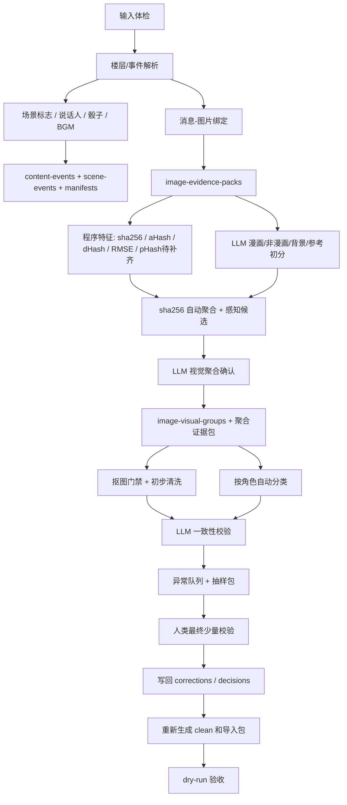

执行规则：

- 先跑输入体检，再讨论图片和导入；源目录不可靠时不继续。
- 原文事件、图片证据包、类型标签、视觉组、角色候选、抠图决策分别输出，不互相覆盖。
- 先生成证据包，再做 LLM 判断；不能把孤立图片直接送去分类。
- 先聚合图片，再按角色分类；不能逐图分类后再合并。
- LLM 审查只写回 CSV/JSON，并在 `ai-review-runs.json` 留痕。
- 人类只处理异常队列和抽样包，不承担逐图分类。
- 人工修正只写回 CSV/JSON，不手改 clean 目录作为事实。
- 每轮规则变更后重新生成 summary，并比较关键数量变化。
- dry-run 通过前不做 live import；live import 后仍要保留本轮清洗报告。

## 八、AI 结果复核与人类终验视图

建议复核页面至少分成这些 tab：

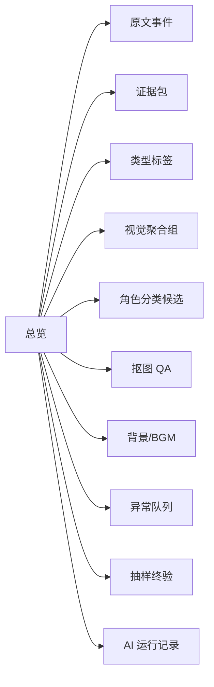

### 总览

显示：

- 楼层范围。
- 事件数量。
- `scene` 数量。
- `dialog` / `inferredDialog` / `dice` / `bgm` / `nonPerformance` 数量。
- 楼层缺失、重复、解析失败数量。
- 未确认说话人和待审别名数量。
- BGM unresolved 数量。
- 图片总数。
- 证据包数量。
- 各 `assetKind` 数量。
- `physicalDuplicate`、`visualDuplicate`、`variantGroup` 数量。
- 感知相似候选数量、已审查数量、驳回数量。
- 视觉组数量、AI 确认数量、待人类复核数量。
- 角色分类候选数量、自动通过数量、低置信数量、冲突数量。
- 抠图候选数量。
- 漫画图错误抠图数量，必须为 0。
- 异常队列数量。
- 抽样终验通过/拒绝数量。
- AI 运行失败和 429 重试数量。
- 已确认/待审/排除数量。

### 原文事件审查

每条事件显示：

- 楼层和来源行。
- 事件类型。
- 当前 `sceneLabel`。
- 当前图片。
- 是否进入演出。
- `inferredDialog` 标记和审查状态。
- 对应 `event-corrections` 状态。
- 修正入口。

### 证据包复核

显示：

- 原图和 `sourceRelPath`。
- `sha256`、尺寸、文件大小和基础特征。
- 楼层、来源时间、作者、URL。
- 图片前后文本窗口。
- 附近说话人、当前场景标志、关联事件。
- 程序类型提示。
- 进入后续 LLM 审查的输入摘要。

### 类型标签复核

显示：

- 原图、上下文和程序初判。
- LLM 类型标签、`assetKind`、`renderUse`。
- `confidence` 和 `evidenceSummary`。
- 漫画/非漫画边界提示。
- 一键标记 `manga-avatar`、`manga-panel`、`character-*`、`background`、`reference-only`、`excluded`。
- `manga-avatar` 和 `manga-panel` 的 `mattingAllowed=false` 校验。

### 视觉聚合组复核

每个组显示：

- 组内所有图片、canonical 候选和来源路径。
- 组内所有证据包摘要、楼层、说话人和场景。
- `sha256`、`aHash`、`dHash`、`pHash`、RMSE 或 embedding 命中信号；未实现的特征必须显示为空或待补齐。
- full/trim 两种视图的缩略图。
- 关系结论：`physicalDuplicate`、`visualDuplicate`、`variantGroup`、`single`。
- canonical 选择入口和理由。
- 冲突原因和 LLM 置信度。

复核要求：

- 默认只把 `sha256` 相同的组视为自动成立。
- 其他相似组必须 LLM 或人工确认。
- 漫画相似组必须能放大看同一格细节。
- 彩色立绘相似组必须重点看眼睛、嘴型、眉毛、状态和服装差异。
- `variantGroup` 必须显示“不会减少上传”。

### 角色分类候选复核

每个角色候选显示：

- `visualGroupId` 和组内代表图。
- 候选角色、候选用途和 `renderUse`。
- 说话人证据、视觉证据、路径弱证据。
- 和已确认角色图库的相似/冲突提示。
- 置信度、冲突原因和 `reviewStatus`.
- 一键确认、改角色、改用途、标记参考、标记排除、送异常队列。

人类只复核：

- 低于阈值的候选。
- 同组多角色冲突。
- 高频角色抽样图板。
- AI 一致性校验指出的混入图。

### 抠图 QA

只显示：

- `mattingAllowed=true`
- `needsMatting=true`
- 或已有 matting result 但被规则拒绝的图

必须能看到：

- 原图。
- 透明图。
- alpha mask。
- QA 结论。
- 拒绝原因。
- 是否来自旧 `__matted.png`，以及是否被作废。

### 背景/BGM 复核

显示：

- 作者场景标志事件和归一化地点。
- 背景图片候选、证据包和 LLM 置信度。
- 普通正文地点词是否被误切场。
- 原文 BGM 名称、出现楼层和事件序号。
- 本地匹配状态、缺失 BGM 清单、是否暂以文本事件保留。

### 异常队列

只收敛需要人类看的问题：

- 低置信类型标签。
- 低置信视觉聚合。
- 同一视觉组多角色冲突。
- 角色图库一致性校验失败。
- 漫画图出现 `needsMatting=true` 或旧透明图被消费。
- 背景/角色/参考边界冲突。
- AI 输出结构化校验失败。

每条异常必须包含：

- 关联证据包、视觉组、候选角色和 contact sheet。
- 自动结论、置信度、冲突原因。
- 建议处理动作。
- 处理后写回的 corrections/decisions 路径。

### 抽样终验

抽样视图用于最终少量校验，不用于全量人工分类。

至少显示：

- 每个高频角色的代表图板和随机样本。
- `manga-avatar`、`manga-panel`、`reference-only`、`background` 的分类样本。
- `visualDuplicate` canonical 复用样本。
- `variantGroup` 保留差分样本。
- 抠图 QA 通过样本。
- 被排除和参考图样本。

抽样结论只能是：

- `sampled-approved`：抽样通过。
- `sampled-rejected`：样本中发现系统性错误，退回相关规则或 AI 审查步骤。
- `needs-more-sampling`：当前样本不足以判断。

### AI 运行记录

显示每次 `ai-review-runs.json`：

- 任务类型、模型、prompt 版本。
- 输入引用和输出引用。
- 成功、部分成功、失败状态。
- 429 或输出校验失败摘要。
- 本轮产出的结论数量和进入异常队列数量。

## 九、最低验收标准

数据清洗完成后，至少满足：

- `source-inventory.json` 和 `floor-audit.csv` 已生成。
- 楼层缺失、重复、乱序、解析失败都有清单。
- 引用缺失图片都有清单，不能静默跳过。
- `content-events.json`、`scene-events.csv`、`speaker-aliases.csv`、`message-image-bindings.csv`、`bgm-manifest.csv` 已生成。
- 所有作者场景标志行都生成 `scene` 事件。
- 普通正文地点词没有误生成 `scene`。
- 骰子选项没有被拆散。
- 作者说明、规则说明、剧情正文有明确分类。
- 所有 `inferredDialog` 都已审查或仍留在待审队列，不能直接当普通对白导入。
- 未确认说话人不会自动创建正式角色卡。
- 每条使用图片的消息都有 `message-image-bindings` 记录。
- `image-evidence-packs.jsonl` 已生成，且每张原始图片都能回溯 `sourceRelPath`、`sha256`、楼层、上下文和附近说话人。
- `image-type-labels.csv` 已生成，漫画/非漫画/背景/参考初分都有 `confidence` 和 `evidenceSummary`。
- `image-feature-index.json` 和 `image-similarity-candidates.csv` 已生成；当前实现未计算的 `pHash` 不能在报告中写成已计算。
- `image-visual-groups.csv` 已生成；`sha256` 物理重复自动成立，其他视觉合并必须有 LLM 或人工确认。
- `role-classification-candidates.csv` 已生成；角色分类消费聚合证据包，不允许逐图孤立分类。
- `ai-review-runs.json` 已记录每轮 LLM 输入、输出、模型、prompt 版本、状态和失败摘要。
- 人类没有被要求逐图分类，只处理 `anomaly-queue.csv` 和 `final-sampling-review.csv`。
- `reference-only`、`manga-panel`、`background`、`author-asset`、`excluded` 图片不会被用作角色头像。
- BGM 事件都有 `bgm-manifest` 记录；缺失音频以 unresolved 形式报告。
- 每张进入角色资源的图片都有 `assetKind`、`renderUse`、`mattingAllowed`。
- 漫画图没有 `__matted` 输出。
- `manga-avatar`、`manga-panel`、`reference-only`、`author-asset`、`excluded` 的 `mattingAllowed` 必须为 false。
- `sha256` 物理重复有 `duplicateSourceRelPaths` 或等价记录。
- 感知相似候选不能直接作为最终关系；所有 `visualDuplicate` 都有 `relationStatus=confirmed` 或 `physicalDuplicate` 的 `auto` 记录。
- `reference-only` 不进入演出资源目录。
- `variantGroup` 没有被合并上传。
- `visualDuplicate` 复用关系有 canonical 和移除/复用报告。
- 所有被使用的透明图都通过 QA。
- 旧 `__matted.png` 没有作为事实层输入。
- `anomaly-queue.csv` 已生成，低置信、冲突、抠图门禁违规、AI 输出结构错误都有可复核记录。
- `final-sampling-review.csv` 已生成，每个高频角色和关键分类都有最终抽样结论。
- `summary.json` 已统计证据包、类型标签、视觉组、角色候选、AI 运行、异常队列和抽样终验数量。
- 所有人工/LLM 修正都写回 CSV/JSON。

## 十、当前遗漏与不确定项

这些内容已经在规则里定义，但需要在执行时确认脚本是否已完全实现。不能因为文档写了，就假设现有脚本已经自动做到。

### 已有实现但仍需审查

- `sha256` 物理去重：已有脚本可计算和硬链接处理，但仍要保留所有来源路径和修正回写。
- 感知候选：`scripts/gululu-build-clean-human-images.mjs` 当前已有 `aHash`、`dHash`、full/trim 灰度向量和 RMSE，并能输出 `visualDuplicate`、`variantGroup` 相关报告；候选关系仍必须看图确认。
- 角色视觉复核：已有 role visual audit 相关脚本能生成审查入口，但最终角色归属必须来自聚合证据包后的 LLM/人工确认。
- 作者场景标志：规则已定义为作者单独标志行，执行时仍要抽样检查，避免正文地点词误切场。
- 骰子链：基础事件可解析，但同楼多轮、嵌套、重投、大成功/大失败解释仍需抽样审查。
- 图片推断对白：现有导入脚本已有基于图片共现的推断能力，但最终流程必须把 `inferredDialog` 标出来并复核。
- BGM 事件：现有 live import 会保留 BGM 并记录 unresolved media，但本地文件匹配仍需单独 manifest。

### 待补齐或待接线

- `pHash`：当前脚本没有独立 `pHash` 字段；需要补齐 DCT pHash 或在报告中明确写 `pHash=null / not-computed`。
- `image-feature-index.json`、`image-similarity-candidates.csv`：本文定义了推荐结构，现有脚本输出可能还不是这个精确 schema，需要实现或适配。
- `image-evidence-packs.jsonl`：需要把原文事件、图片引用、楼层上下文、场景、说话人和图片特征统一打包。
- `image-type-labels.csv`：自动漫画/非漫画/背景/参考初分还需要稳定特征提取和 LLM 结构化输出。
- `image-visual-groups.csv`：需要把 `sha256`、感知候选和 LLM 视觉聚合接成先聚合再分类的主流程。
- `role-classification-candidates.csv`：需要实现按视觉组消费聚合证据包的角色自动分类，而不是逐图分类。
- LLM 结构化视觉审查：需要把图片、上下文、候选关系、输出 JSON/CSV 串成稳定流水线；不能只依赖临时自然语言判断。
- `ai-review-runs.json`：需要记录模型、prompt 版本、输入输出引用、429/失败信息，便于重试和复盘。
- `anomaly-queue.csv` 和 `final-sampling-review.csv`：需要生成异常队列和人类最终少量抽样包，避免把 unknown 全量交给人。
- 端到端抠图 QA：规则要求 `matting-decisions.csv`、alpha mask、QA contact sheet 和 `qaStatus=approved`，现有自动运行 rembg 与 QA 汇总需要现场确认或补齐。
- clean 阶段抠图门禁：必须确认脚本按 `mattingAllowed`、`needsMatting`、`qaStatus` 消费透明图，而不是只看 `transparentRelPath` 是否存在。
- 背景流程：`scene` 时间线和 `background` 图片候选已定义，但背景资源上传、WebGAL 切背景和缺省背景策略还需要单独接线。
- BGM manifest：文本 BGM 事件可以保留；本地音频匹配、上传、播放绑定和缺失清单还不是完整自动链路。
- 复核 UI：本文定义了证据包、类型标签、视觉组、角色候选、异常队列和抽样终验视图，现有 `gululu-review-server.mjs` 是否完全覆盖需要另行核对。
- `source-inventory.json`、`floor-audit.csv`、`event-corrections.csv`、`message-image-bindings.csv` 的精确 schema 需要脚本接线。

### 需要按作品现场确认

- `sourceRoot` 的导出结构：不同作品可能有不同 `parts/`、`images/`、`image-map.json` 和图片路径规则。
- 图片路径是否含角色名：`images/gululu/...` 不含角色信息，历史人工目录才可能提供弱证据。
- 作品级角色别名：opus 88 的别名不能直接迁移到其他作品。
- 作者场景标志样式：不同作者可能使用 `~地点~`、`——地点——`、`【地点】` 等不同格式，必须抽样确认。
- `reference-only` 的边界：作者吐槽图、战斗过程图、规则图是否保留为参考，需要按作品审查标准决定。
- 背景候选是否现在进入演出，还是只保留 `scene` 元数据，等待后续 GAL directing。
- BGM 来源必须由用户提供本地文件或 manifest，不能自动从公开音乐/视频平台抓取。

## 十一、待你确认的问题

请重点审查这些规则：

- LLM 自动确认阈值：图片类型、视觉聚合、角色分类分别用多少 `confidence` 才能 `ai-confirmed`。
- 高频角色抽样量：每个高频角色最终至少抽几张，低频角色是否全量抽样。
- `manga-avatar` 是否只允许作为聊天头像，并且永不进入 WebGAL 舞台。
- 低置信视觉组默认处理：保留为 `single`、进入异常队列，还是允许二次 LLM 重试。
- 非漫画相似图默认处理：彩色头像/立绘相似时是否一律先当 `variantGroup`。
- `character-avatar-bust` 在什么条件下可以作为舞台立绘并触发抠图。
- `reference-only` 是否需要单独输出目录。
- 作者吐槽配图是 `author-asset` 还是 `reference-only`。
- 背景候选是否现在就纳入，还是只先保留 `scene`。
- `inferredDialog` 是否默认开启。
- `inferredScene` 是否永远关闭，还是允许人工显式添加。
