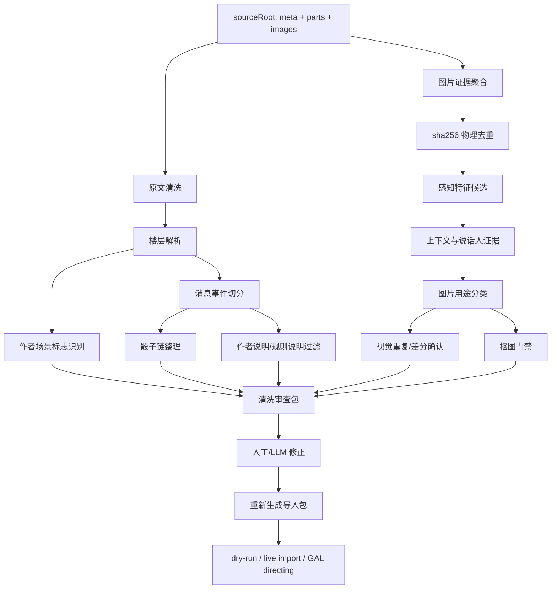
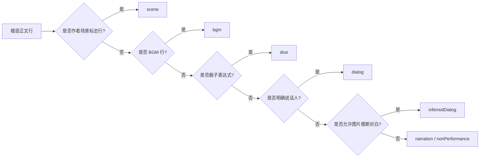
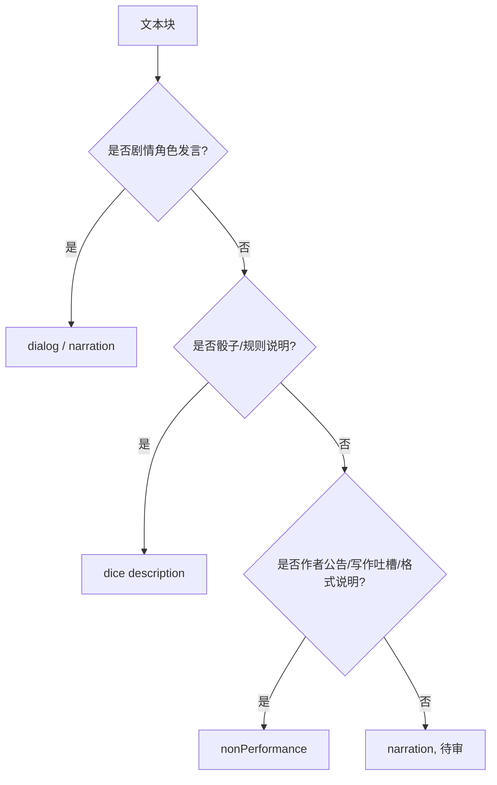
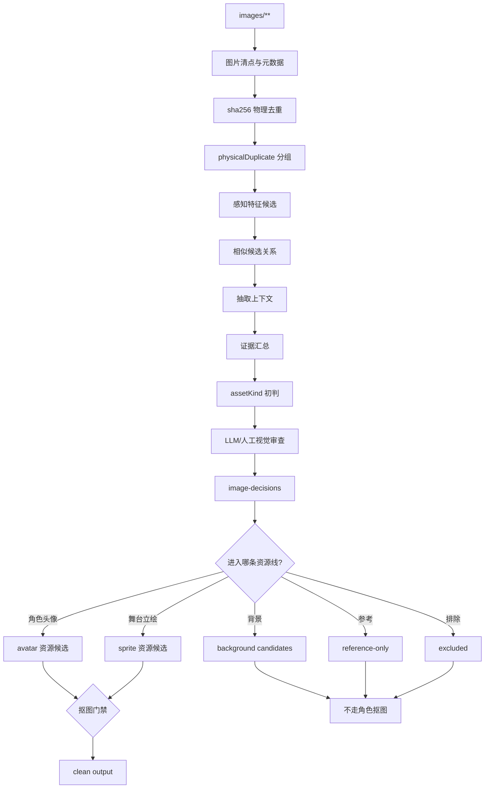
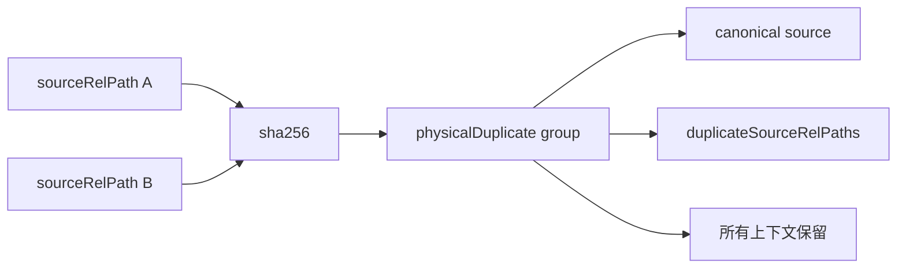
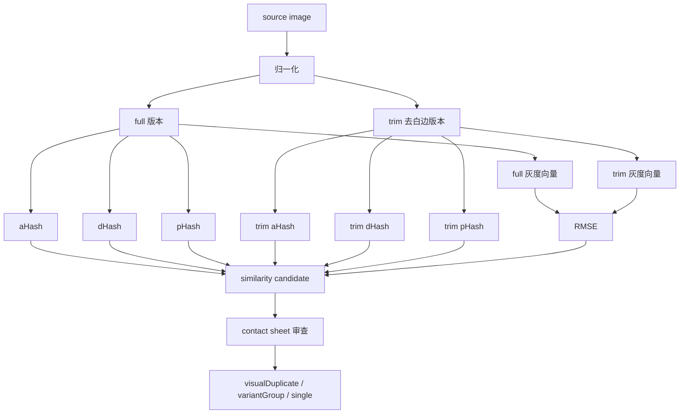
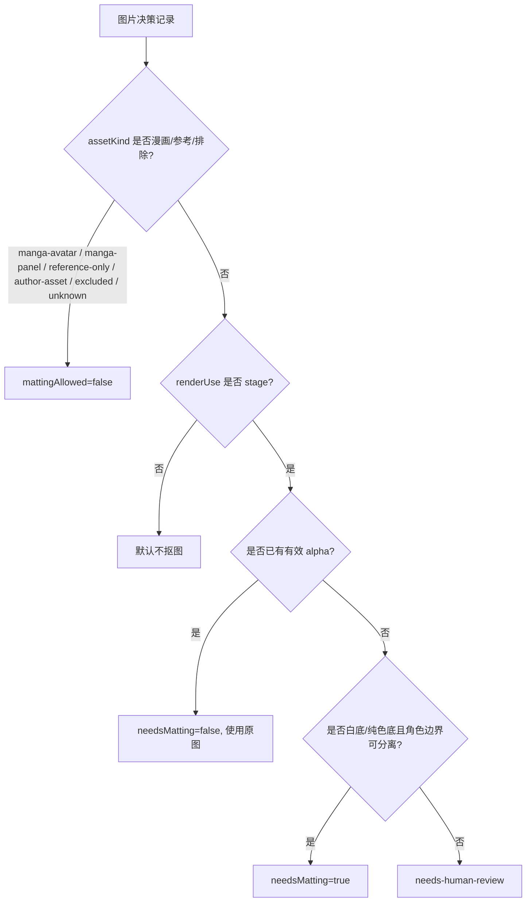
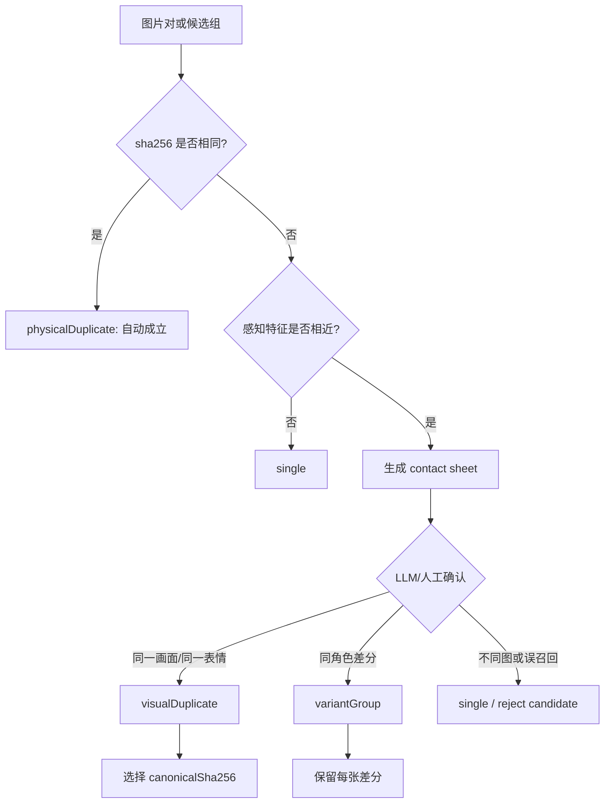
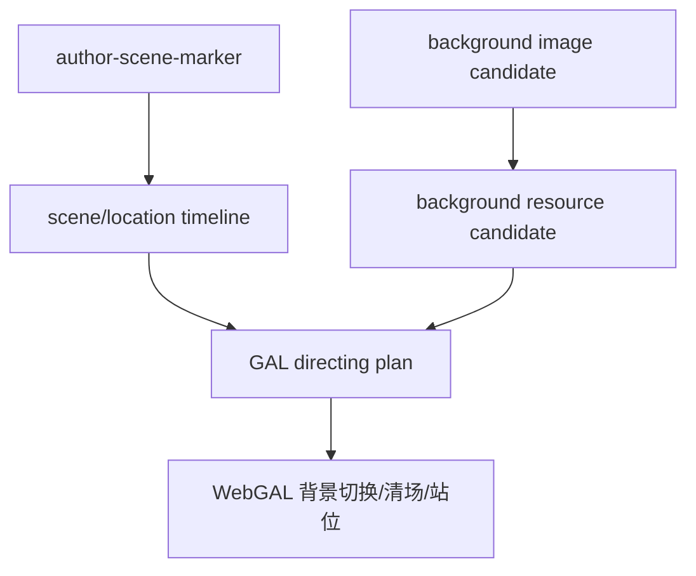
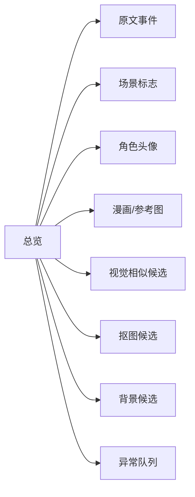

# 咕噜噜 Replay 数据清洗规则审查稿

## 定位

本文是咕噜噜安科文导入 replay 前的**数据清洗规则定义稿**，用于人工审查和重新定义流程。

本文不声明当前脚本已经全部实现这些规则。正式落地时，应把本文中的字段、分类和门禁规则同步到脚本、修正表和验收报告。

## 清洗目标

把咕噜噜作品目录中的原文和图片整理成可复核、可重生成的 replay 事实层：

```text
sourceRoot/
  meta.json
  parts/*.md
  images/**

-> 原文事件流
-> 场景标志 timeline
-> 图片用途决策表
-> 角色与头像候选
-> 骰子/BGM/作者说明清理结果
-> 可导入资源目录
```

核心原则：

- 楼层不是消息，只是来源元数据。
- 图片不是默认头像，必须先判定用途。
- 地点/背景只从作者显式场景标志行产生，普通正文地点词不切场。
- 漫画类图片不抠图。
- 图片去重分两层：`sha256` 只处理物理重复；`aHash`、`dHash`、`pHash`、RMSE 或 embedding 只生成视觉相似候选，不能直接自动合并。
- 每个 AI/人工判断必须写回结构化文件，不能只停留在口头结论。

## 总览



## 输出文件建议

所有输出都应放在当前 `sourceRoot` 下。

```text
sourceRoot/
  cleaning-review/
    content-events.json
    scene-events.csv
    image-decisions.csv
    image-decisions.json
    image-relations.csv
    image-similarity-candidates.csv
    image-feature-index.json
    matting-decisions.csv
    unresolved-review.csv
    summary.json

  image-role-review-copy/
    manifest.json
    corrections.csv

  image-role-review-clean-human-full/
    by-character/
    reference-only/
    background-candidates/
    reports/
      role-visual-audit/
      duplicate-contact-sheets/
      visual-duplicates-removed.csv
```

## 责任边界

| 执行方 | 负责内容 | 不能负责 |
| --- | --- | --- |
| 程序 | 解析楼层、找图片、算 hash、抽上下文、按显式规则分桶、生成报告 | 判断复杂语义、判断漫画图是否适合演出、决定最终角色归属 |
| LLM | 看图、看上下文、判定用途、识别作者说明、整理场景和演出建议 | 直接修改线上消息作为最终方案 |
| 人工 | 审查异常队列、确认规则边界、批准最终清洗规则 | 手工改输出目录但不回写 corrections |

## 重生成原则

清洗结果必须可重复生成。任何临时输出目录都不是事实来源。

事实来源优先级：

1. 当前 `sourceRoot` 下的原始 `parts/*.md`、`images/**`、`meta.json`。
2. 人工批准的 `corrections.csv`、`visual-corrections.csv`、`image-decisions.csv`、`matting-decisions.csv`。
3. LLM 输出并已写回的结构化审查文件。
4. 程序生成的证据索引和候选报告。
5. clean 目录、contact sheet、透明图、导入包等派生产物。

硬约束：

- 不从旧 clean 目录反推事实。
- 不把旧 `__matted.png` 当成原图。
- 不跨作品复用 `sourceRoot` 下的修正文件，除非人工明确迁移。
- 重新生成时必须先读取保留的 corrections，再清理和重建输出目录。
- 每次规则变更后，summary 必须体现关键数量变化。

## 一、原文清洗

### 原文事件类型



| 类型 | 来源 | 是否进入演出 | 备注 |
| --- | --- | --- | --- |
| `scene` | 作者场景标志行 | 不作为对白；作为场景元数据 | 后续可驱动背景/清场 |
| `dialog` | `角色：文本` | 是 | 保留原始 speaker，另存归一化 roleName |
| `inferredDialog` | 图片 + 高置信上下文 | 可选 | 默认需审查 |
| `narration` | 普通叙述 | 是 | 可转旁白或 intro |
| `dice` | 历史骰子和选项 | 是 | 不重新投骰 |
| `bgm` | `BGM：xxx` | 是，或保留事件 | 无音频时保留缺失项 |
| `nonPerformance` | 作者公告、格式说明、无关吐槽 | 否 | 保留来源，不进入演出 |

### 场景标志规则

地点/背景信息只从作者单独添加的场景标志行产生。

应识别：

```text
~永远亭~
～永远亭～
——神灵庙——
~红魔馆门口~
～午饭后的神灵庙～
```

不应识别：

```text
神灵庙吗，是偏向人类方的势力呢。
神子：在神灵庙的门口出现了……
1 博丽神社
2 红魔馆
具体发生的地点是【1d10:10】
```

建议 `scene` 事件结构：

```json
{
  "kind": "scene",
  "floor": 84,
  "eventIndex": 1201,
  "sceneLabel": "午饭后的神灵庙",
  "locationName": "神灵庙",
  "source": "author-scene-marker",
  "sourceText": "～午饭后的神灵庙～"
}
```

字段规则：

| 字段 | 说明 |
| --- | --- |
| `sceneLabel` | 作者原始标题，保留“门口”“午饭后”“指挥部”等修饰 |
| `locationName` | 归一化主地点，用于背景匹配和场景归并 |
| `sourceText` | 原始标志行 |
| `source` | 固定为 `author-scene-marker` |

硬约束：

- 普通正文提到地点名，不产生 `scene`。
- 骰子选项中的地点名，只属于 dice options。
- 角色对白中的地点名，不产生 `scene`。
- 没有作者标志行时，不自动更新当前地点。
- 如需正文推断地点，必须另设 `inferredScene`，默认关闭，且不能覆盖作者标志。

### 骰子清洗

骰子是 replay 事实，不允许重投。

需要保留：

```text
diceTurn.command
diceTurn.options
diceTurn.replies
diceTurn.sourceText
```

示例：

```text
那么烈啊，你要去往何处呢【1d13：】

1 博丽神社
2 红魔馆
...
13 其他的势力
```

结果：

```text
那么烈啊，你要去往何处呢【1d13：9】
```

清洗规则：

- 骰子前说明尽量并入 `diceTurn.command`。
- 选项表不能拆成多条旁白。
- 嵌套骰要保留多段 `replies`。
- 大成功/大失败、重投、继续投不能压成单一结果。
- 选项中的地点名不产生 `scene`。

### 作者说明与规则说明



应进入 `nonPerformance` 的例子：

- 更新公告。
- 作者写作反思。
- 格式说明。
- “之后会怎么写”的 meta 说明。
- 和剧情无关的作者吐槽。

可保留为 `dice description` 的例子：

- 技能说明。
- 判定规则。
- 选项含义。
- 大成功/大失败说明。

## 二、图片清洗

### 图片清洗主流程



### 图片证据层

图片清洗要先建立证据层，再做用途和导入决策。证据层只描述“文件是什么、在哪里出现、和哪些图片相似”，不直接决定角色归属。

每张原始图片至少保留：

| 字段 | 说明 |
| --- | --- |
| `sourceRelPath` | 图片相对 `sourceRoot` 的原始路径 |
| `absolutePath` | 本地绝对路径，只用于本机处理，不进入导入包 |
| `sourceUrl` | 原帖图片 URL，如导出中存在 |
| `firstFloor` | 第一次出现楼层 |
| `allFloors` | 所有出现楼层 |
| `contextBefore` / `contextAfter` | 图片前后文本窗口 |
| `nearbySpeakers` | 图片附近明确说话人 |
| `width` / `height` / `mime` / `fileSize` | 文件基础信息 |
| `sha256` | 物理去重键 |
| `featureRefs` | 指向感知特征记录 |

证据优先级：

1. 人工修正和已批准的 `visual-corrections.csv`。
2. LLM 看图后写回的结构化视觉结论。
3. 图片附近明确说话人和当前剧情上下文。
4. `sha256` 聚合出的同图多上下文证据。
5. 路径名中的角色目录，且仅当路径确实包含角色信息时使用。
6. 感知相似候选，只能用于排队和提醒，不是角色事实。

路径规则：

- `images/gululu/<id>_<hash>.<ext>` 这类路径不含角色信息，不能从 `gululu` 推断角色。
- 历史整理目录如果出现 `东方/丰聪耳神子/...` 这类结构，可作为弱证据。
- 路径名和画面冲突时，以视觉审查结论为准。
- 同一 `sha256` 在不同上下文被判成不同角色时，必须进入 `needs-human-review` 或 `conflict`，不能静默选一个。

### `sha256` 物理去重

`sha256` 只回答一个问题：两个文件字节是否完全相同。



规则：

- `sha256` 相同可自动标记为 `physicalDuplicate`。
- 可以用硬链接节省磁盘，但不能删除原始路径，也不能改 Markdown 引用。
- 导入资源可以复用同一个 canonical 文件，但事件溯源必须保留每个 `sourceRelPath`。
- `corrections` 查找必须同时支持 `sourceRelPath` 和 `sha256`。
- 如果同一 `sha256` 有多个非空修正，以人工最近确认或更具体的 `sourceRelPath` 修正优先；冲突不能自动覆盖。
- 物理重复不是视觉判断，不说明“这张图适合作为头像”，只说明文件相同。

### 感知相似候选

你记得的 pHash 属于这一层。它和 `sha256` 不同：它用于发现“看起来可能相同或相近”的图片，但不能直接合并图片。



推荐特征：

| 特征 | 用途 | 限制 |
| --- | --- | --- |
| `aHash` | 快速发现整体亮度布局相近的图 | 对裁切、边框、局部差分较敏感 |
| `dHash` | 发现边缘和明暗梯度相近的图 | 不能区分细微表情语义 |
| `pHash` | 用 DCT 频域特征发现缩放、压缩后的近似图 | 当前脚本尚未实现为独立字段，需要补齐 |
| `RMSE` | 在统一尺寸灰度图上比较像素差异 | 对裁切和构图变化敏感 |
| `embedding` | 可选，用于更强的视觉语义相似检索 | 可能把同画风不同角色拉近，必须审查 |
| `full` / `trim` 双版本 | 同时比较原图和去白边图 | 去白边可能误删漫画边框或文字气泡 |

当前实现状态：

- `scripts/gululu-build-clean-human-images.mjs` 当前已有 `aHash`、`dHash`、`full/trim` 双版本灰度向量和 RMSE 辅助判断。
- 当前脚本有 `isSameMangaFrame`、`isNearIdenticalRaster`、`isColorVariantCandidate` 这类候选规则。
- 当前脚本没有真正命名为 `pHash` 的字段；本文把 `pHash` 写为目标流程中应补齐的同层感知特征。
- 因此，现阶段报告里如果写“pHash 已处理”是不准确的；应写“感知哈希候选已处理，当前为 aHash/dHash/RMSE，pHash 待补齐”。

感知候选输出建议：

| 字段 | 说明 |
| --- | --- |
| `sourceSha256` | 图片 A |
| `candidateSha256` | 图片 B |
| `sourceRelPath` | 图片 A 的代表路径 |
| `candidateRelPath` | 图片 B 的代表路径 |
| `candidateKind` | `near-identical`、`same-manga-frame-candidate`、`color-variant-candidate`、`uncertain-similar` |
| `featureSignals` | 命中的特征，例如 `dHash<=3;trimRmse<=34` |
| `sameCharacterCandidate` | 是否同一候选角色范围内发现 |
| `requiresReview` | 固定为 true，除 `sha256` 物理重复外都需要审查 |
| `reviewResult` | 审查后写入 `visualDuplicate`、`variantGroup`、`single`、`reject` |

硬约束：

- 感知哈希相近只能生成候选，不能自动删除图片。
- 感知哈希相近不能自动选 canonical。
- 漫画图相似必须确认是否同一漫画格，不可只看 dHash 或 pHash。
- 彩色立绘相似默认先按差分候选看待，不能因为 pHash 接近就合并。
- 不同角色之间的相似候选必须进入冲突队列，不能自动跨角色归并。
- `visualDuplicate` 减少上传数；`variantGroup` 不减少上传数。

### 图片用途分类

| `assetKind` | 定义 | 进演出 | 是否抠图 | 典型例子 |
| --- | --- | --- | --- | --- |
| `character-sprite` | 可上 WebGAL 舞台的角色立绘 | 是 | 按门禁处理，通常需要 | 全身/半身白底角色图 |
| `character-avatar-bust` | 半身/胸像角色头像，可能可上舞台 | 视 `renderUse` | 可抠 | 动漫胸像、角色半身图 |
| `character-avatar-chat` | 聊天小头像 | 是，仅聊天头像 | 默认不抠 | 小裁切头像、头像框 |
| `manga-avatar` | 漫画头像裁切，可代表角色 | 可作聊天头像 | 永不抠图 | 黑白漫画角色头部 |
| `manga-panel` | 漫画分镜/大幅画面 | 默认不进演出 | 永不抠图 | 战斗分镜、倒地图 |
| `background` | 明确背景候选 | 可进背景流程 | 不走角色抠图 | 神社、庭院、门口背景 |
| `reference-only` | 参考图，不进演出 | 否 | 永不抠图 | 规则图、剧情参考、多人图 |
| `author-asset` | 作者说明配图 | 否 | 永不抠图 | 作者吐槽图、公告图 |
| `excluded` | 排除 | 否 | 永不抠图 | 无关图、垃圾图 |
| `unknown` | 待审 | 否 | 不抠 | 信息不足 |

### `reference-only` 范围

`reference-only` 是“有审查价值但不进入演出”的素材证据层。

适用：

- 剧情参考图。
- 大幅漫画分镜，但需要回溯剧情。
- 战斗过程图、倒地图、受击图。
- 规则/技能/状态说明图。
- 作者吐槽配图，但仍有回溯价值。
- 多人图，不能稳定绑定到单个角色。
- 场景参考图，但尚未纳入背景流程。
- 低置信但不想丢弃的候选图。

不适用：

- 明确角色头像：应为 `character-avatar-*` 或 `manga-avatar`。
- 明确角色立绘：应为 `character-sprite`。
- 明确背景且准备进入演出：应为 `background`。
- 明确无关图：应为 `excluded`。

硬约束：

- 不参与头像选择。
- 不参与 `spriteTransform`。
- 不参与 matting。
- 不进入正式角色资源目录。
- 必须保留 `sourceRelPath`、楼层、上下文和 `notes`。

## 三、抠图门禁

### 决策字段

抠图不能只看 `assetKind`，需要同时看用途。

```json
{
  "assetKind": "character-avatar-bust",
  "renderUse": "stage",
  "mattingAllowed": true,
  "needsMatting": true,
  "mattingReason": "白底半身图，进入舞台显示"
}
```

字段说明：

| 字段 | 说明 |
| --- | --- |
| `assetKind` | 图片用途分类 |
| `renderUse` | `stage`、`chat-avatar`、`background`、`reference`、`none` |
| `mattingAllowed` | 此类图片是否允许抠图 |
| `needsMatting` | 当前图片是否实际需要抠图 |
| `mattingStatus` | `not-needed`、`pending`、`processed`、`rejected`、`approved` |
| `mattingReason` | 为什么抠或不抠 |

### 抠图决策图



### 抠图规则表

| 分类 | `renderUse` | 默认 `mattingAllowed` | 默认 `needsMatting` |
| --- | --- | --- | --- |
| `character-sprite` | `stage` | true | 无 alpha 且白底时 true |
| `character-avatar-bust` | `stage` | true | 无 alpha 且白底时 true |
| `character-avatar-bust` | `chat-avatar` | false | false |
| `character-avatar-chat` | `chat-avatar` | false | false |
| `manga-avatar` | `chat-avatar` | false | false |
| `manga-panel` | `reference` | false | false |
| `background` | `background` | false | false |
| `reference-only` | `reference` | false | false |
| `author-asset` | `none` | false | false |
| `excluded` | `none` | false | false |
| `unknown` | `none` | false | false |

硬约束：

- 漫画头像即使是角色头像，也不抠图。
- 大幅漫画分镜不抠图。
- 聊天小头像默认不抠图。
- 只有进入舞台的角色立绘/胸像才考虑抠图。
- 已有 `matting-results.json` 不能被 clean 脚本无条件消费，必须先通过 `mattingAllowed=true`。
- QA 未通过的透明图不能进入正式导入。

### 错误案例归因

错误路径示例：

```text
by-character/烈海王/0085__3438_a27d3f490aa6__dup9__matted.png
by-character/烈海王/0108__5409_ce3e3b72c159__dup15__matted.png
by-character/烈海王/0102__426_bd28ff5d711d__dup4__matted.png
```

错误原因：

```text
漫画头像
-> 被标成 assetKind=avatar
-> 因白边和低彩度进入 shouldMatte=true
-> rembg 产出透明图
-> clean 阶段无条件消费 transparentRelPath
-> 生成 __matted.png
```

修正规则：

```text
漫画头像 -> manga-avatar
manga-avatar -> mattingAllowed=false
clean 阶段必须忽略已有 matting result
```

旧错误产物处理规则：

- 旧目录中的 `__matted.png` 不能作为事实层输入。
- 重新生成 clean 目录时，必须从 `images/**` 原图、`image-decisions`、`image-relations`、`matting-decisions` 出发。
- 如果旧 `__matted.png` 对应图片现在被判定为 `manga-avatar`、`manga-panel`、`reference-only`、`author-asset`、`excluded` 或 `unknown`，则旧透明图必须作废。
- 如果旧 `matting-results.json` 中存在透明图，但 `mattingAllowed=false`，clean 阶段必须忽略 `transparentRelPath`。
- 如果旧透明图仍可能有用，也必须重新经过 `mattingAllowed=true`、`needsMatting=true`、`qaStatus=approved` 三道门禁。
- 验收时应专门统计 `manga-avatar` 和 `manga-panel` 的 `__matted` 数量，必须为 0。

## 四、视觉重复与差分



| 关系 | 是否减少上传 | 是否保留差分 | 说明 |
| --- | --- | --- | --- |
| `physicalDuplicate` | 是 | 否 | 文件完全相同 |
| `visualDuplicate` | 是 | 否 | 同一画面不同裁切/压缩，需人工/LLM 确认 |
| `variantGroup` | 否 | 是 | 表情、眼睛、嘴型、受伤状态等不同 |
| `single` | 否 | 是 | 独立图片 |

判定标准：

| 关系 | 可以自动判定吗 | 允许的依据 |
| --- | --- | --- |
| `physicalDuplicate` | 可以 | `sha256` 相同 |
| `visualDuplicate` | 不可以 | 感知候选 + 视觉确认同一画面、同一角色、同一表情或同一漫画格 |
| `variantGroup` | 不可以 | 视觉确认同角色、同构图或同基础立绘，但表情/动作/状态不同 |
| `single` | 可以作为默认 | 无相似候选，或候选被审查驳回 |

`visualDuplicate` 的 canonical 选择优先级：

1. 分辨率更高。
2. 裁切更完整，头发、帽子、手臂、道具不缺失。
3. 压缩噪声更少。
4. 没有明显文字气泡、边框、遮挡、截图 UI。
5. 和正文对白上下文最稳定共现。
6. 若以上相同，选择更早出现的 `sourceRelPath`，保证重生成稳定。

`variantGroup` 必须保留的差分：

- 睁眼/闭眼、嘴型、眉毛、脸红、汗、受伤、流血、倒地等状态差异。
- 彩色立绘的表情差分、姿势差分、服装差分。
- 同一漫画角色但不是同一格的不同截图。
- 同一角色在不同剧情状态下的图，例如战斗前、受伤后、特殊变身。

漫画图特殊规则：

- `manga-avatar` 可以参与视觉相似候选，但只作为候选进入审查。
- 黑白漫画的边框、网点、对白气泡容易让 hash 相近或相远，因此不能单靠 dHash/pHash/RMSE。
- 只有确认是同一漫画格的裁切、缩放、压缩版本，才能标为 `visualDuplicate`。
- 不同漫画格即使构图相似，也必须是 `single` 或 `variantGroup`，不能复用 canonical。
- 漫画图无论是 `visualDuplicate` 还是 `variantGroup`，都不改变“永不抠图”的规则。

彩色立绘特殊规则：

- 彩色立绘、白底半身、透明底角色图，相似候选默认先进入 `variantGroup` 待审。
- 只有确认没有表情/姿势/状态差异，只是裁切、缩放、压缩、格式转换，才能改成 `visualDuplicate`。
- 不能因为整体 pHash 接近就合并彩色差分。

输出行为：

- `physicalDuplicate` 和 `visualDuplicate` 可在导入阶段复用同一个 avatar/resource。
- `variantGroup` 只用于整理和审查，不减少上传数。
- `visualDuplicate` 被隐藏或复用时，仍要在 `visual-duplicates-removed.csv` 记录从哪个 `sourceRelPath` 复用哪个 canonical。
- 任何视觉关系都不删除 `images/**` 原图，也不改原始 Markdown 引用。

示例记录：

```json
{
  "sourceRelPath": "images/gululu/3438_a27d3f490aa6.png",
  "sha256": "source-sha256",
  "visualRelationType": "visualDuplicate",
  "visualGroupId": "烈海王-manga-frame-001",
  "canonicalSha256": "canonical-sha256",
  "relationReviewedBy": "llm",
  "relationStatus": "confirmed",
  "notes": "同一漫画头像的不同下载副本，画面和表情一致"
}
```

硬约束：

- `variantGroup` 不能合并为一个 canonical。
- 彩色立绘差分默认按 `variantGroup` 保留。
- 漫画图即使相似，也要确认是否同一格，不可只靠 dHash。
- 所有非 `sha256` 关系都必须能回溯到 contact sheet 或人工/LLM 审查记录。

## 五、背景与场景资源

场景标志和背景图片是两件事。



规则：

- `scene` 事件只说明当前地点/场景，不代表已有背景图。
- `background` 图片必须来自图片审查，不从角色头像里推断。
- 普通地点词不创建 `scene`。
- 背景图不走角色抠图流程。
- 没有背景图时，仍保留 `scene` 元数据，后续可用默认背景或不切背景。

## 六、审查表字段

### `image-decisions.csv`

| 字段 | 必填 | 说明 |
| --- | --- | --- |
| `sourceRelPath` | 是 | 原始图片相对路径 |
| `sha256` | 是 | 物理去重键 |
| `allSourceRelPaths` | 否 | 同一 `sha256` 的所有来源路径，JSON 数组或分号分隔 |
| `duplicateSourceRelPaths` | 否 | 除代表图外的物理重复路径 |
| `decisionStatus` | 是 | `ai-confirmed`、`manual-confirmed`、`needs-human-review`、`reference-only`、`excluded` |
| `assetKind` | 是 | 图片用途分类 |
| `renderUse` | 是 | `stage`、`chat-avatar`、`background`、`reference`、`none` |
| `character` | 否 | 最终角色；正式导入时应来自 `visualCharacter` 或人工确认 |
| `visualCharacter` | 否 | 视觉确认后的角色，覆盖自动候选 |
| `visualStatus` | 是 | `unreviewed`、`ai-confirmed`、`manual-confirmed`、`rejected`、`conflict` |
| `locationName` | 否 | 背景/地点候选 |
| `mattingAllowed` | 是 | 是否允许抠图 |
| `needsMatting` | 是 | 是否需要抠图 |
| `mattingStatus` | 是 | `not-needed`、`pending`、`processed`、`approved`、`rejected`、`skipped-existing-alpha` |
| `visualRelationType` | 是 | `single`、`physicalDuplicate`、`visualDuplicate`、`variantGroup` |
| `visualGroupId` | 否 | 视觉关系组 |
| `canonicalSha256` | 否 | 复用 canonical |
| `relationStatus` | 是 | `auto`、`candidate`、`confirmed`、`rejected` |
| `relationReviewedBy` | 否 | `program`、`llm`、`human` |
| `featureCandidateCount` | 否 | 感知相似候选数量 |
| `exclude` | 是 | 是否排除 |
| `evidenceSummary` | 否 | 角色/用途判断的主要证据摘要 |
| `notes` | 否 | 审查说明 |

### `image-feature-index.json`

保存每个 `sha256` 的感知特征，供重生成和调试使用。特征文件是证据层，不应被人工直接当成最终决策。

建议结构：

```json
{
  "sha256": "image-sha256",
  "representativeSourceRelPath": "images/gululu/3438_a27d3f490aa6.png",
  "width": 512,
  "height": 512,
  "fullAHash": "123",
  "fullDHash": "456",
  "fullPHash": null,
  "trimAHash": "789",
  "trimDHash": "101112",
  "trimPHash": null,
  "fullVectorRef": "vectors/image-sha256-full.gray16.json",
  "trimVectorRef": "vectors/image-sha256-trim.gray16.json",
  "featureVersion": "aHash-dHash-rmse-v1",
  "notes": "当前脚本未实现独立 pHash，字段保留为待补齐"
}
```

字段规则：

- `full*` 特征基于原图归一化版本。
- `trim*` 特征基于去白边或裁切边缘后的版本。
- `pHash` 未实现时必须写 `null` 或省略，并在 `featureVersion` 或报告中说明，不能伪装成已计算。
- 特征版本变化时，必须刷新相似候选报告，避免旧阈值和新特征混用。

### `image-similarity-candidates.csv`

保存感知相似候选。这里的每一行都只是“需要看”的候选，不是最终视觉关系。

| 字段 | 必填 | 说明 |
| --- | --- | --- |
| `candidateGroupId` | 是 | 候选组 ID |
| `sourceSha256` | 是 | 图片 A |
| `candidateSha256` | 是 | 图片 B |
| `sourceRelPath` | 是 | 图片 A 代表路径 |
| `candidateRelPath` | 是 | 图片 B 代表路径 |
| `candidateKind` | 是 | `near-identical`、`same-manga-frame-candidate`、`color-variant-candidate`、`uncertain-similar` |
| `hashDistanceMin` | 否 | `aHash`/`dHash`/`pHash` 的最小汉明距离 |
| `fullRmse` | 否 | full 灰度向量 RMSE |
| `trimRmse` | 否 | trim 灰度向量 RMSE |
| `featureSignals` | 是 | 命中的阈值或规则 |
| `sourceAssetKind` | 否 | 图片 A 当前用途 |
| `candidateAssetKind` | 否 | 图片 B 当前用途 |
| `sameCharacterCandidate` | 否 | 是否同一候选角色 |
| `requiresReview` | 是 | 除 `sha256` 物理重复外固定为 true |
| `reviewResult` | 否 | 审查后写 `visualDuplicate`、`variantGroup`、`single`、`reject` |
| `reviewNotes` | 否 | 审查说明 |

### `image-relations.csv`

保存最终视觉关系。导入脚本应只消费这里或 `image-decisions.csv` 中已确认的关系，不直接消费相似候选。

| 字段 | 必填 | 说明 |
| --- | --- | --- |
| `sourceSha256` | 是 | 当前图片 |
| `sourceRelPath` | 是 | 当前图片代表路径 |
| `visualRelationType` | 是 | `single`、`physicalDuplicate`、`visualDuplicate`、`variantGroup` |
| `visualGroupId` | 否 | 视觉组 ID |
| `canonicalSha256` | 否 | `physicalDuplicate` 或 `visualDuplicate` 的 canonical |
| `canonicalRelPath` | 否 | canonical 代表路径 |
| `relationStatus` | 是 | `auto`、`confirmed`、`rejected` |
| `relationReviewedBy` | 是 | `program`、`llm`、`human` |
| `contactSheetPath` | 否 | 审查图板路径 |
| `notes` | 否 | 说明 |

### `matting-decisions.csv`

保存抠图门禁和 QA 结果。clean 阶段必须读取这张表或等价 JSON，不允许只因为存在透明图文件就使用。

| 字段 | 必填 | 说明 |
| --- | --- | --- |
| `sourceRelPath` | 是 | 原始图片 |
| `sha256` | 是 | 图片 hash |
| `assetKind` | 是 | 图片用途 |
| `renderUse` | 是 | 演出用途 |
| `mattingAllowed` | 是 | 是否允许抠图 |
| `needsMatting` | 是 | 是否需要抠图 |
| `mattingStatus` | 是 | `not-needed`、`pending`、`processed`、`approved`、`rejected`、`skipped-existing-alpha` |
| `mattingModel` | 否 | 例如 `rembg:isnet-anime` |
| `transparentRelPath` | 否 | 透明图路径 |
| `alphaMaskRelPath` | 否 | mask 路径 |
| `qaStatus` | 是 | `not-required`、`pending`、`approved`、`rejected` |
| `qaReason` | 否 | QA 说明 |

### `summary.json`

至少统计：

- 图片总数、唯一 `sha256` 数、`physicalDuplicate` 组数。
- 感知相似候选数、已审查候选数、驳回候选数。
- `visualDuplicate` 组数、被复用图片数、canonical 数。
- `variantGroup` 组数、差分图片数。
- 各 `assetKind` 数量。
- `manga-avatar`、`manga-panel` 中 `needsMatting=true` 的数量，必须为 0。
- `mattingAllowed=true`、`needsMatting=true`、QA 通过、QA 拒绝数量。
- `reference-only`、`background`、`excluded`、`unknown` 数量。
- `needs-human-review` 和 `conflict` 数量。

### `scene-events.csv`

| 字段 | 必填 | 说明 |
| --- | --- | --- |
| `floor` | 是 | 楼层 |
| `eventIndex` | 是 | 事件序号 |
| `sceneLabel` | 是 | 作者原始场景标题 |
| `locationName` | 是 | 归一化地点 |
| `sourceText` | 是 | 原始标志行 |
| `source` | 是 | 固定 `author-scene-marker` |
| `notes` | 否 | 歧义说明 |

### `content-events.json`

每条事件建议保留：

```json
{
  "eventIndex": 1201,
  "floor": 84,
  "kind": "dialog",
  "content": "……",
  "speakerName": "神子",
  "roleName": "丰聪耳神子",
  "imagePath": "gululu/example.png",
  "sceneId": "scene-shinreibyou-001",
  "sourceTime": "2022-01-22 20:40",
  "sourceLine": "神子：……"
}
```

## 七、人工审查视图

建议审查页面至少分成这些 tab：



### 总览

显示：

- 楼层范围。
- 事件数量。
- `scene` 数量。
- `dialog` / `dice` / `bgm` / `nonPerformance` 数量。
- 图片总数。
- 各 `assetKind` 数量。
- `physicalDuplicate`、`visualDuplicate`、`variantGroup` 数量。
- 感知相似候选数量、已审查数量、驳回数量。
- 抠图候选数量。
- 漫画图错误抠图数量，必须为 0。
- 已确认/待审/排除数量。

### 原文事件审查

每条事件显示：

- 楼层和来源行。
- 事件类型。
- 当前 `sceneLabel`。
- 当前图片。
- 是否进入演出。
- 修正入口。

### 图片审查

每张图显示：

- 原图。
- 若有透明图，显示原图/透明图对比。
- 上下文文本。
- 当前 `assetKind`。
- 当前 `renderUse`。
- 当前 `mattingAllowed` / `needsMatting`。
- 视觉重复/差分组。
- 相似候选来源：`sha256`、`aHash`、`dHash`、`pHash`、RMSE 或 embedding。
- 一键改为 `manga-avatar`、`manga-panel`、`reference-only`、`excluded`。

### 视觉相似候选审查

每个候选组显示：

- canonical 候选和所有相似图片。
- `sourceRelPath`、`sha256`、楼层、候选角色。
- `aHash`、`dHash`、`pHash`、RMSE 或 embedding 命中的信号；未实现的特征必须显示为空或待补齐。
- full/trim 两种视图的缩略图。
- 原图上下文。
- 快捷判定：`visualDuplicate`、`variantGroup`、`single`、`reject candidate`。
- canonical 选择入口和理由。

审查要求：

- 默认只把 `sha256` 相同的组视为自动成立。
- 其他相似组必须人工或 LLM 确认。
- 漫画相似组必须能放大看同一格细节。
- 彩色立绘相似组必须重点看眼睛、嘴型、眉毛、状态和服装差异。

### 抠图审查

只显示：

- `mattingAllowed=true`
- `needsMatting=true`
- 或已有 matting result 但被规则拒绝的图

必须能看到：

- 原图。
- 透明图。
- alpha mask。
- QA 结论。
- 拒绝原因。

## 八、最低验收标准

数据清洗完成后，至少满足：

- 所有作者场景标志行都生成 `scene` 事件。
- 普通正文地点词没有误生成 `scene`。
- 骰子选项没有被拆散。
- 作者说明、规则说明、剧情正文有明确分类。
- 每张进入角色资源的图片都有 `assetKind`、`renderUse`、`mattingAllowed`。
- 漫画图没有 `__matted` 输出。
- `manga-avatar`、`manga-panel`、`reference-only`、`author-asset`、`excluded` 的 `mattingAllowed` 必须为 false。
- `sha256` 物理重复有 `duplicateSourceRelPaths` 或等价记录。
- 感知相似候选不能直接作为最终关系；所有 `visualDuplicate` 都有 `relationStatus=confirmed` 或 `physicalDuplicate` 的 `auto` 记录。
- `reference-only` 不进入演出资源目录。
- `variantGroup` 没有被合并上传。
- `visualDuplicate` 复用关系有 canonical 和移除/复用报告。
- 所有被使用的透明图都通过 QA。
- 旧 `__matted.png` 没有作为事实层输入。
- 当前实现未计算的 `pHash` 不能在报告中写成已计算。
- 所有人工/LLM 修正都写回 CSV/JSON。

## 九、当前遗漏与不确定项

这些内容已经在规则里定义，但需要在执行时确认脚本是否已完全实现。不能因为文档写了，就假设现有脚本已经自动做到。

### 已有实现但仍需审查

- `sha256` 物理去重：已有脚本可计算和硬链接处理，但仍要保留所有来源路径和修正回写。
- 感知候选：`scripts/gululu-build-clean-human-images.mjs` 当前已有 `aHash`、`dHash`、full/trim 灰度向量和 RMSE，并能输出 `visualDuplicate`、`variantGroup` 相关报告；候选关系仍必须看图确认。
- 角色视觉复核：已有 role visual audit 相关脚本能生成审查入口，但最终 `visualCharacter` 必须由 LLM/人工确认。
- 作者场景标志：规则已定义为作者单独标志行，执行时仍要抽样检查，避免正文地点词误切场。
- 骰子链：基础事件可解析，但同楼多轮、嵌套、重投、大成功/大失败解释仍需抽样审查。

### 待补齐或待接线

- `pHash`：当前脚本没有独立 `pHash` 字段；需要补齐 DCT pHash 或在报告中明确写 `pHash=null / not-computed`。
- `image-feature-index.json`、`image-similarity-candidates.csv`：本文定义了推荐结构，现有脚本输出可能还不是这个精确 schema，需要实现或适配。
- LLM 结构化视觉审查：需要把图片、上下文、候选关系、输出 JSON/CSV 串成稳定流水线；不能只依赖临时自然语言判断。
- 端到端抠图 QA：规则要求 `matting-decisions.csv`、alpha mask、QA contact sheet 和 `qaStatus=approved`，现有自动运行 rembg 与 QA 汇总需要现场确认或补齐。
- clean 阶段抠图门禁：必须确认脚本按 `mattingAllowed`、`needsMatting`、`qaStatus` 消费透明图，而不是只看 `transparentRelPath` 是否存在。
- 背景流程：`scene` 时间线和 `background` 图片候选已定义，但背景资源上传、WebGAL 切背景和缺省背景策略还需要单独接线。
- BGM manifest：文本 BGM 事件可以保留；本地音频匹配、上传、播放绑定和缺失清单还不是完整自动链路。
- 审查 UI：本文定义了 tab 和字段，现有 `gululu-review-server.mjs` 是否完全覆盖这些视图需要另行核对。

### 需要按作品现场确认

- `sourceRoot` 的导出结构：不同作品可能有不同 `parts/`、`images/`、`image-map.json` 和图片路径规则。
- 图片路径是否含角色名：`images/gululu/...` 不含角色信息，历史人工目录才可能提供弱证据。
- 作品级角色别名：opus 88 的别名不能直接迁移到其他作品。
- 作者场景标志样式：不同作者可能使用 `~地点~`、`——地点——`、`【地点】` 等不同格式，必须抽样确认。
- `reference-only` 的边界：作者吐槽图、战斗过程图、规则图是否保留为参考，需要按作品审查标准决定。
- `manga-avatar` 是否只用于聊天头像、是否永不进 WebGAL 舞台，需要你最终确认。
- 背景候选是否现在进入演出，还是只保留 `scene` 元数据，等待后续 GAL directing。
- BGM 来源必须由用户提供本地文件或 manifest，不能自动从公开音乐/视频平台抓取。

## 十、待你确认的问题

请重点审查这些规则：

- `manga-avatar` 是否允许作为聊天头像。
- `manga-avatar` 是否永不进入 WebGAL 舞台。
- `character-avatar-bust` 在什么条件下可以作为舞台立绘。
- `reference-only` 是否需要单独输出目录。
- 作者吐槽配图是 `author-asset` 还是 `reference-only`。
- 背景候选是否现在就纳入，还是只先保留 `scene`。
- `inferredDialog` 是否默认开启。
- `inferredScene` 是否永远关闭，还是允许人工显式添加。
