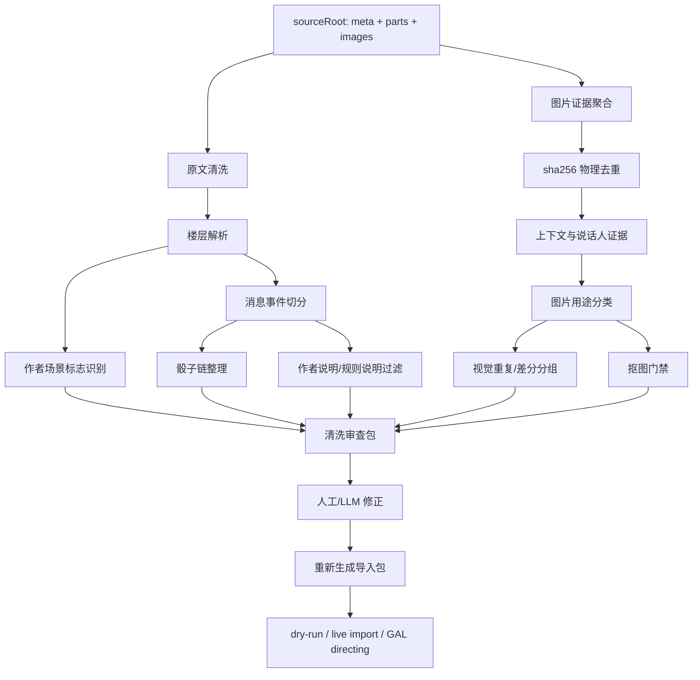
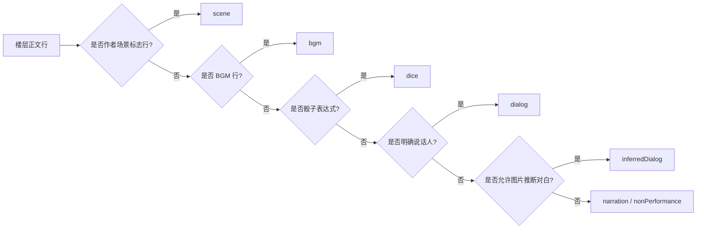
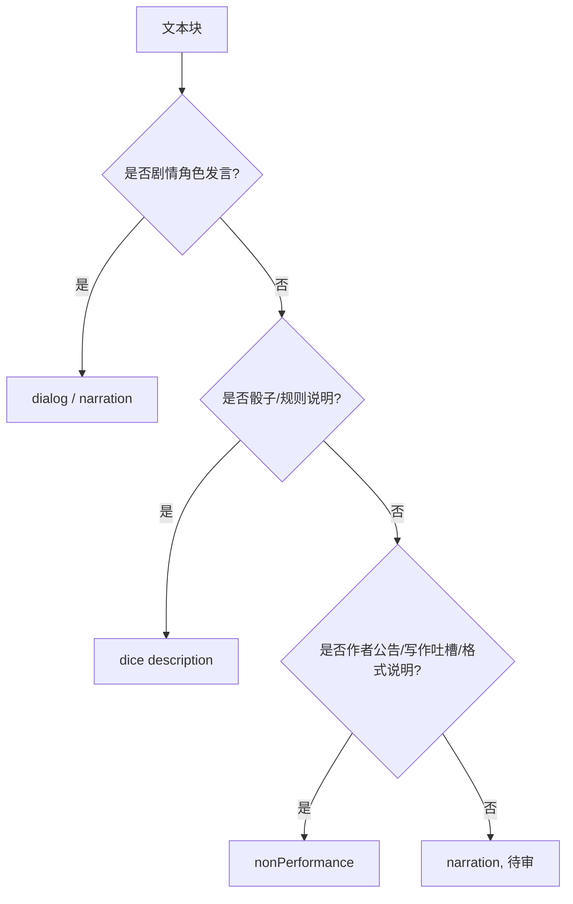
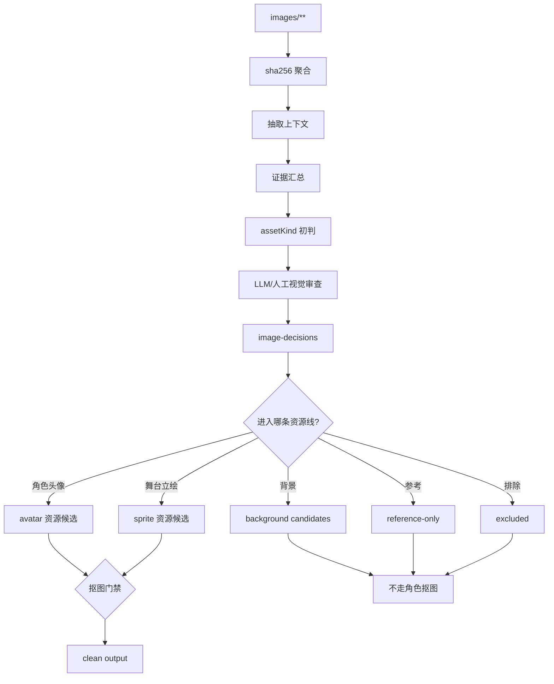
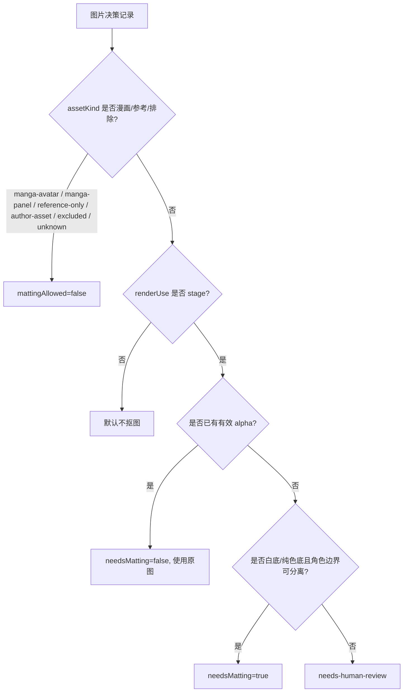
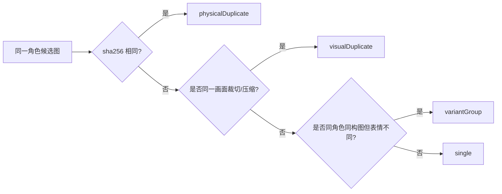
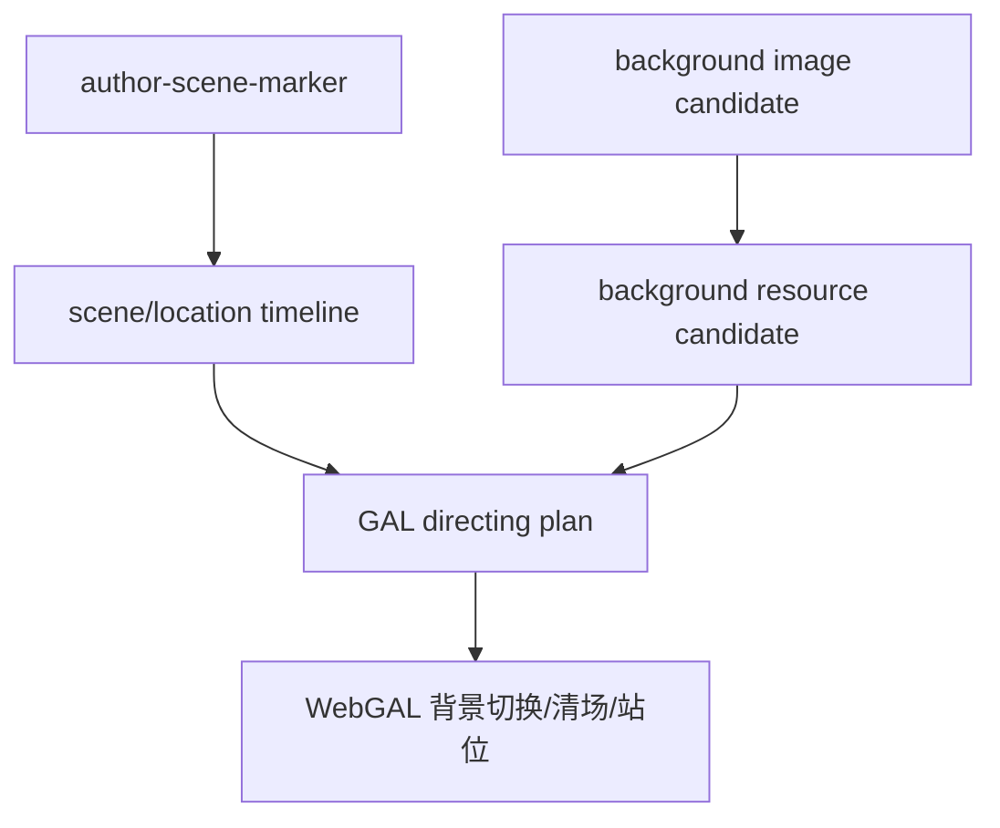
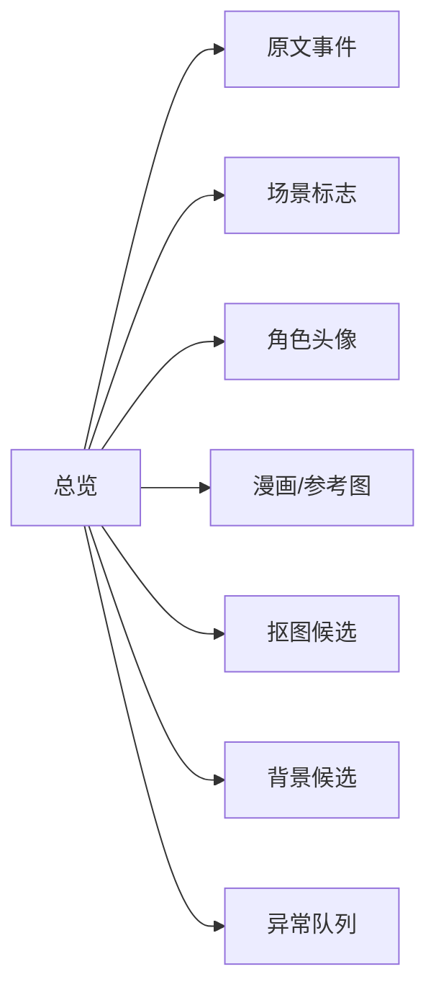

# 咕噜噜 Replay 数据清洗规则审查稿

## 定位

本文是咕噜噜安科文导入 replay 前的**数据清洗规则定义稿**，用于人工审查和重新定义流程。

本文不声明当前脚本已经全部实现这些规则。正式落地时，应把本文中的字段、分类和门禁规则同步到脚本、修正表和验收报告。

## 清洗目标

把咕噜噜作品目录中的原文和图片整理成可复核、可重生成的 replay 事实层：

```text
sourceRoot/
  meta.json
  parts/*.md
  images/**

-> 原文事件流
-> 场景标志 timeline
-> 图片用途决策表
-> 角色与头像候选
-> 骰子/BGM/作者说明清理结果
-> 可导入资源目录
```

核心原则：

- 楼层不是消息，只是来源元数据。
- 图片不是默认头像，必须先判定用途。
- 地点/背景只从作者显式场景标志行产生，普通正文地点词不切场。
- 漫画类图片不抠图。
- 每个 AI/人工判断必须写回结构化文件，不能只停留在口头结论。

## 总览



## 输出文件建议

所有输出都应放在当前 `sourceRoot` 下。

```text
sourceRoot/
  cleaning-review/
    content-events.json
    scene-events.csv
    image-decisions.csv
    image-decisions.json
    image-relations.csv
    matting-decisions.csv
    unresolved-review.csv
    summary.json

  image-role-review-copy/
    manifest.json
    corrections.csv

  image-role-review-clean-human-full/
    by-character/
    reference-only/
    background-candidates/
    reports/
```

## 责任边界

| 执行方 | 负责内容 | 不能负责 |
| --- | --- | --- |
| 程序 | 解析楼层、找图片、算 hash、抽上下文、按显式规则分桶、生成报告 | 判断复杂语义、判断漫画图是否适合演出、决定最终角色归属 |
| LLM | 看图、看上下文、判定用途、识别作者说明、整理场景和演出建议 | 直接修改线上消息作为最终方案 |
| 人工 | 审查异常队列、确认规则边界、批准最终清洗规则 | 手工改输出目录但不回写 corrections |

## 一、原文清洗

### 原文事件类型



| 类型 | 来源 | 是否进入演出 | 备注 |
| --- | --- | --- | --- |
| `scene` | 作者场景标志行 | 不作为对白；作为场景元数据 | 后续可驱动背景/清场 |
| `dialog` | `角色：文本` | 是 | 保留原始 speaker，另存归一化 roleName |
| `inferredDialog` | 图片 + 高置信上下文 | 可选 | 默认需审查 |
| `narration` | 普通叙述 | 是 | 可转旁白或 intro |
| `dice` | 历史骰子和选项 | 是 | 不重新投骰 |
| `bgm` | `BGM：xxx` | 是，或保留事件 | 无音频时保留缺失项 |
| `nonPerformance` | 作者公告、格式说明、无关吐槽 | 否 | 保留来源，不进入演出 |

### 场景标志规则

地点/背景信息只从作者单独添加的场景标志行产生。

应识别：

```text
~永远亭~
～永远亭～
——神灵庙——
~红魔馆门口~
～午饭后的神灵庙～
```

不应识别：

```text
神灵庙吗，是偏向人类方的势力呢。
神子：在神灵庙的门口出现了……
1 博丽神社
2 红魔馆
具体发生的地点是【1d10:10】
```

建议 `scene` 事件结构：

```json
{
  "kind": "scene",
  "floor": 84,
  "eventIndex": 1201,
  "sceneLabel": "午饭后的神灵庙",
  "locationName": "神灵庙",
  "source": "author-scene-marker",
  "sourceText": "～午饭后的神灵庙～"
}
```

字段规则：

| 字段 | 说明 |
| --- | --- |
| `sceneLabel` | 作者原始标题，保留“门口”“午饭后”“指挥部”等修饰 |
| `locationName` | 归一化主地点，用于背景匹配和场景归并 |
| `sourceText` | 原始标志行 |
| `source` | 固定为 `author-scene-marker` |

硬约束：

- 普通正文提到地点名，不产生 `scene`。
- 骰子选项中的地点名，只属于 dice options。
- 角色对白中的地点名，不产生 `scene`。
- 没有作者标志行时，不自动更新当前地点。
- 如需正文推断地点，必须另设 `inferredScene`，默认关闭，且不能覆盖作者标志。

### 骰子清洗

骰子是 replay 事实，不允许重投。

需要保留：

```text
diceTurn.command
diceTurn.options
diceTurn.replies
diceTurn.sourceText
```

示例：

```text
那么烈啊，你要去往何处呢【1d13：】

1 博丽神社
2 红魔馆
...
13 其他的势力
```

结果：

```text
那么烈啊，你要去往何处呢【1d13：9】
```

清洗规则：

- 骰子前说明尽量并入 `diceTurn.command`。
- 选项表不能拆成多条旁白。
- 嵌套骰要保留多段 `replies`。
- 大成功/大失败、重投、继续投不能压成单一结果。
- 选项中的地点名不产生 `scene`。

### 作者说明与规则说明



应进入 `nonPerformance` 的例子：

- 更新公告。
- 作者写作反思。
- 格式说明。
- “之后会怎么写”的 meta 说明。
- 和剧情无关的作者吐槽。

可保留为 `dice description` 的例子：

- 技能说明。
- 判定规则。
- 选项含义。
- 大成功/大失败说明。

## 二、图片清洗

### 图片清洗主流程



### 图片用途分类

| `assetKind` | 定义 | 进演出 | 是否抠图 | 典型例子 |
| --- | --- | --- | --- | --- |
| `character-sprite` | 可上 WebGAL 舞台的角色立绘 | 是 | 按门禁处理，通常需要 | 全身/半身白底角色图 |
| `character-avatar-bust` | 半身/胸像角色头像，可能可上舞台 | 视 `renderUse` | 可抠 | 动漫胸像、角色半身图 |
| `character-avatar-chat` | 聊天小头像 | 是，仅聊天头像 | 默认不抠 | 小裁切头像、头像框 |
| `manga-avatar` | 漫画头像裁切，可代表角色 | 可作聊天头像 | 永不抠图 | 黑白漫画角色头部 |
| `manga-panel` | 漫画分镜/大幅画面 | 默认不进演出 | 永不抠图 | 战斗分镜、倒地图 |
| `background` | 明确背景候选 | 可进背景流程 | 不走角色抠图 | 神社、庭院、门口背景 |
| `reference-only` | 参考图，不进演出 | 否 | 永不抠图 | 规则图、剧情参考、多人图 |
| `author-asset` | 作者说明配图 | 否 | 永不抠图 | 作者吐槽图、公告图 |
| `excluded` | 排除 | 否 | 永不抠图 | 无关图、垃圾图 |
| `unknown` | 待审 | 否 | 不抠 | 信息不足 |

### `reference-only` 范围

`reference-only` 是“有审查价值但不进入演出”的素材证据层。

适用：

- 剧情参考图。
- 大幅漫画分镜，但需要回溯剧情。
- 战斗过程图、倒地图、受击图。
- 规则/技能/状态说明图。
- 作者吐槽配图，但仍有回溯价值。
- 多人图，不能稳定绑定到单个角色。
- 场景参考图，但尚未纳入背景流程。
- 低置信但不想丢弃的候选图。

不适用：

- 明确角色头像：应为 `character-avatar-*` 或 `manga-avatar`。
- 明确角色立绘：应为 `character-sprite`。
- 明确背景且准备进入演出：应为 `background`。
- 明确无关图：应为 `excluded`。

硬约束：

- 不参与头像选择。
- 不参与 `spriteTransform`。
- 不参与 matting。
- 不进入正式角色资源目录。
- 必须保留 `sourceRelPath`、楼层、上下文和 `notes`。

## 三、抠图门禁

### 决策字段

抠图不能只看 `assetKind`，需要同时看用途。

```json
{
  "assetKind": "character-avatar-bust",
  "renderUse": "stage",
  "mattingAllowed": true,
  "needsMatting": true,
  "mattingReason": "白底半身图，进入舞台显示"
}
```

字段说明：

| 字段 | 说明 |
| --- | --- |
| `assetKind` | 图片用途分类 |
| `renderUse` | `stage`、`chat-avatar`、`background`、`reference`、`none` |
| `mattingAllowed` | 此类图片是否允许抠图 |
| `needsMatting` | 当前图片是否实际需要抠图 |
| `mattingStatus` | `not-needed`、`pending`、`processed`、`rejected`、`approved` |
| `mattingReason` | 为什么抠或不抠 |

### 抠图决策图



### 抠图规则表

| 分类 | `renderUse` | 默认 `mattingAllowed` | 默认 `needsMatting` |
| --- | --- | --- | --- |
| `character-sprite` | `stage` | true | 无 alpha 且白底时 true |
| `character-avatar-bust` | `stage` | true | 无 alpha 且白底时 true |
| `character-avatar-bust` | `chat-avatar` | false | false |
| `character-avatar-chat` | `chat-avatar` | false | false |
| `manga-avatar` | `chat-avatar` | false | false |
| `manga-panel` | `reference` | false | false |
| `background` | `background` | false | false |
| `reference-only` | `reference` | false | false |
| `author-asset` | `none` | false | false |
| `excluded` | `none` | false | false |
| `unknown` | `none` | false | false |

硬约束：

- 漫画头像即使是角色头像，也不抠图。
- 大幅漫画分镜不抠图。
- 聊天小头像默认不抠图。
- 只有进入舞台的角色立绘/胸像才考虑抠图。
- 已有 `matting-results.json` 不能被 clean 脚本无条件消费，必须先通过 `mattingAllowed=true`。
- QA 未通过的透明图不能进入正式导入。

### 错误案例归因

错误路径示例：

```text
by-character/烈海王/0085__3438_a27d3f490aa6__dup9__matted.png
by-character/烈海王/0108__5409_ce3e3b72c159__dup15__matted.png
by-character/烈海王/0102__426_bd28ff5d711d__dup4__matted.png
```

错误原因：

```text
漫画头像
-> 被标成 assetKind=avatar
-> 因白边和低彩度进入 shouldMatte=true
-> rembg 产出透明图
-> clean 阶段无条件消费 transparentRelPath
-> 生成 __matted.png
```

修正规则：

```text
漫画头像 -> manga-avatar
manga-avatar -> mattingAllowed=false
clean 阶段必须忽略已有 matting result
```

## 四、视觉重复与差分



| 关系 | 是否减少上传 | 是否保留差分 | 说明 |
| --- | --- | --- | --- |
| `physicalDuplicate` | 是 | 否 | 文件完全相同 |
| `visualDuplicate` | 是 | 否 | 同一画面不同裁切/压缩，需人工/LLM 确认 |
| `variantGroup` | 否 | 是 | 表情、眼睛、嘴型、受伤状态等不同 |
| `single` | 否 | 是 | 独立图片 |

硬约束：

- `variantGroup` 不能合并为一个 canonical。
- 彩色立绘差分默认按 `variantGroup` 保留。
- 漫画图即使相似，也要确认是否同一格，不可只靠 dHash。

## 五、背景与场景资源

场景标志和背景图片是两件事。



规则：

- `scene` 事件只说明当前地点/场景，不代表已有背景图。
- `background` 图片必须来自图片审查，不从角色头像里推断。
- 普通地点词不创建 `scene`。
- 背景图不走角色抠图流程。
- 没有背景图时，仍保留 `scene` 元数据，后续可用默认背景或不切背景。

## 六、审查表字段

### `image-decisions.csv`

| 字段 | 必填 | 说明 |
| --- | --- | --- |
| `sourceRelPath` | 是 | 原始图片相对路径 |
| `sha256` | 是 | 物理去重键 |
| `decisionStatus` | 是 | `confirmed`、`needs-human-review`、`excluded` |
| `assetKind` | 是 | 图片用途分类 |
| `renderUse` | 是 | `stage`、`chat-avatar`、`background`、`reference`、`none` |
| `character` | 否 | 最终角色 |
| `locationName` | 否 | 背景/地点候选 |
| `mattingAllowed` | 是 | 是否允许抠图 |
| `needsMatting` | 是 | 是否需要抠图 |
| `visualRelationType` | 是 | `single`、`physicalDuplicate`、`visualDuplicate`、`variantGroup` |
| `visualGroupId` | 否 | 视觉关系组 |
| `canonicalSha256` | 否 | 复用 canonical |
| `exclude` | 是 | 是否排除 |
| `notes` | 否 | 审查说明 |

### `scene-events.csv`

| 字段 | 必填 | 说明 |
| --- | --- | --- |
| `floor` | 是 | 楼层 |
| `eventIndex` | 是 | 事件序号 |
| `sceneLabel` | 是 | 作者原始场景标题 |
| `locationName` | 是 | 归一化地点 |
| `sourceText` | 是 | 原始标志行 |
| `source` | 是 | 固定 `author-scene-marker` |
| `notes` | 否 | 歧义说明 |

### `content-events.json`

每条事件建议保留：

```json
{
  "eventIndex": 1201,
  "floor": 84,
  "kind": "dialog",
  "content": "……",
  "speakerName": "神子",
  "roleName": "丰聪耳神子",
  "imagePath": "gululu/example.png",
  "sceneId": "scene-shinreibyou-001",
  "sourceTime": "2022-01-22 20:40",
  "sourceLine": "神子：……"
}
```

## 七、人工审查视图

建议审查页面至少分成这些 tab：



### 总览

显示：

- 楼层范围。
- 事件数量。
- `scene` 数量。
- `dialog` / `dice` / `bgm` / `nonPerformance` 数量。
- 图片总数。
- 各 `assetKind` 数量。
- 抠图候选数量。
- 已确认/待审/排除数量。

### 原文事件审查

每条事件显示：

- 楼层和来源行。
- 事件类型。
- 当前 `sceneLabel`。
- 当前图片。
- 是否进入演出。
- 修正入口。

### 图片审查

每张图显示：

- 原图。
- 若有透明图，显示原图/透明图对比。
- 上下文文本。
- 当前 `assetKind`。
- 当前 `renderUse`。
- 当前 `mattingAllowed` / `needsMatting`。
- 视觉重复/差分组。
- 一键改为 `manga-avatar`、`manga-panel`、`reference-only`、`excluded`。

### 抠图审查

只显示：

- `mattingAllowed=true`
- `needsMatting=true`
- 或已有 matting result 但被规则拒绝的图

必须能看到：

- 原图。
- 透明图。
- alpha mask。
- QA 结论。
- 拒绝原因。

## 八、最低验收标准

数据清洗完成后，至少满足：

- 所有作者场景标志行都生成 `scene` 事件。
- 普通正文地点词没有误生成 `scene`。
- 骰子选项没有被拆散。
- 作者说明、规则说明、剧情正文有明确分类。
- 每张进入角色资源的图片都有 `assetKind`、`renderUse`、`mattingAllowed`。
- 漫画图没有 `__matted` 输出。
- `reference-only` 不进入演出资源目录。
- `variantGroup` 没有被合并上传。
- 所有被使用的透明图都通过 QA。
- 所有人工/LLM 修正都写回 CSV/JSON。

## 九、待你确认的问题

请重点审查这些规则：

- `manga-avatar` 是否允许作为聊天头像。
- `manga-avatar` 是否永不进入 WebGAL 舞台。
- `character-avatar-bust` 在什么条件下可以作为舞台立绘。
- `reference-only` 是否需要单独输出目录。
- 作者吐槽配图是 `author-asset` 还是 `reference-only`。
- 背景候选是否现在就纳入，还是只先保留 `scene`。
- `inferredDialog` 是否默认开启。
- `inferredScene` 是否永远关闭，还是允许人工显式添加。
