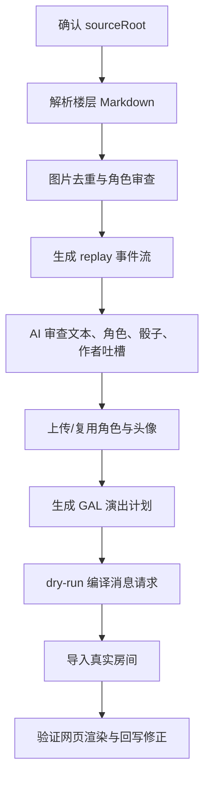

# 从零到一制作咕噜噜 Replay 的流程

## 目标

把一个咕噜噜导出的作品目录转换为团剧共创中的 replay 房间，并能在 WebGAL 渲染窗口中播放。

这里的 replay 导入不是团剧共创里的一个专用业务功能。正确架构是：

- 团剧共创提供稳定的房间、角色、头像、消息、annotation、资源上传、侧边栏等 CLI/API 原语。
- AI 使用这些原语完成导入、校对、演出编排和反复修正。
- 作品相关判断主要由 AI 做；代码只做可验证、可重复的机械处理。

## 文档边界

本文是咕噜噜安科文导入 replay 的权威流程入口。早期 opus 88 试点方案已删除，不应再作为执行依据。

相关文档的职责边界：

- `docs/reference/gululu-replay-from-zero-workflow.md`：从原帖/导出目录到团剧 replay 房间的完整流程。
- `docs/reference/gululu-replay-data-cleaning-review.md`：原文与图片数据清洗规则审查稿，用于重新定义分类、场景标志和抠图门禁。
- `docs/reference/webgal-realtime-render-rules.md`：WebGAL 实时渲染规则，主要用于导入后验证舞台表现。
- `docs/reference/webgal-tuanchat-translation-map.md`：团剧消息、annotation 与 WebGAL 命令的映射说明。
- `docs/reference/webgal-tuanchat-index.md`：团剧共创与 WebGAL/Terre 联动入口索引，不替代本文流程。

## 输入与产物

### 输入

源目录通常来自 `D:\gululu-cache\output\opus-*`：

```text
sourceRoot/
  meta.json
  parts/*.md
  images/**
  image-map.json                 可选
  downloaded-images.json          可选
  bgm/                            可选
```

### 主要产物

```text
sourceRoot/
  image-role-review-copy/
    manifest.json
    summary.json
    corrections.csv

  tuanchat-import-test/
    *.tuanchat-replay-import.json
    *.chat-import.txt
    *.live-import-*.json
    *.gal-directing-plan*.json
    *.gal-directed-live-import-plan*.json
    *.gal-directed-live-import-result*.json
```

### 相关脚本索引

脚本默认路径里仍有历史 opus 88 示例值。正式执行时必须显式传入当前作品的 `--root`、`--out-dir`、`--input`、`--source-root` 等参数。

| 阶段 | 脚本 | 当前职责 | 产物或备注 |
| --- | --- | --- | --- |
| 原帖重拉 | `scripts/gululu-refetch-opus.mjs` | 从咕噜噜后端重新拉取作品、楼层、图片 | 生成 `meta.json`、`parts/`、`images/`、`raw/` |
| 物理去重 | `scripts/gululu-dedupe-images.mjs` | 按 `sha256` 找重复图片；带 `--apply` 时用硬链接处理 | 不改变 Markdown 引用 |
| 初始图片审查包 | `scripts/gululu-image-review-pack.mjs` | 聚合图片上下文、候选角色、人工修正 | 生成 `image-role-review-copy/manifest.json`、`manifest.csv`、`corrections.csv`、`summary.json` |
| 人工审查台 | `scripts/gululu-review-server.mjs` | 本地网页审查 `manifest` 与 `corrections` | 写回 `corrections.csv` |
| 视觉审查图板 | `scripts/gululu-vision-contact-sheet.mjs` | 对指定状态图片生成 contact sheet | 用于 LLM/人工看图后写回修正 |
| 角色图库审查 | `scripts/gululu-role-audit-sheets.mjs` | 按角色输出审查图板 | 用于检查同一角色图库一致性 |
| 视觉修正模板 | `scripts/gululu-build-role-visual-audit.mjs` | 基于 clean 目录生成 `visual-corrections.csv` 模板 | 输出到 `reports/role-visual-audit/` |
| 干净头像目录 | `scripts/gululu-build-clean-human-images.mjs` | 合并视觉修正、排除项、视觉重复和差分组，生成可导入图片目录 | 支持 `--require-visual-confirmation` |
| 基础导入包 | `scripts/gululu-replay-import.mjs` | 解析楼层，生成 replay 事件、角色、头像候选、BGM 文本事件 | 生成 `*.tuanchat-replay-import.json` 与 `*.chat-import.txt` |
| authoring dry-run | `scripts/gululu-authoring-dry-run.ts` | 用内存 authoring primitives 编译导入包 | 生成 `*.authoring-dry-run.json` |
| 真实导入计划/执行 | `scripts/gululu-authoring-live-import.ts` | 创建/复用房间、角色、头像，上传头像，批量写消息，更新侧边栏 | 不加 `--apply` 只出计划；加 `--apply` 写入真实环境 |
| 头像 transform 回填 | `scripts/gululu-avatar-transform-backfill.ts` | 从 live import 结果和本地图片尺寸生成或应用 transform 回填 | 用于早期导入后修正头像位置 |
| GAL directed 导入 | `scripts/gululu-gal-directed-import.ts` | 把 live result 与 directing plan 编译为带演出 annotation 的消息补丁或导入结果 | 不加 `--apply` 只出计划；加 `--apply` 写入真实环境 |

### 状态分级

本文同时描述了已实现脚本能力、必须人工或 LLM 介入的步骤，以及尚未完全自动化的目标能力。执行时按以下状态理解：

- `已接线`：已有脚本入口，能在本地重复运行并生成文件或调用 API。
- `半自动`：已有脚本负责证据聚合或编译，但关键判断必须由 LLM/人工写回 CSV、manifest 或 directing plan。
- `待接线`：文档规定了目标和验收标准，但当前没有一条稳定脚本能端到端完成。
- `需现场验证`：依赖当前作品、当前资源、当前线上环境或当前 WebGAL 表现，不能从静态代码直接断言。

## 总流程



## 执行方标记

后文所有阶段都用以下标记区分责任边界：

- **[程序]**：确定性脚本、CLI、API 调用或可重复校验。
- **[LLM]**：需要语义理解、视觉理解、演出判断或取舍的部分。
- **[人工]**：用户审查、最终确认或对高风险判断的抽查。

凡是标了 **[LLM]** 的步骤，都不能被当成纯程序规则；结果必须写回 manifest、corrections 或 directing plan，保证后续可复现。

## 1. 确认源目录

执行方：**[程序]**

先验证源目录，不要假设固定作品路径。

检查项：

- `meta.json` 存在。
- `parts/` 存在且有楼层 Markdown。
- `images/` 存在或确认该作品无图片。
- 输出目录在当前 `sourceRoot` 下面，避免不同作品互相污染。

推荐命令：

```powershell
rg --files D:\gululu-cache\output\opus-xxx
```

## 2. 解析楼层为 replay 事件

执行方：**[程序] 为主，疑难分类交给 [LLM]**

楼层只作为来源元数据，不直接变成消息。

应该拆成这些事件：

- `scene`：作者显式场景标志行，只用于地点/场景切换。
- `dialog`：明确角色对白。
- `inferredDialog`：AI 或规则高置信推断出的对白。
- `narration`：旁白、说明、环境叙述。
- `dice`：历史骰子过程与结果。
- `bgm`：原文 BGM 切换。

保留来源字段：

- 楼层号。
- 原发布时间。
- 原始图片路径。
- 原始说话人文本。
- 原始事件序号。

不进入演出消息的内容：

- 楼层号。
- 作者名。
- 来源 URL。
- 与剧情无关的作者公告、更新说明、格式说明。

### 场景标志行

执行方：**[程序] 识别显式标志，[LLM] 只处理歧义标志**

地点/背景信息只从作者单独添加的场景标志行产生，不能从普通正文的地点词自动推断。

应识别的标志行示例：

```text
~永远亭~
～永远亭～
——神灵庙——
~红魔馆门口~
～午饭后的神灵庙～
```

这类行应生成独立 `scene` 事件：

```json
{
  "kind": "scene",
  "locationName": "神灵庙",
  "sceneLabel": "午饭后的神灵庙",
  "source": "author-scene-marker",
  "sourceText": "～午饭后的神灵庙～"
}
```

字段含义：

- `sceneLabel`：作者原始场景标题，保留时间、门口、指挥部等修饰。
- `locationName`：归一化地点名，用于后续背景匹配和场景归并。
- `sourceText`：原始标志行，用于回溯。
- `source`：固定为 `author-scene-marker`，表示来自作者显式标志。

硬约束：

- 普通正文提到地点名，不产生 `scene` 事件。
- 骰子选项中的地点名，只属于 dice options，不产生 `scene` 事件。
- 角色对白中的地点名，不产生 `scene` 事件。
- 没有作者标志行时，不自动更新当前地点。
- 后续若需要正文推断地点，必须使用单独的 `inferredScene`，默认关闭，且不能覆盖作者标志行。

不应识别为场景切换的反例：

```text
神灵庙吗，是偏向人类方的势力呢。
神子：在神灵庙的门口出现了……
1 博丽神社
2 红魔馆
具体发生的地点是【1d10:10】
```

`scene` 事件不等于已经有可用背景图。背景资源绑定应在后续 GAL directing 阶段完成；如果当前没有背景素材，只保留结构化地点/场景元数据。

**[LLM] 必须介入的情况：**

- 规则说明、技能说明、骰子说明和角色对白混在一起。
- 作者吐槽带头像或图片，程序无法仅靠格式区分。
- 无显式说话人但上下文强烈指向某个角色。
- 场景标志行包含非地点修饰，需要归一化 `locationName`，例如“午饭后的神灵庙”。

## 3. 处理骰子

执行方：**[程序] 识别结构，复杂骰链由 [LLM] 校对**

骰子是 replay 的核心结构，不能重新投骰。

### 基本规则

- 包含 `【1d100:90】`、`【1d10：10】`、`【262+1d100：82=344】` 的文本是历史骰子。
- 骰子前的提问和骰子后的选项表应尽量保留在同一条 dice 消息中。
- 骰子结果和过程要分开存储，方便 WebGAL 用 anko 样式显示。

### 选项表规则

这种内容是一条消息，不应拆成多条：

```text
那么烈啊，你要去往何处呢【1d13：】

1 博丽神社
2 红魔馆
...
13 其他的势力
```

骰娘回复是同一轮的结果：

```text
那么烈啊，你要去往何处呢【1d13：9】
```

### 嵌套骰规则

如果第 10 项本身又触发骰子，也仍然属于同一轮骰子链。

例如：

```text
【1d10：】
1 师匠，请指导我
...
10 大成功/大失败【1d2：】
```

结果应保存为同一条 dice 消息的多段 replies：

```text
【1d10：10】
10 大成功/大失败【1d2：2】
【1d10：9】
```

这里的语义是：

```text
先出了 1d10 = 10
再出了 1d2 = 2
然后重投/继续出了 1d10 = 9
```

**[LLM] 必须介入的情况：**

- 选项项本身包含新骰子，例如第 10 项大成功/大失败。
- 骰子说明被 speaker parser 误判成角色。
- 同一楼内存在多轮骰子，程序无法可靠判断哪几行属于同一轮。

## 4. 处理角色与头像

执行方：**[程序] 收集证据，核心归属判断由 [LLM]，高风险项由 [人工] 审查**

### 角色识别原则

优先级：

1. 文本中的明确说话人。
2. 同一图片与明确说话人的共现证据。
3. 人工/AI 审查过的 image manifest。
4. 图片路径名，仅在路径本身带有可信角色目录时作为弱证据。

当前 `owner-only-refetch-v3` 的图片通常是 `images/gululu/<id>_<hash>.<ext>`，这种路径不包含角色信息。程序会把 `gululu` 这类宽泛目录忽略，不能从中推出角色。只有历史分类目录或人工整理目录中出现类似 `东方/丰聪耳神子/...` 的结构时，路径才可作为弱证据。

即使路径带角色名，也不能当成最终事实。路径可能错，例如路径写在某角色目录下，但画面实际是另一个角色。

### AI-first 图片审查流程

目标是让 **[LLM]** 完成绝大多数图片归属判断，**[人工]** 只审异常队列和少量抽样。

推荐流程：

```text
[程序] sha256 去重
-> [程序] 聚合同一图片的所有上下文
-> [程序] 生成感知相似候选关系
-> [程序] 生成单图审查包 / contact sheet
-> [LLM] 看图 + 看上下文，输出结构化判断
-> [LLM] 区分 visualDuplicate 和 variantGroup，并选择是否可复用 canonical
-> [程序] 合并 LLM 判断并检测冲突
-> [LLM] 做角色图库一致性复核
-> [程序] 生成 ai-confirmed / needs-human-review / reference-only / excluded
-> [人工] 只审 needs-human-review 和少量抽样
-> [程序] 写回 manifest/corrections 并重新生成导入包
```

### 程序负责证据聚合和风险排队

**[程序]** 负责：

- 计算图片 `sha256`。
- 合并同 hash 的重复图片记录。
- 用 pHash/dHash/图像 embedding 等感知特征生成相似图片候选关系。
- 抽取图片前后文本。
- 抽取图片前后的显式说话人。
- 在路径确实包含角色目录时读取候选角色名；当前 `images/gululu/...` 形式通常不会提供这类证据。
- 读取视觉缓存结果。
- 生成供 LLM 审查的单图输入和 contact sheet。
- 合并 LLM 结果，检测同 hash、多上下文、多角色之间的冲突。
- 生成 `manifest.json`、`manifest.csv`、`corrections.csv`、`summary.json`。

程序分桶只用于排序和风险排队，不作为最终角色归属。

### 最终角色归属必须过视觉校验

**[程序]** 输出的 `confirmedCharacter` 只能代表“有证据的候选角色”，不能直接作为最终角色目录。图片可能被邻近对白、规则说明、变身描写或作者吐槽误绑定；例如规则表里的字段、战斗流程中的对手图、变身后的参考图，都可能被程序错当作当前角色头像。

最终导入前必须执行一轮 **[LLM]** 视觉正确性校验：

```text
[程序] 当前候选 by-character
-> [程序] 生成 role-visual-audit/contact-sheets
-> [LLM] 看图 + 看上下文，填写 visual-corrections.csv
-> [程序] 使用 visual-corrections.csv 重建 clean 目录
-> [程序] 严格模式检查所有导入图片都有 visualStatus=confirmed
```

严格最终版要求：

- 每张进入导入的图片都必须有 `visualStatus=confirmed`。
- `visualCharacter` 是最终角色归属；它覆盖 `manifest.confirmedCharacter`。
- `exclude=true` 的图不进入角色头像目录。
- 未被视觉确认的图只能留在候选目录或待审队列，不能进入正式导入。
- 视觉复核要检查整页角色图库一致性，而不是只看单图上下文。

当前脚本约定：

```powershell
node scripts/gululu-build-role-visual-audit.mjs `
  --root <sourceRoot> `
  --clean-dir <sourceRoot>\image-role-review-clean-human-full

node scripts/gululu-build-clean-human-images.mjs `
  --root <sourceRoot> `
  --visual-corrections <sourceRoot>\image-role-review-clean-human-full\reports\role-visual-audit\visual-corrections.csv `
  --require-visual-confirmation
```

### 视觉关系分层

`sha256` 只能识别完全相同的文件。咕噜噜图片经常存在同一画面的不同裁切、尺寸、压缩版本，也存在同一基础立绘的表情差分。两者必须分开处理。

图片流程需要三层关系：

```text
physicalDuplicate  sha256 相同，物理文件重复
visualDuplicate    sha256 不同，但确实是同一画面/同一表情的裁切、缩放、压缩版本
variantGroup       同一角色、同一基础立绘或同一构图，但眼睛、嘴、眉毛、表情不同
```

只有 `physicalDuplicate` 和经 LLM 确认的 `visualDuplicate` 可以复用同一个 canonical 头像资源。`variantGroup` 只用于整理和审查，不能用 canonical 合并上传，因为微小表情差异可能有明确语义。

**[程序]** 负责生成候选：

- 对图片归一化尺寸。
- 计算 pHash/dHash 或图像 embedding。
- 检测图片是偏漫画/黑白扫描，还是彩色立绘/差分素材。
- 只在同一候选角色、同一 assetKind 或相近上下文中优先建立候选关系，降低误合并。
- 输出 relation report、CSV 映射和 contact sheet。

**[LLM]** 负责确认：

- 候选关系是 `visualDuplicate` 还是 `variantGroup`。
- 是否混入了不同表情、不同角色、不同漫画格。
- 对 `visualDuplicate` 选择 canonical 图片。
- 对 `variantGroup` 保留每个差分，只标记同属一个差分组。

`visualDuplicate` 的 canonical 选择优先级：

1. 分辨率更高。
2. 裁切更完整。
3. 压缩噪声更少。
4. 没有明显遮挡、文字气泡或多余边框。
5. 与正文对白上下文最稳定共现。

差分判断规则：

- 彩色角色立绘、游戏立绘、透明底/白底角色半身图，默认按 `variantGroup` 处理。
- 如果眼睛开闭、嘴型、眉毛、脸红、受伤、表情方向有变化，必须保留为不同头像差分。
- 黑白漫画头像可以进入 `visualDuplicate` 候选，但仍需要 LLM 确认是否只是同一画面的裁切/压缩，而不是不同漫画格或不同表情。
- 不能只因为整体 pHash 接近就合并彩色立绘差分。

manifest 中应记录：

```json
{
  "sha256": "...",
  "visualRelationType": "visualDuplicate",
  "visualGroupId": "烈海王-avatar-framed-001",
  "visualCanonicalSha256": "...",
  "visualDuplicateOf": "...",
  "sourceRelPath": "gululu/715_a48b60ef5fdb.png"
}
```

差分组示例：

```json
{
  "sha256": "...",
  "visualRelationType": "variantGroup",
  "visualGroupId": "烈海王-standing-diff-001",
  "expression": "closed-eyes-smile",
  "sourceRelPath": "gululu/2237_87e08d28d05d.png"
}
```

注意：视觉关系不删除图片，也不改原始 Markdown 引用。只有 `visualDuplicate` 决定导入时复用同一个角色头像资源；`variantGroup` 仍应保留每个差分头像。

用户验收视觉去重时看这些结果，而不是看文件是否消失：

- source 图片数。
- `visualDuplicate` 数量和 canonical。
- `variantGroup` 数量和每组差分清单。
- 每个 sourceRelPath 到 visualRelationType/visualGroupId/canonical 的映射。
- 头像上传数只按 `visualDuplicate` canonical 减少，不能按 `variantGroup` 减少。
- 导入结果中多条历史消息是否复用同一个 avatarId。

### 图片归属由 LLM 完成大多数判断

**[LLM]** 必须重点判断：

- 有角色路径名但和画面内容冲突时，以谁为准；当前 `images/gululu/...` 路径没有这个角色证据。
- 当前图片是角色头像、全身立绘、半身图、漫画头像，还是不进入演出的参考图。
- 大幅漫画格是否应该从演出消息中排除。
- 倒地、战斗、说明性图片是否不适合作为立绘。
- 作者吐槽带图时是否应移出正文演出。
- 刃牙漫画头像是否确实是当前角色头像，而不是普通漫画分镜。

LLM 输出必须是结构化结果，不能只给自然语言结论。建议字段：

```json
{
  "sha256": "...",
  "character": "烈海王",
  "assetKind": "avatar-framed",
  "visualRelationType": "visualDuplicate",
  "visualGroupId": "烈海王-avatar-framed-001",
  "visualCanonicalSha256": "...",
  "confidence": 0.92,
  "isAuthorCommentaryAsset": false,
  "shouldImportAsAvatar": true,
  "shouldExcludeFromPerformance": false,
  "reason": "画面为烈海王头像，且后文连续由烈发言"
}
```

建议 `assetKind`：

```text
avatar-full       全身/接近全身立绘
avatar-bust       半身/胸像
avatar-framed     漫画头像、头像框、小裁切头像
reference-only    只保留来源/审查参考，不进入演出
excluded          排除
```

### 人工只审异常队列

**[人工]** 主要审查：

- LLM 置信度低的图片，例如 `< 0.75`。
- LLM 判断与上下文说话人冲突的图片。
- 同一 hash 在不同上下文被判成不同角色的图片。
- 同一角色头像风格明显异常的图片。
- 作者吐槽集中楼层里的图片。
- 非角色图但 LLM 想导入为头像的图片。
- 每个高频角色少量抽样，例如 5-10 张。

### 最终审查桶

最终 manifest 建议使用这些状态：

```text
ai-confirmed        LLM 高置信，可自动进入导入
needs-human-review  冲突、低置信或高风险
reference-only      只保留来源/审查参考，不进入演出
excluded            排除
manual-confirmed    人工确认
```

旧的 `candidate`、`low-confidence`、`conflict`、`unknown` 可以继续作为程序中间态，但不应作为最终导入决策。

### 作者吐槽过滤

作者说明、更新公告、格式说明、写法反思等应从演出消息中移除或降级为非演出元数据。

注意：作者说明有时也带头像或图片，不能因为有头像就当作角色对白。

AI 需要重点检查开头楼层和作者集中说明楼层，因为作者吐槽通常在这些位置高度集中。

### 头像/立绘与非演出图区分

不是所有图片都应该变成立绘。

应作为角色头像/立绘的图片：

- 当前说话人的头像。
- 半身或全身角色图。
- 刃牙角色的漫画头像，如果确实是该角色头像。

不作为立绘、也不进入演出消息的图片：

- 大幅漫画格。
- 当前说话人不对应的场景图。
- 倒地、战斗过程、说明性插图。
- 不能稳定代表当前说话人的图片。

应排除的图片：

- 食物、截图、纯反应图、明显无关图。
- 背景素材，除非后续明确纳入背景识别。

## 5. 透明化角色立绘

执行方：**[程序] 检测与运行模型，[LLM] 审查 QA 图**

进入 GAL 舞台的角色立绘必须优先使用透明背景资源。白底角色图不能直接作为立绘进入舞台。

### 处理顺序

```text
[程序] 检查 hasAlpha
-> 已有有效 alpha：跳过模型
-> 无 alpha 且边缘近白：needsMatting = true
-> [程序] 运行 rembg:isnet-anime
-> [程序] 输出 transparent / alpha mask / QA contact sheet
-> [LLM] 审查边缘、头发、帽子、道具、误抠
-> 通过后导入透明版
```

### 默认模型

动漫/东方立绘默认使用：

```text
rembg:isnet-anime
```

原因：

- 对动漫线稿和角色边缘比通用轻量模型更稳定。
- 能处理白底或近白底立绘。
- 可通过 rembg CLI/Python 库批量处理。

`u2netp` 只可作为快速预检模型，不作为最终默认模型。古明地恋白底立绘试验中，`rembg:isnet-anime` 输出被确认可用，`rembg:u2netp` 输出被确认不可作为正式结果。

### 程序检测规则

**[程序]** 可以自动判断：

- 图片没有 alpha 通道，或 alpha 全不透明。
- 四角/边缘大面积接近白色。
- 图片已被判为 `avatar-full`、`avatar-bust` 或 `avatar-framed`。

这类图片进入：

```json
{
  "needsMatting": true,
  "mattingModel": "rembg:isnet-anime",
  "mattingStatus": "pending"
}
```

如果图片已经有有效 alpha，例如透明像素比例明显大于 0，则必须跳过模型，避免二次抠图破坏原始透明边缘：

```json
{
  "needsMatting": false,
  "mattingStatus": "skipped-existing-alpha"
}
```

### 输出产物

不覆盖原图。模型输出写入 processed 目录：

```text
processed/transparent/<source-id>.png
processed/mask/<source-id>.mask.png
processed/qa/<batch>.png
```

manifest 记录：

```json
{
  "sourceRelPath": "gululu/4669_f1e6efe4e4c7.png",
  "transparentRelPath": "processed/transparent/4669_f1e6efe4e4c7.png",
  "maskRelPath": "processed/mask/4669_f1e6efe4e4c7.mask.png",
  "mattingModel": "rembg:isnet-anime",
  "mattingStatus": "auto-pass"
}
```

### LLM 审查重点

**[LLM]** 重点检查：

- 头发尖端是否被吃掉。
- 帽子、飘带、道具边缘是否断裂。
- 白色衣服是否被误抠透明。
- 背景是否残留白边。
- 原本已有透明通道的图片是否被错误二次处理。

未通过的图片进入 `needs-human-review` 或改回原图不作为立绘。

## 6. 计算 spriteTransform

执行方：**[程序] 计算初始 transform，[LLM] 判断图片类型是否适合立绘**

头像上传后需要给默认 `spriteTransform`，否则 WebGAL 里位置和大小会失控。

基础原则：

- 全身图、半身图、仅头像图要分开处理。
- 同类图片在舞台上的视觉高度应一致。
- 图片应位于对话框之上，不遮挡文本框。
- 不能把漫画大图强行当立绘缩放到舞台中央。

建议分类：

```text
avatar-full      全身或接近全身角色图
avatar-bust      半身、胸像、头肩图
avatar-framed    头像框、漫画头像、小裁切头像
reference-only   仅保留为来源/审查参考，不进入演出消息
excluded         不进入演出
```

代码负责根据图片宽高、透明区域和可见边界给出初始 transform。

AI 负责判断图片属于哪一类，以及是否应该从演出消息中排除。

**[LLM] 必须介入的情况：**

- 同一角色有全身图和头像图混用，视觉大小不一致。
- 图片虽然可计算 transform，但实际是漫画格或倒地图。
- 立绘应该随剧情进入、离开或换位置。
- 非立绘图片是否只保留为来源/审查参考。

## 7. 处理 BGM

执行方：**[程序] 解析和上传资源，[LLM] 判断演出时机**

原文 BGM 应进入 replay 时间线。

流程：

1. 解析 `BGM：xxx` 或 `BGM: xxx`。
2. 建立 BGM manifest，记录原文标题、候选文件、匹配状态。
3. 已有本地音频时上传并绑定。
4. 缺失音频时保留缺失清单，不把 BGM 行静默删除。
5. WebGAL 演出计划中保留 BGM 起止、切换、淡入淡出信息。

AI 负责判断原文 BGM 的语义位置和演出时机。

代码负责上传、复用、生成资源引用和验证资源可读。

## 8. 生成基础导入包

执行方：**[程序]**

基础导入包只解决 replay 事实，不做复杂演出。

必须包含：

- 消息事件流。
- 角色列表。
- 头像/图片资源候选。
- 骰子过程与结果。
- BGM 事件。
- 来源元数据。
- 统计信息。

输出两个文件：

```text
*.tuanchat-replay-import.json
*.chat-import.txt
```

其中 `.chat-import.txt` 用于快速人工审查切分是否合理。

## 9. AI 审查与修正

执行方：**[LLM] 为主，[人工] 审查结论**

AI 审查不是可选项。代码规则只能处理明显结构，不能可靠判断演出语义。

重点审查：

- 规则说明是否被误识别为角色。
- 技能卡、规则卡、骰子说明是否应属于 dice 描述。
- 作者吐槽是否被错误保留。
- 选项表是否被拆散。
- 嵌套骰是否保留多段结果。
- 图片是否绑定到错误角色。
- 头像/立绘和非演出图是否混淆。

修正结果应写回当前 `sourceRoot` 下的 manifest/corrections/plan 文件，不能只停留在临时判断中。

## 10. 上传/复用团剧共创资源

执行方：**[程序]**

使用团剧共创 API/CLI 原语：

- 创建或复用房间。
- 创建或复用角色。
- 上传或复用头像图片。
- 写入角色头像 transform。
- 批量写入消息。
- 更新空间侧边栏。

要求：

- 批量写入消息，不逐条发送。
- 资源引用使用团剧可读的内部资源信息，避免 WebGAL 渲染时再去拉需要鉴权的外部 URL。
- 导入成功后必须检查侧边栏是否真的加入新房间。

认证 token 只通过临时环境变量传入，不写入文件。

## 11. 生成 GAL 演出计划

执行方：**[LLM] 为主，[程序] 做格式校验和编译**

GAL 演出主要由 AI 判断，代码只提供可验证约束。

### L1：可播放

必须做到：

- BGM 真播放。
- 对白有角色立绘或头像。
- 骰子按 anko 样式显示。
- 必要时清场。

### L2：可读演出

AI 判断：

- 说话人切换时更新立绘。
- 连续同角色对白使用 `dialog.concat` 或 `dialog.notend`。
- 大段旁白转 `intro` 或普通旁白。
- 角色可以随剧情移动，不要求固定站位。

### L3：精修

AI 判断：

- 情绪特效 `effect.*`。
- 动作动画 `figure.anim.*`。
- 背景精确识别。
- BGM 起止、淡入淡出、音效。

## 12. 编译 directed dry-run

执行方：**[程序]**

在导入真实房间前，先编译 directed plan。

检查项：

- 消息数没有异常变化。
- dice 消息数量正确。
- 每条 source event 都有对应方向。
- 多段 `diceTurn.replies` 没有被压成一条。
- `figure.clear` 不会误清当前需要保留的角色。
- `spriteTransform` 没有明显离谱。

关键原则：

如果源消息已经有 canonical `diceTurn.command/replies`，directed 阶段不能重算骰子文本，只能补演出元数据。

## 13. 导入真实房间

执行方：**[程序]**

导入时执行：

1. 创建房间。
2. 复用已有角色/头像，缺失时创建。
3. 批量写入消息。
4. 写入侧边栏。
5. 输出 live result。

live result 必须记录：

- 新房间 ID。
- 侧边栏 action 与 version。
- 消息写入数量。
- 角色/头像复用情况。
- 每条 source event 到 messageId 的映射。

## 14. 网页端验证

执行方：**[程序] 检查数据，[LLM]/[人工] 检查视觉效果**

在 `tuan.chat` 网页端验证：

- 房间出现在侧边栏。
- WebGAL 渲染能加载资源。
- 立绘不遮挡对话框。
- 头像大小基本一致。
- 应清场的地方清场。
- 不该清场的地方保留。
- 非立绘图片没有误当立绘进入舞台。
- 骰子过程和结果显示符合原文。
- BGM 可以播放。

如果出现资源 401：

- 优先检查是否引用了需要鉴权的外部 URL。
- 应改为使用已上传资源的内部 fileId/media 信息。
- 不应依赖 WebGAL 前端临时代理去重新拉受限资源。

## 15. 迭代修正

执行方：**[LLM] 提出修正，[程序] 重生成，[人工] 审查关键版本**

发现问题后不要直接手改线上消息作为最终方案。

正确做法：

1. 在 manifest/corrections/directing plan 中记录修正。
2. 重新生成导入包。
3. 重新 dry-run。
4. 重新导入新房间或按明确策略覆盖。
5. 验证新房间。

这样才能保证流程可复现。

## 最低验收标准

一个 replay 版本可以交给用户审查前，至少要满足：

- 目标楼层范围正确。
- 作者无关话语已去除或降级为非演出内容。
- 对白、旁白、骰子、BGM 分类基本正确。
- 选项表没有被拆散。
- 嵌套骰保留多段过程与结果。
- 主要角色有可用头像/立绘。
- 明显错误图片已排除或只保留为来源/审查参考。
- WebGAL 可以渲染，不出现资源权限错误。
- 房间已加入侧边栏。
- 生成文件、修正文件和导入结果都保存在当前 `sourceRoot` 下。

## 当前遗漏与不确定项

这些项目是整理文档时从现有脚本和流程边界中明确出来的风险台账。它们不阻塞基础文本 replay 导入，但会影响“可审查、可播放、可复现”的最终质量。

### 已有脚本但仍需人工或 LLM 判断

- 图片角色归属：`gululu-image-review-pack.mjs`、`gululu-review-server.mjs`、`gululu-build-role-visual-audit.mjs` 能生成证据和修正入口，但最终 `visualCharacter` 仍需 LLM/人工确认。
- 作者吐槽过滤：基础解析会保留可识别结构，但作者说明、格式说明、规则说明与剧情混杂时，必须由 LLM 审查并把修正写回导入包或 directing plan。
- 嵌套骰链：已有测试覆盖多段 `diceTurn.replies` 保留，但同楼多轮骰、选项项内再投骰、重投语义仍需要 LLM 校对。
- 视觉去重：`gululu-build-clean-human-images.mjs` 已有 `visualDuplicate` 与 `variantGroup` 输出，但候选关系是否正确仍要看图确认，不能只按哈希或 dHash 自动合并。
- GAL 演出：`gululu-gal-directed-import.ts` 能编译 directing plan，但 directing plan 本身主要由 LLM 产出，不能由基础导入脚本自动推断。

### 待接线或未完全自动化

- BGM 音频 manifest：基础导入能解析 BGM 行，live import 当前主要把 BGM 保留为文本事件和 warning；本地音频匹配、上传、播放绑定还不是完整自动链路。
- 透明化立绘：流程规定优先使用 `rembg:isnet-anime`，`gululu-build-clean-human-images.mjs` 能消费 matting 结果并优先使用透明图，但自动运行 rembg、生成 mask、QA contact sheet 的端到端脚本需要现场确认或补齐。
- LLM 结构化审查流水线：文档要求 LLM 输出结构化 JSON/CSV，但当前仓库没有统一的模型调用入口把图片、上下文、修正结果全自动串起来。
- 背景识别：当前流程默认把背景素材排除；如果要做 WebGAL 背景切换，需要新增背景候选识别、资源上传和 directing plan 规则。
- BGM 版权与来源：流程只允许使用用户提供的本地音频或 manifest，不能自动从公开视频/音乐平台抓取。

### 需要按作品现场确认

- `sourceRoot` 是否来自重新拉取脚本，还是用户已有导出目录；两者的图片路径结构可能不同。
- `parts/*.md` 是否有楼层缺失、重复、乱序或非 UTF-8 编码。
- 角色别名表是否只适用于当前作品；opus 88 的别名不能迁移到其他作品当作事实。
- `images/gululu/<id>_<hash>.<ext>` 这类路径不含角色信息，不能据此推断角色。
- 目标房间、目标空间、骰娘角色/头像 ID、认证 token 和 API 地址必须在导入当天确认。
- WebGAL 视觉验收必须在真实网页或本地预览中完成；静态导入结果不能证明立绘不遮挡文本框、BGM 能播放或资源不会 401。

### 文档维护规则

- 本文是执行入口；新增脚本或流程变更时优先更新本文的脚本索引和风险台账。
- 只描述已验证的默认行为；对未验证能力使用 `待接线` 或 `需现场验证` 标记。
- 不再新增按单一 opus 编写的平行流程文档；作品特定结论应保存到当前 `sourceRoot` 下的 manifest、corrections 或 directing plan。
