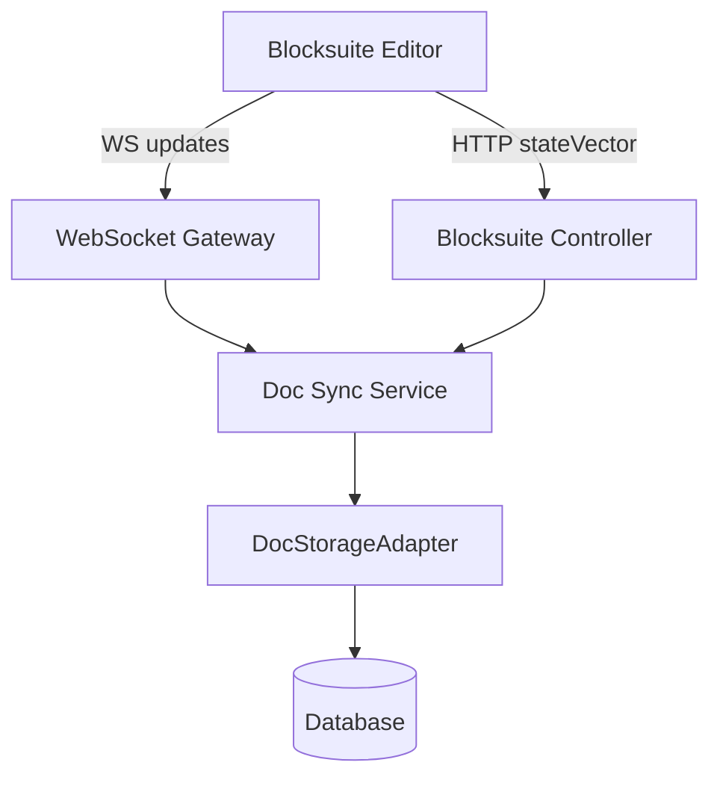

# 技术设计: Blocksuite Yjs 同步适配层

## 技术方案
### 核心技术
- yjs updates/stateVector
- WebSocket（服务端长连接推送）
- 现有数据库（存储 updates + snapshot + history）

### 实现要点
- **存储适配层:** 抽象 updates 写入、snapshot 合并、diff 读取、history 回放接口，后端以现有数据库实现。
- **同步协议:** 客户端通过 WebSocket 进入 space/doc 房间，push-update 由服务端校验后入库并广播。
- **差量读取:** 客户端携带 stateVector 拉取缺失 updates，避免全量传输。
- **合并策略:** updates 进入待合并队列，定时合并为 snapshot，并保存历史记录。
- **迁移流程:** 旧 snapshot 作为初始 update 写入，生成 snapshot 记录并完成一致性校验。

## 架构设计


## 架构决策 ADR
### ADR-001: 使用 updates+snapshot+stateVector 同步管线并引入存储适配层
**上下文:** 需要与 AFFiNE 对齐更新管线，同时保持现有数据库能力与迭代成本可控。  
**决策:** 采用 updates 入库 + 定期合并 snapshot + stateVector diff，同步层通过存储适配层访问数据。  
**理由:** 兼顾实时协作、断线增量与可维护性，且可在未来替换为 OctoBase 实现。  
**替代方案:** 直接绑定数据库实现或直接引入 OctoBase 服务 → 拒绝原因: 前者耦合高、后者成本高。  
**影响:** 需要新增适配层、迁移脚本与 WS 协议扩展。

## API设计
### [POST] /blocksuite/spaces/{spaceId}/docs/{docId}/updates
- **请求:** { updates: base64[], clientId, editorId? }
- **响应:** { timestamp, stateVector }

### [GET] /blocksuite/spaces/{spaceId}/docs/{docId}
- **请求:** ?stateVector=base64
- **响应:** { missing: base64, stateVector, timestamp }

### [GET] /blocksuite/spaces/{spaceId}/docs/{docId}/history
- **请求:** ?before=&limit=
- **响应:** { list: [{ timestamp, editor }] }

### WebSocket 事件
- **blocksuite:join** { spaceId, docId, clientVersion }
- **blocksuite:push-update** { spaceId, docId, update }
- **blocksuite:broadcast-update** { spaceId, docId, update, editorId }
- **blocksuite:awareness-update** { spaceId, docId, awarenessUpdate }

## 数据模型
```sql
CREATE TABLE blocksuite_doc_snapshot (
  space_id VARCHAR(64) NOT NULL,
  doc_id VARCHAR(64) NOT NULL,
  bin BLOB NOT NULL,
  timestamp BIGINT NOT NULL,
  editor_id VARCHAR(64),
  PRIMARY KEY (space_id, doc_id)
);

CREATE TABLE blocksuite_doc_update (
  space_id VARCHAR(64) NOT NULL,
  doc_id VARCHAR(64) NOT NULL,
  bin BLOB NOT NULL,
  timestamp BIGINT NOT NULL,
  editor_id VARCHAR(64)
);

CREATE TABLE blocksuite_doc_history (
  space_id VARCHAR(64) NOT NULL,
  doc_id VARCHAR(64) NOT NULL,
  bin BLOB NOT NULL,
  timestamp BIGINT NOT NULL,
  editor_id VARCHAR(64)
);

CREATE INDEX idx_blocksuite_doc_update_space_doc_ts
  ON blocksuite_doc_update(space_id, doc_id, timestamp);
```

## 安全与性能
- **安全:** 统一权限校验、输入大小限制、避免明文记录敏感信息。
- **性能:** updates 压缩、批量合并、广播分片与背压控制。

## 测试与部署
- **测试:** updates 合并与 diff 单测、WS 同步集成测试、迁移一致性校验测试。
- **部署:** 先上线后端与迁移脚本，完成迁移后再切换前端流量。
