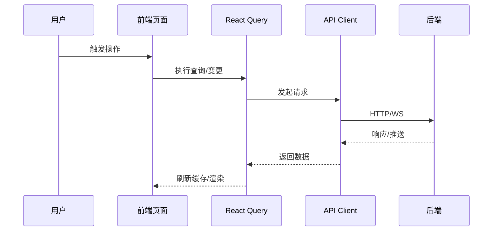

# 架构设计

## 总体架构

```mermaid
flowchart TD
    UI[Web UI / React Router] -->|HTTP Fetch| API[API Client (OpenAPI + 封装)]
    UI -->|WebSocket| WS[WS Client]
    API --> BE[后端服务]
    WS --> BE

    UI --> TERRE[terre / WebGAL 服务]
    ELEC[Electron 壳] --> UI
    ANDR[Android 壳] --> UI
```

## 技术栈

- **前端:** React 19 / React Router 7 / TypeScript / Vite
- **状态与请求:** TanStack React Query（hooks 约定见模块文档）
- **桌面端:** Electron + electron-builder
- **安卓端:** `android/`（混合开发）

## 核心流程



## 重大架构决策

完整的 ADR 存储在各变更的 `how.md` 中，本章节提供索引。

| adr_id | title | date | status | affected_modules | details |
|--------|-------|------|--------|------------------|---------|

