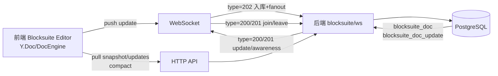
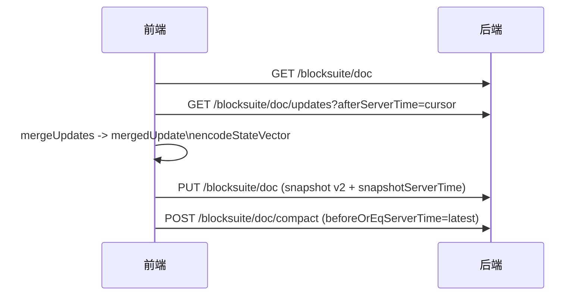

# Blocksuite Yjs 同步设计（仿 AFFiNE/OctoBase）

本文档用于阐述本次 Blocksuite 前后端交互从“仅快照(snapshot)”升级到“yjs 增量(updates) 为主”的设计与实现取舍，便于审阅与后续演进。

---

## 1. 背景与问题

历史实现主要依赖 `/blocksuite/doc` 存储“合并后的 full update（base64）”作为快照：

- 冷启动可恢复，但缺少“增量日志”作为一致性基础
- 多端同时编辑时只能靠频繁写回快照，容易覆盖/抖动，无法稳定实时协作
- 断线重连只能全量拉快照，无法按 stateVector 做 diff
- 无法像 AFFiNE/OctoBase 那样进行“updates 入库 + snapshot compaction”

因此需要升级为：以 yjs updates 日志作为 SSOT（事实来源），快照作为可丢弃的缓存（加速冷启动/减少日志长度）。

---

## 2. 目标与非目标

### 2.1 目标

1. 前后端统一为 blocksuite/yjs 的增量同步语义：
   - updates 入库（持久化）
   - WebSocket 实时 fanout
   - 断线重连可通过 stateVector diff 补齐
2. 定期将 updates 合并为快照（snapshot compaction），并删除已合并的 updates
3. 一次性迁移历史快照（v1）到 updates 日志（baseline update）
4. 保留“存储适配层”抽象，便于未来替换存储介质/分布式扩展

### 2.2 非目标（当前不做）

- 服务端不实现 yjs 合并/解码/按 stateVector diff（Java 侧缺少可用、成熟且可维护的 yjs 合并栈）
- 不实现分布式协作网关（当前 WS room 为单节点内存）
- 不把 blocksuite WS 与现有聊天 WS 客户端强制合并到同一个前端 hook（避免对聊天链路引入回归风险）

---

## 3. 术语与关键约定

- **DocKey**：`(entityType, entityId, docType)`，例如 `space:123:description`
- **update**：yjs update（二进制）在传输/存储时使用 base64（`updateB64`）
- **serverTime**：服务端写入 update 的时间戳(ms)，作为拉取游标
- **snapshot**
  - v1：`{ v:1, updateB64, updatedAt }`（历史格式）
  - v2：`{ v:2, updateB64, snapshotServerTime, stateVectorB64?, updatedAt }`（用于 compaction）

---

## 4. 总体架构

关键点：

- updates（`blocksuite_doc_update`）是远端一致性的基础（SSOT）
- snapshot（`blocksuite_doc.snapshot`）是缓存：用于冷启动与减少 logs；可由客户端定期重写
- stateVector diff 在前端进行：`pull(docId, stateVector)` 返回最小差量

---

## 5. 后端设计（TuanChat）

### 5.1 数据表

- `tuanchat.blocksuite_doc`
  - `(entity_type, entity_id, doc_type)` 唯一键
  - `snapshot`：JSON 字符串（v1/v2）
- `tuanchat.blocksuite_doc_update`
  - `update_b64`：单条 update（base64）
  - `server_time`：游标(ms)
  - 索引：`(entity_type, entity_id, doc_type, server_time)`

### 5.2 存储适配层

目的：把“权限/协议/合并策略”与“具体存储实现”解耦。

- 接口：`src/main/java/com/jxc/tuanchat/blocksuite/storage/BlocksuiteDocStorageAdapter.java`
- 当前实现：`src/main/java/com/jxc/tuanchat/blocksuite/storage/MybatisBlocksuiteDocStorageAdapter.java`

### 5.3 HTTP API

Controller：`src/main/java/com/jxc/tuanchat/blocksuite/controller/BlocksuiteDocController.java`

- `GET /blocksuite/doc`：获取快照（字符串）
- `PUT /blocksuite/doc`：写入快照
- `POST /blocksuite/doc/update`：写入单条 update（离线/无 WS 兜底）
- `GET /blocksuite/doc/updates`：按 `afterServerTime` 拉取增量 updates
- `POST /blocksuite/doc/compact`：删除 `<= beforeOrEqServerTime` 的 updates（配合 compaction）

权限策略（与原快照一致）由：

- `src/main/java/com/jxc/tuanchat/blocksuite/service/BlocksuiteDocService.java`
  - `ensureEntityAccessibleForRead/Write/Delete`

### 5.4 WebSocket 协议

枚举定义：

- `src/main/java/com/jxc/tuanchat/websocket/domain/enums/WSReqTypeEnum.java`
  - `200 BLOCKSUITE_JOIN`
  - `201 BLOCKSUITE_LEAVE`
  - `202 BLOCKSUITE_PUSH_UPDATE`
  - `203 BLOCKSUITE_AWARENESS`
- `src/main/java/com/jxc/tuanchat/websocket/domain/enums/WSRespTypeEnum.java`
  - `200 BLOCKSUITE_DOC_UPDATE`
  - `201 BLOCKSUITE_DOC_AWARENESS`
  - `202 BLOCKSUITE_DOC_UPDATE_ACK`

处理入口：

- WS 分发：`src/main/java/com/jxc/tuanchat/websocket/NettyWebSocketServerHandler.java`
- blocksuite WS 业务：`src/main/java/com/jxc/tuanchat/blocksuite/service/BlocksuiteWsSyncService.java`
- doc room：`src/main/java/com/jxc/tuanchat/websocket/registry/BlocksuiteDocRoomRegistry.java`

语义：

1. `JOIN`：做读权限校验后加入 room
2. `PUSH_UPDATE`：写入 `blocksuite_doc_update` + ACK 给发送者 + 广播给同 room 其它连接（不回推给发送者）
3. `AWARENESS`：仅广播，不入库

### 5.5 一次性迁移（baseline updates）

目标：把历史 `snapshot(v1)` 内的 `updateB64` 迁移为 `blocksuite_doc_update` 的首条 baseline update（仅当该 doc 尚无任何 updates 时插入）。

- 服务：`src/main/java/com/jxc/tuanchat/blocksuite/service/BlocksuiteDocMigrationService.java`
- Runner：`src/main/java/com/jxc/tuanchat/blocksuite/service/BlocksuiteBaselineMigrationRunner.java`
  - 默认关闭：`blocksuite.migration.baseline.enabled=false`
  - 可配置 `blocksuite.migration.baseline.pageSize`

注意：v2 快照为 compaction 产物，不参与 baseline 迁移/回填。

---

## 6. 前端设计（tuan-chat-web）

### 6.1 远端 DocSource（核心）

核心文件：`app/components/chat/infra/blocksuite/remoteDocSource.ts`

- `pull(docId, stateVector)`
  1. `GET /blocksuite/doc` 读取 snapshot（v1/v2）
  2. 计算游标 `afterServerTime`（优先 v2 的 `snapshotServerTime`，否则退化为 `updatedAt`）
  3. `GET /blocksuite/doc/updates` 拉取增量 updates
  4. `mergeUpdates([snapshotUpdate, ...updates])` 得到 mergedUpdate
  5. `diffUpdate(mergedUpdate, stateVector)` 返回最小差量
- `push(docId, update)`
  - WS 已连接：走 WebSocket `type=202`（服务端入库 + fanout）
  - WS 不可用：落入离线队列（IndexedDB），debounce 后用 `POST /blocksuite/doc/update` flush
- `subscribe(cb)`
  - 通过 blocksuite WS 客户端监听远端 update，回调给 DocEngine（DocEngine 会触发 pull/apply）

### 6.2 WebSocket 客户端

文件：`app/components/chat/infra/blocksuite/blocksuiteWsClient.ts`

- 复用 `VITE_API_WS_URL` 与 token query
- 提供 join/leave/pushUpdate/pushAwareness、onUpdate/onAck/onAwareness

### 6.3 Workspace 侧断线补齐

文件：`app/components/chat/infra/blocksuite/runtime/spaceWorkspace.ts`

- doc load 时 join 对应 DocKey
- catch-up 使用 stateVector diff：
  - `stateVector = encodeStateVector(doc)`
  - `remoteDocSource.pull(docId, stateVector)` 得到 diff 并 apply

### 6.4 定期合并快照（compaction）

触发（best-effort, debounce）：

- pull/push 发现 updates 积累、或快照缺失/仍为 v1

流程：

说明：

- v2 快照让后续拉取从 `snapshotServerTime` 开始，避免重复回放已合并 updates
- compaction 成功与否不影响在线协作（失败时下次仍可重试）

---

## 7. 失败模式与一致性策略

- **WS 断开**：push 会转入离线队列 + HTTP flush；pull/catch-up 仍可恢复
- **HTTP 失败**：离线队列不会清空，等待下次 flush
- **updates 乱序/同毫秒写入**：当前游标基于 `serverTime(ms)`，极端情况下可能出现同毫秒多条 update 的边界；当前实现允许客户端再 pull 一次补齐（幂等 apply）
- **单节点限制**：doc room registry 为单节点内存；多实例需引入共享 pubsub（未来演进）

---

## 8. 安全与权限

- HTTP：复用现有登录态与 `BlocksuiteDocService` 权限校验
- WS：join 时复用读权限校验；pushUpdate 时复用写权限校验
- awareness 不入库，仅广播；依赖 join 权限控制进入 room

---

## 9. 上线与回滚建议

上线顺序建议：

1. 先应用数据库变更（新增 `blocksuite_doc_update`）
2. 部署后端（HTTP/WS 协议）
3. 部署前端（RemoteYjsLogDocSource + ws client）
4. （可选）启用一次性 baseline 迁移 Runner 跑一轮后关闭

回滚策略：

- 若需回滚前端：后端新增接口/表可保留（向后兼容）
- 若需回滚后端：前端的 WS/updates 路径会退化失败；不建议在生产直接回滚后端而保留新前端

---

## 10. 实现与参考入口（代码事实来源）

前端：

- `app/components/chat/infra/blocksuite/remoteDocSource.ts`
- `app/components/chat/infra/blocksuite/blocksuiteWsClient.ts`
- `app/components/chat/infra/blocksuite/descriptionDocRemote.ts`
- `app/components/chat/infra/blocksuite/runtime/spaceWorkspace.ts`

后端：

- `src/main/java/com/jxc/tuanchat/blocksuite/controller/BlocksuiteDocController.java`
- `src/main/java/com/jxc/tuanchat/blocksuite/service/BlocksuiteDocService.java`
- `src/main/java/com/jxc/tuanchat/blocksuite/service/BlocksuiteWsSyncService.java`
- `src/main/java/com/jxc/tuanchat/blocksuite/storage/*`
- `src/main/java/com/jxc/tuanchat/websocket/domain/enums/WSReqTypeEnum.java`
- `src/main/java/com/jxc/tuanchat/websocket/domain/enums/WSRespTypeEnum.java`
- `src/main/java/com/jxc/tuanchat/websocket/registry/BlocksuiteDocRoomRegistry.java`

